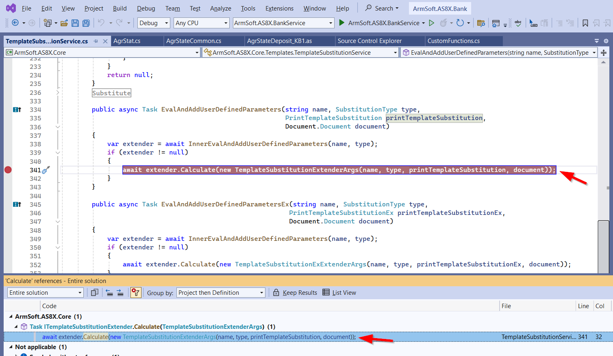
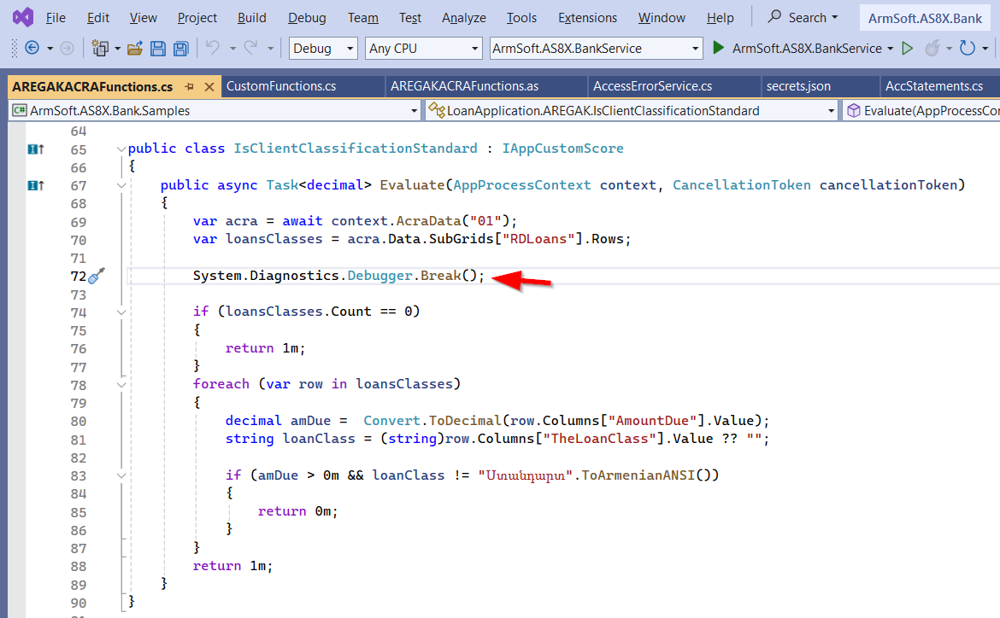

## Բովանդակություն

- [Ներածություն](#ներածություն)
- [Visual Studio ծրագրում կատարվող կարգավորումները](#visual-studio-ծրագրում-կատարվող-կարգավորումները)
- [config.as-ի կարգավորում](#configas-ի-կարգավորում)
- [Breakpoint-ի տեղադրում ընդլայնումների ֆայլերում](#breakpoint-ի-տեղադրում-ընդլայնումների-ֆայլերում)
- [Աշխատանք Debugger-ի հետ](#աշխատանք-debugger-ի-հետ)

## Ներածություն

8X սերվիսում ընդլայնումների C# ֆայլերը բեռնվում են տվյալների բազայից և դինամիկ կոմպիլյացվում են։
Այդ պատճառով դրանց չի լինում Debug անել սովորական ձևով կոդի ցանկալի տողում Breakpoint դնելով և պրոյեկտը աշխատացնելով։

## Visual Studio ծրագրում կատարվող կարգավորումները 

Անհրաժեշտ է `Set as Startup Project` գործողության միջոցով միացող պրոյեկտ սահմանել `ArmSoft.AS8X.BankService`-ը:

Սերվիսը աշխատացնելու համար անհրաժեշտ է [appsettings.json](../Project/appsettings_json.md)-ում կարգավորել [բազային միանալու](../Project/appsettings_json.md#db) համար անհրաժեշտ տվյալները՝ սերվերի անունը, բազան, sql-ի մուտքանունն ու գաղտնաբառը: 

```json
"db": {
  "server": "SQLSERVER2",
  "database": "bank2",
  "login": "sa",
  "password": "password"
}
```

Այնուհետև անհրաժեշտ է Debug ռեժիմում միացնել `ArmSoft.AS8X.BankService`-ը։ 


Սերվիսի հաջող գործարկումից հետո բացված browser-ի պատուհանում կարտացոլվի Swagger-ի էջը իսկ Visual Studio ծրագրում կհայտնվի Debug-ի գործիքների վահանակը։ 


## config.as-ի կարգավորում

Debug անելու համար անհրաժեշտ է կարգավորել ՀԾ-Բանկ համակարգը local սերվիսով աշխատելու համար։ 

Այդ նպատակով Config.as ֆայլում տվյալների բազայի կոնֆիգուրացիայի համար պետք է ավելացնել նրա կրնկնօրինակը փոխելով `SERVICE` պարամետրի արժեքը local սերվիսի հասցեյով՝ `"https://localhost:1027"`։

Օրինակ՝
```as4x
CONFIG {
  NAME="bank2_local";
  SERVER=BANK-SQLSERVER2;
  DATABASE=bank2;
  CONTEXT=ASBANK;
  SERVICE="https://localhost:1027";
};
```

## Breakpoint-ի տեղադրում ընդլայնումների ֆայլերում

Ծրագրի ընթացքը կանգնեցնելու համար առկա են հետևյալ երկու տարբերակները։ 

1. Breakpoint-ի տեղադրում ընդլայնման հաշվարկի մեթոդը (Calculate, Evaluate) կանչող տողի վրա՝ տվյալ ֆայլից դուրս գտնվող:  
   Նշված տողը գտնելու համար նշեք մեթոդի անունը և աշխատացրեք `Find All References` հրամանը։ 
   Բացված References պատուհանում ընտրեք տվյալ մեթոդը կանչող տողը։ 
   Արդյունքում կկատարվի անցում համապատասխան ֆայլի պահանջող տողի վրա, որտեղ և տեղադրեք Breakpoint-ը։ 
   Երբ Debug-ի ժամանակ պրոցեսը կանգնի այդ տողի վրա, հարկավոր կլինի անցնել ֆունկցիայի մեջ։
   

2. `System.Diagnostics.Debugger.Break();` տողի տեղադրում ընդլայնման ֆայլի այն տեղում, որտեղ ցանկանում ենք կանգնեցնել ծրագրի կատարումը։
   Սա հատուկ հրաման է, որին հասնելով Visual Studio-ն կանգնացնում է կատարման ընթացքը ինչպես սովորական Breakpoint-ին հասնելուց։  
   Ընդլայնման ֆայլը խմբագրելուց հետո, նախքան սերվիսի գործարկումը ներմուծեք այն SysCon ծրագրի միջոցով: Իսկ Debug -ի հետ աշխատանքը ավարտելուց հետո կարևոր է չմոռանալ հեռացնել նշված տողը ֆայլից։
   

## Աշխատանք Debugger-ի հետ

Debugger-ի հետ աշխատանքի վերաբերյալ տես հետևյալ հղումով՝ [Learn to debug C# code using Visual Studio](https://learn.microsoft.com/en-us/visualstudio/get-started/csharp/tutorial-debugger)

