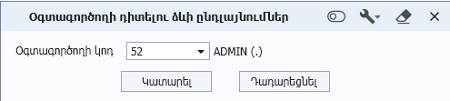

# DataView.ApplyDialog(DataViewDialogWindow dialog, bool isRefreshMode) մեթոդ

## Նկարագիր

**Դաս՝** [DataView](../DataView.md)

```c#
public virtual void ApplyDialog(DataViewDialogWindow dialog, bool isRefreshMode)
```

Այս մեթոդը նախատեսված է դիտելու ձևի [CreateDialog](CreateDialog.md) մեթոդի միջոցով ստեղծված նախնական ֆիլտրման դիալոգի ցուցադրման և control-ների արժեքները որպես դիտելու ձևի պարամետրեր փոխանցելու համար։

**Պարամետրեր**

| Անվանում | Տվյալների տիպ | Լռությամբ արժեք | Նկարագրություն |
| --- | --- | --- | --- |
| dialog | DataViewDialogWindow | - | Դիտելու ձևի նախնական ֆիլտրման դիալոգը։ |
| isRefreshMode | bool | - | Պարամետրը վերադարձնում է, արդյոք նախնական ֆիլտրման դիալոգը բացվել է դիտելու ձևի սկզբնական բացման պահին, թե ծրագրի Toolbar-ի **«Փոխել պարամետրերը»** (Ctrl + G) կոճակի միջոցով։ |

**Օրինակ** 

```c#
public override void ApplyDialog(DataViewDialogWindow dialog, bool isRefreshMode)
{
    this.Parameters.UserId = ((DocumentsChangeRequestsDialogWindow)dialog).Code;
}
```

