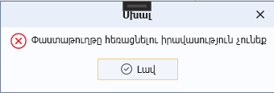

# DataView.DeleteDocument() մեթոդ

## Նկարագիր

**Դաս՝** [DataView](../DataView.md)

```c#
public virtual void DeleteDocument()
```

Սահմանում է դիտելու ձևի «Հեռացնել» կոնտեքստային ֆունկցիայի կատարման արդյունքում բացվող պատուհանը՝ [IsDocumentBased](../Properties/IsDocumentBased.md) հատկության true արժեքի դեպքում։

Մեթոդը չմշակելու դեպքում հեռացնում է դիտելու ձևի ընթացիկ տողում պարունակվող փաստաթուղթը համակարգից։

«Հեռացնել» կոնտեքստային ֆունկցիայի վարքագիծը կարգավորվում է [AllowDelete](../Properties/AllowDelete.md), [IsDeleteEnabled](../Properties/IsDeleteEnabled.md), IsDocumentBased հատկությունների միջոցով։

**Օրինակ**

```c#
public override void DeleteDocument()
{
    // ցուցադրվող հաղորդագրության պատուհանի սահմանում
    Core.UI.MessageBox.Show("Փաստաթուղթը հեռացնելու իրավասություն չունեք", "Սխալ", MessageBoxButton.OK, MessageBoxImage.Error);
}
```


