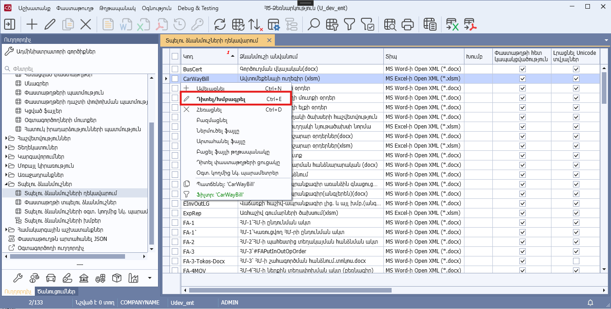
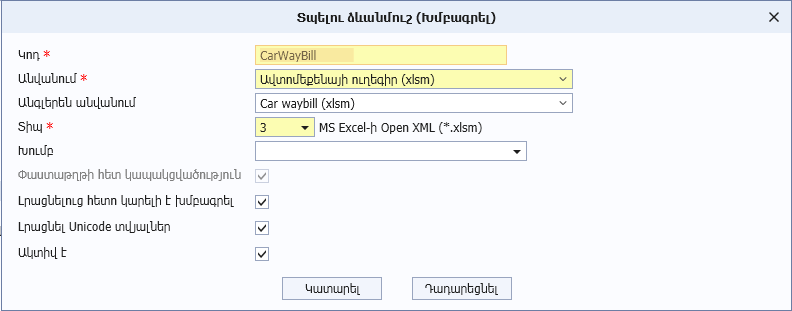

# DataView.Edit() մեթոդ

## Նկարագիր

**Դաս՝** [DataView](../DataView.md)

```c#
public virtual void Edit()
```

Սահմանում է դիտելու ձևի «Դիտել/Խմբագրել» կոնտեքստային ֆունկցիայի կատարման արդյունքում բացվող պատուհանը՝ IsDocumentBased հատկության false արժեքի դեպքում։

«Դիտել/Խմբագրել» կոնտեքստային ֆունկցիայի վարքագիծը կարգավորվում է AllowEdit, IsEditEnabled, IsDocumentBased հատկությունների միջոցով։

```c#
public override void Edit()
{
    // ընթացիկ տողի ստացում
    var row = (TemplatesManagementDataRow)this.Panel.FocusedRow();
    if (row != null)
    {
        // ցուցադրվող դիալոգի սահմանում
        var dialog = EditTemplateDialog(row, TemplateMode.Edit);
        // դիալոգի ցուցադրում
        bool? result = dialog.ShowDialog();
        // դիալոգի կատարման դեպքում դիտելու ձևի պանելի տողերի թարմացում՝ խմբագրված տողը ցուցադրելու նպատակով
        if (result.HasValue && result.Value)
        {
            this.Panel.Update(row.fROWID);
        }
    }
}
```






