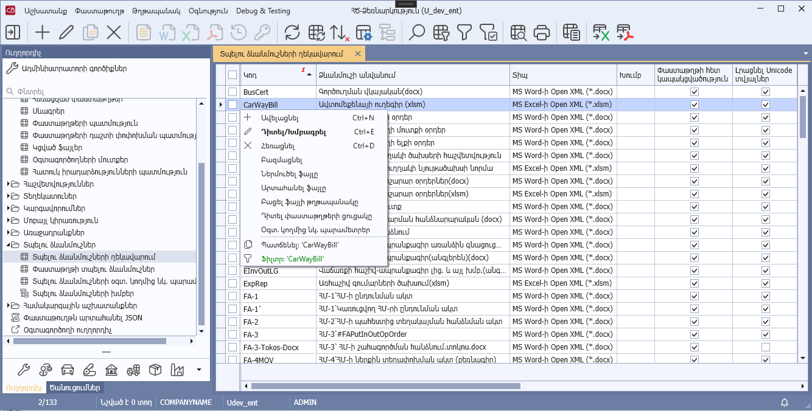

# DataView.InitContextFunctions() մեթոդ

## Նկարագիր

**Դաս՝** [DataView](../DataView.md)

```c#
public virtual PopupMenu InitContextFunctions()
```

Ստեղծում և վերադարձնում է դիտելու ձևի կոնտեքստային մենյուն։ 

Օրինակ

```c#
public override PopupMenu InitContextFunctions()
{
    var panel = this.Panel.InitContextMenu();
    panel.AddContextFunction(nameof(ViewStepReport), "Կատարման մանրամասներ", ViewStepReport, FunctionAvailability.CurrentRow);
    return panel;
}
```

