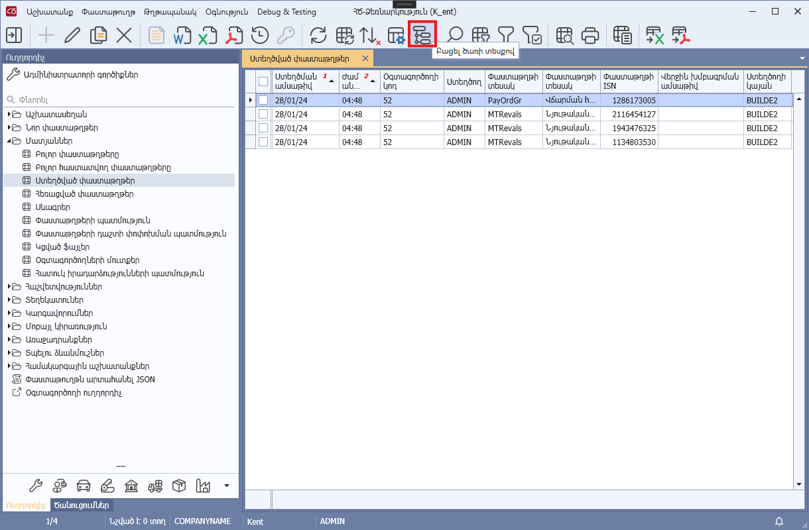
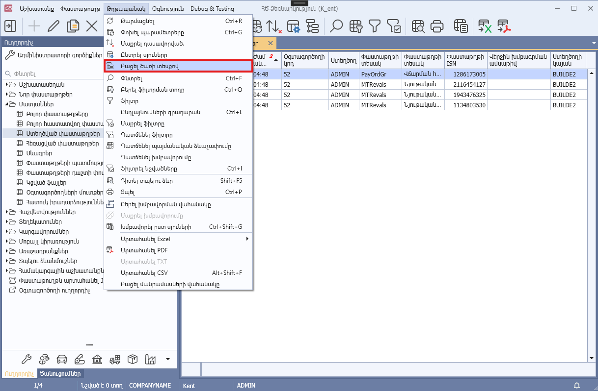

# DataView.OpenTree() մեթոդ

## Նկարագիր

**Դաս՝** [DataView](../DataView.md)

```c#
public virtual void OpenTree()
```

Նախատեսված է ընթացիկ տողի ծառային ներկայացումը ցուցադրելու համար։

Մեթոդը կանչվում է ծրագրի Toolbar-ի **«Բացել ծառի տեսքով»** կոճակը սեղմելիս, «Թղթապանակ» -> **«Բացել ծառի տեսքով»** կոնտեքստային ֆունկցիան ընտրելիս:

Ընթացիկ տողի ծառային ներկայացման բացման իրավասությունը սահմանվում է [AllowOpenTree](../Properties/AllowOpenTree.md) հատկության միջոցով։




