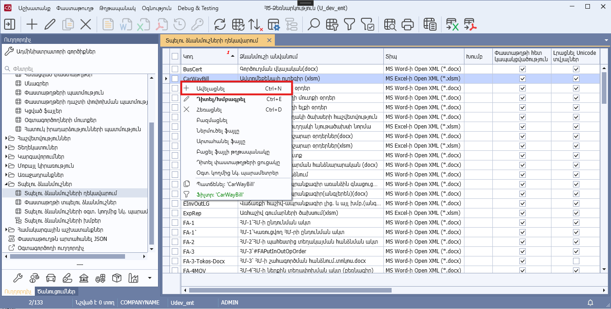
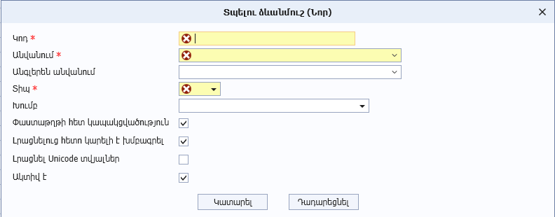

# DataView.AllowAdd հատկություն

## Նկարագիր

**Դաս՝** [DataView](../DataView.md)

```c#
public virtual bool AllowAdd { get; }
```

Սահմանում է դիտելու ձևում նոր տող ավելացնելու իրավասությունը` IsAddEnabled հատկության հետ համատեղ: 

* Եթե `AllowAdd=true` և `IsAddEnabled=true`, ապա դիտելու ձևի կոնտեքստային մենյուում ցուցադրվում է «Ավելացնել» կոնտեքստային ֆունկցիան, որը հասանելի է կատարման համար։
* Եթե `AllowAdd=true` և `IsAddEnabled=false`, ապա դիտելու ձևի կոնտեքստային մենյուում ցուցադրվում է «Ավելացնել» կոնտեքստային ֆունկցիան, սակայն հասանելի չէ կատարման համար (ցուցադրվում է readonly ռեժիմով)։
* Եթե `AllowAdd=false`, ապա դիտելու ձևի կոնտեքստային մենյուում չի ցուցադրվում «Ավելացնել» կոնտեքստային ֆունկցիան։

«Ավելացնել» կոնտեքստային ֆունկցիայի կատարման արդյունքում բացվող ավելացման պատուհանը սահմանվում է `Add` կամ `AddDocument` մեթոդներով: 
* Եթե `AllowAdd=true` և `IsAddEnabled=true` և `IsDocumentBased=false`, ապա կանչվում է `Add` մեթոդը:
* Եթե `AllowAdd=true` և `IsAddEnabled=true` և `IsDocumentBased=true`, ապա կանչվում է `AddDocument` մեթոդը:





