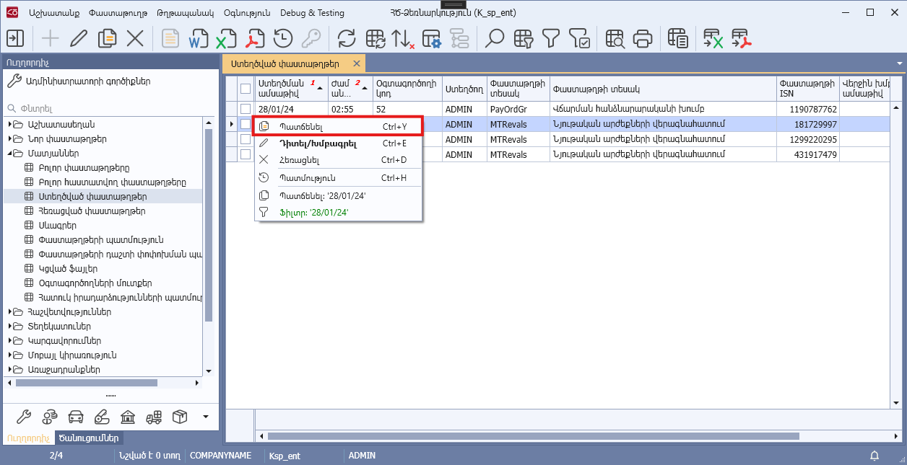
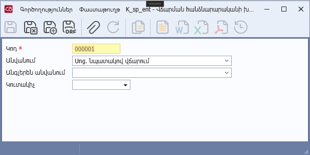

# DataView.AllowCreateCopy հատկություն

## Նկարագիր

**Դաս՝** [DataView](../DataView.md)

```c#
public virtual bool AllowCreateCopy { get; }
```

Սահմանում է դիտելու ձևի ընթացիկ տողի պատճենման իրավասությունը` [IsCreateCopyEnabled](IsCreateCopyEnabled.md) հատկության հետ համատեղ: Հատկության լռությամբ արժեքը համընկնում է [IsDocumentBased](IsDocumentBased.md) հատկության արժեքի հետ։

* Եթե `AllowCreateCopy=true` և [`IsCreateCopyEnabled=true`](IsCreateCopyEnabled.md) և ([`IsDocumentBased=false`](IsDocumentBased.md) կամ [`IsDocumentBased=true`](IsDocumentBased.md), ընթացիկ տողը պարունակող փաստաթղթի `Schema.DisableCopy=false`), ապա դիտելու ձևի կոնտեքստային մենյուում ցուցադրվում է «Պատճենել» կոնտեքստային ֆունկցիան, որը հասանելի է կատարման համար։
* Եթե `AllowCreateCopy=true` և [`IsCreateCopyEnabled=false`](IsCreateCopyEnabled.md) և ([`IsDocumentBased=false`](IsDocumentBased.md) կամ [`IsDocumentBased=true`](IsDocumentBased.md), ընթացիկ տողը պարունակող փաստաթղթի `Schema.DisableCopy=false`), ապա դիտելու ձևի կոնտեքստային մենյուում ցուցադրվում է «Պատճենել» կոնտեքստային ֆունկցիան, սակայն հասանելի չէ կատարման համար (ցուցադրվում է readonly ռեժիմով)։
* Եթե `AllowCreateCopy=false`, ապա դիտելու ձևի կոնտեքստային մենյուում չի ցուցադրվում «Պատճենել» կոնտեքստային ֆունկցիան։

«Պատճենել» կոնտեքստային ֆունկցիայի կատարման արդյունքում բացվող պատճենման պատուհանը սահմանվում է [`CreateCopy`](../Methods/CreateCopy.md) կամ `CreateCopyDocument` մեթոդներով: 
* Եթե `AllowCreateCopy=true` և [`IsCreateCopyEnabled=true`](IsCreateCopyEnabled.md) և [`IsDocumentBased=false`](IsDocumentBased.md), ապա կանչվում է [`CreateCopy`](../Methods/CreateCopy.md) մեթոդը:
* Եթե `AllowCreateCopy=true` և [`IsCreateCopyEnabled=true`](IsCreateCopyEnabled.md) և [`IsDocumentBased=true`](IsDocumentBased.md), ապա ցուցադրվում է ընթացիկ տողում պարունակվող փաստաթղթի պատճենը։



