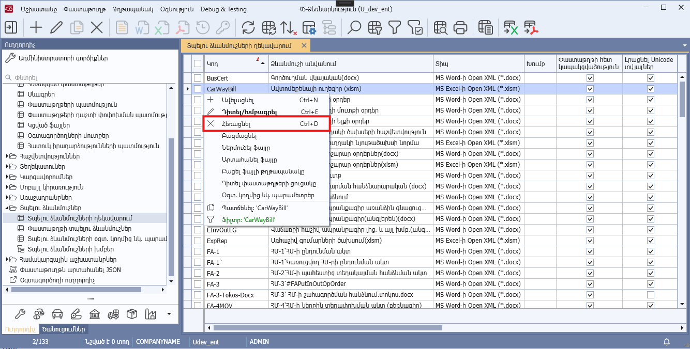
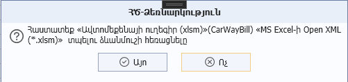

# DataView.AllowDelete հատկություն

## Նկարագիր

**Դաս՝** [DataView](../DataView.md)

```c#
public virtual bool AllowDelete { get; }
```

Սահմանում է դիտելու ձևի ընթացիկ տողի հեռացման իրավասությունը` IsDeleteEnabled հատկության հետ համատեղ: Հատկության լռությամբ արժեքը false է:

* Եթե `AllowDelete=true` և `IsDeleteEnabled=true`, ապա դիտելու ձևի կոնտեքստային մենյուում ցուցադրվում է «Հեռացնել» կոնտեքստային ֆունկցիան, որը հասանելի է կատարման համար։
* Եթե `AllowDelete=true` և `IsDeleteEnabled=false`, ապա դիտելու ձևի կոնտեքստային մենյուում ցուցադրվում է «Հեռացնել» կոնտեքստային ֆունկցիան, սակայն հասանելի չէ կատարման համար (ցուցադրվում է readonly ռեժիմով)։
* Եթե `AllowDelete=false`, ապա դիտելու ձևի կոնտեքստային մենյուում չի ցուցադրվում «Հեռացնել» կոնտեքստային ֆունկցիան։

«Հեռացնել» կոնտեքստային ֆունկցիայի կատարման արդյունքում բացվող հեռացման պատուհանը սահմանվում է `Delete` կամ `DeleteDocument` մեթոդներով: 
* Եթե `AllowDelete=true` և `IsDeleteEnabled=true` և `IsDocumentBased=false`, ապա կանչվում է `Delete` մեթոդը:
* Եթե `AllowDelete=true` և `IsDeleteEnabled=true` և `IsDocumentBased=true`, ապա կանչվում է `DeleteDocument` մեթոդը:





