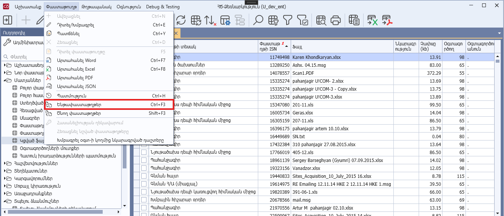

# DataView.AllowDocumentChildren հատկություն

## Նկարագիր

**Դաս՝** [DataView](../DataView.md)

```c#
public virtual bool AllowDocumentChildren { get; }
```

Սահմանում է դիտելու ձևի ընթացիկ տողի (փաստաթղթի) զավակ փաստաթղթերի դիտման իրավասությունը: Հատկության լռությամբ արժեքը համընկնում է IsDocumentBased հատկության արժեքի հետ։

Հատկության true արժեքի դեպքում **«Փաստաթուղթ»** կոնտեքստային մենյուում հասանելի է դառնում **«Ենթափաստաթղթեր»** (Ctrl + F3) կոնտեքստային ֆունկցիան։ Կատարման արդյունքում բացվում է **«Ենթափաստաթղթեր»** դիտելու ձևը, որը պարունակում է դիտելու ձևի ընթացիկ տողի (փաստաթղթի) զավակ փաստաթղթերի ցուցակը։ 



