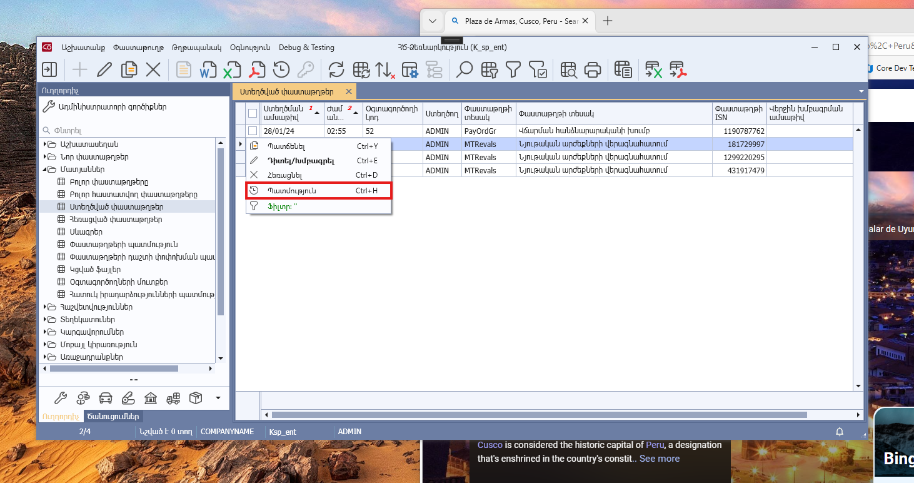
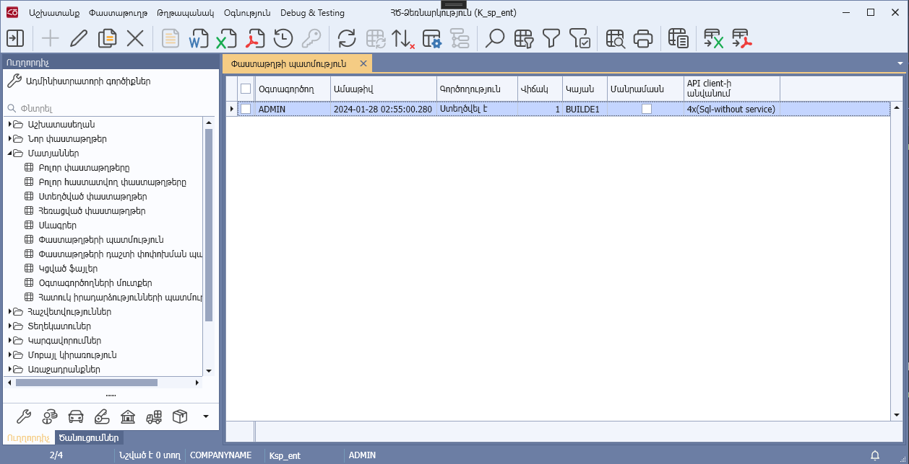

# DataView.AllowDocumentHistory հատկություն

## Նկարագիր

**Դաս՝** [DataView](../DataView.md)

```c#
public virtual bool AllowDocumentHistory { get; }
```

Սահմանում է դիտելու ձևի ընթացիկ տողի պատմությունը դիտելու իրավասությունը` AllowDocHistory համակարգային պարամետրի համատեղ: Հատկության լռությամբ արժեքը համընկնում է IsDocumentBased հատկության արժեքի հետ։

* Եթե `AllowDocumentHistory=true` և `AllowDocHistory=true`, ապա դիտելու ձևի կոնտեքստային մենյուում ցուցադրվում է «Պատմություն» կոնտեքստային ֆունկցիան, որը հասանելի է կատարման համար։

«Պատմություն» կոնտեքստային ֆունկցիայի կատարման արդյունքում բացվող պատմությունը պարունակող պատուհանը սահմանվում է `DocumentHistory` մեթոդով: 
* Եթե `AllowDocumentHistory=true` և `AllowDocHistory=true` և `IsDocumentBased=false`, ապա կանչվում է `DocumentHistory` մեթոդը:
* Եթե `AllowDocumentHistory=true` և `IsHistoryEnabled=true` և `IsDocumentBased=true`, ապա ցուցադրվում է ընթացիկ տողում պարունակվող փաստաթղթի պատմությունը։



