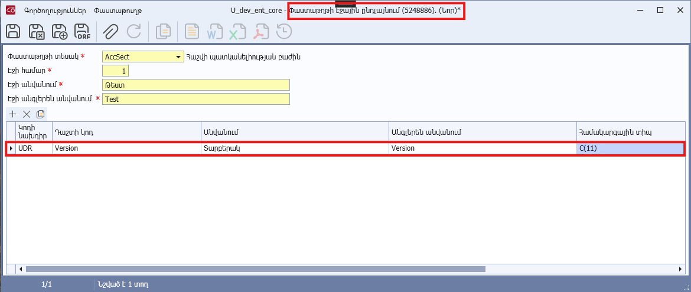
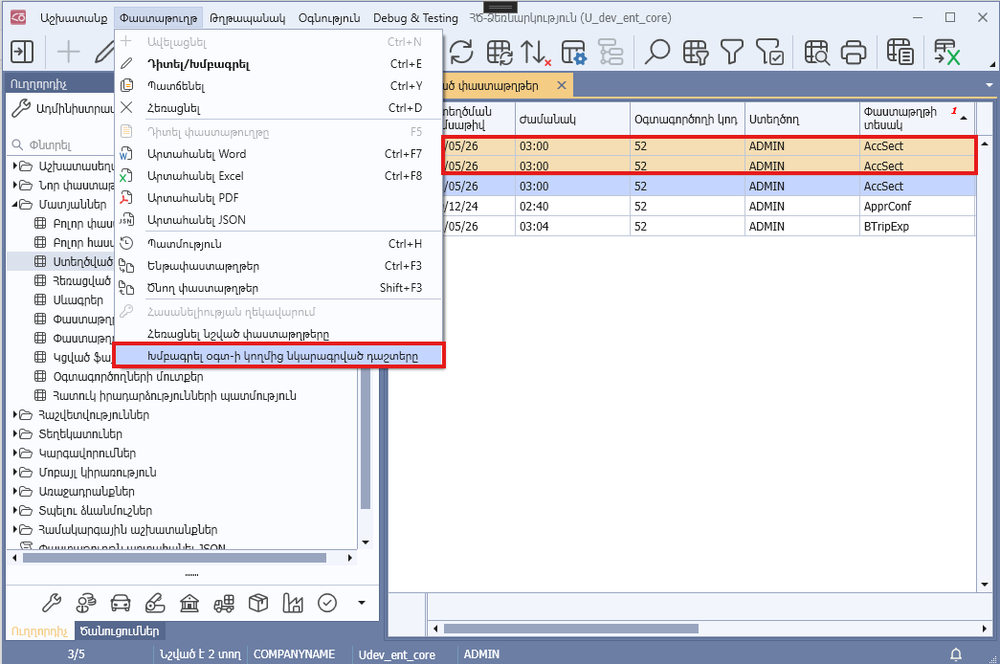
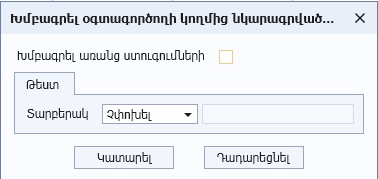

# DataView.AllowEditUDR հատկություն

## Նկարագիր

**Դաս՝** [DataView](../DataView.md)

```c#
public virtual bool AllowEditUDR { get; }
```

Սահմանում է դիտելու ձևի ընտրված տողերի (փաստաթղթերի) «Օգտագործողի կողմից նկարագրված դաշտերի» խմբագրման իրավասությունը: Հատկության լռությամբ արժեքը համընկնում է [IsDocumentBased](IsDocumentBased.md) հատկության արժեքի հետ։

Հատկության true արժեքի դեպքում **«Փաստաթուղթ»** կոնտեքստային մենյուում հասանելի է դառնում **«Խմբագրել օգտ-ի կողմից նկարագրված դաշտերը»** կոնտեքստային ֆունկցիան։ Այն տալիս է հնարավորություն խմբագրել դիտելու ձևում ընտրված տողերի (փաստաթղթերի) **«Օգտագործողի կողմից նկարագրված դաշտերը»**։ Նշված դաշտերի բացակայության դեպքում խմբագրման պատուհան չի ցուցադրվում։

**«Օգտագործողի կողմից նկարագրված դաշտ»-ի սահմանում**





**«Օգտագործողի կողմից նկարագրված դաշտ»-ի խմբագրում**




