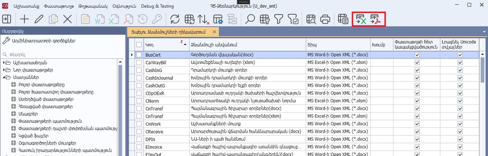
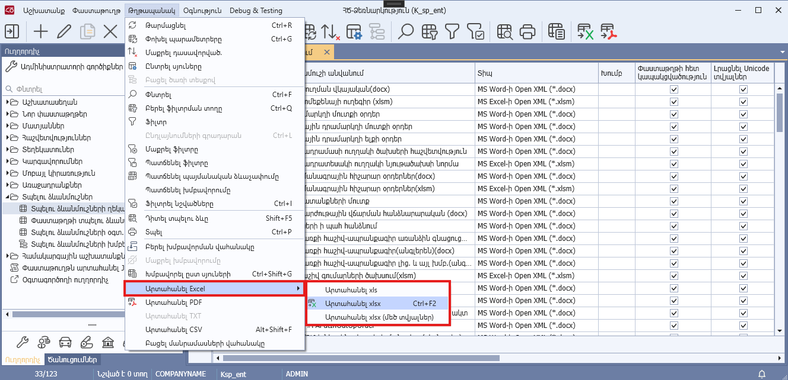
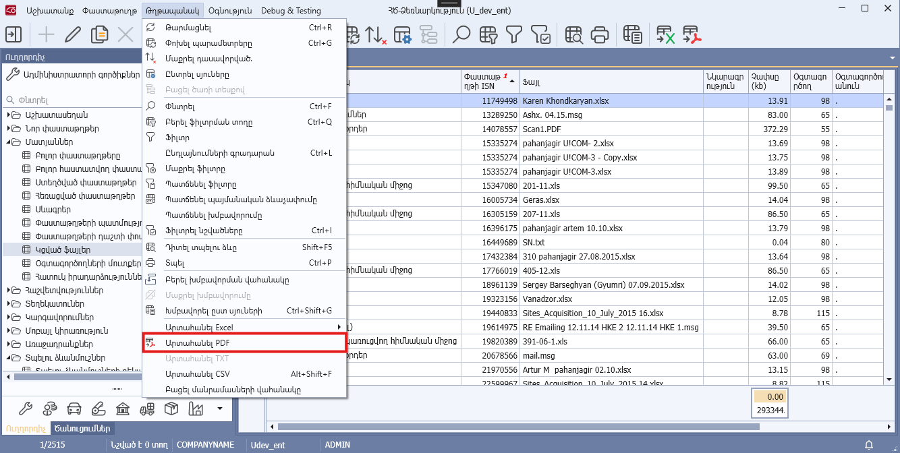

# DataView.AllowExport հատկություն

## Նկարագիր

**Դաս՝** [DataView](../DataView.md)

```c#
public virtual bool AllowExport { get; }
```

Սահմանում է դիտելու ձևի արտահանման իրավասությունը: Հատկության լռությամբ արժեքը true է:

Հատկության true արժեքի դեպքում` 
* Ծրագրի Toolbar-ում հասանելի են դառնում **«Արտահանել xlsx»** (Ctrl + F3), **«Արտահանել PDF»** կոճակները,
* **«Թղթապանակ» -> «Արտահանել Excel»** կոնտեքստային մենյուում հասանելի են դառնում **«Արտահանել xls»**, **«Արտահանել xlsx»** (Ctrl + F3), **«Արտահանել xlsx (մեծ տվյալներ)»** կոնտեքստային ֆունկցիաները, 
* **«Թղթապանակ»** կոնտեքստային մենյուում հասանելի է դառնում -> **«Արտահանել PDF»** կոնտեքստային ֆունկցիան։

Նշված ֆունկցիոնալության միջոցով հնարավոր է արտահանել դիտելու ձևի տվյալները համապատասխանաբար xls, xlsx, PDF ձևաչափերով։








