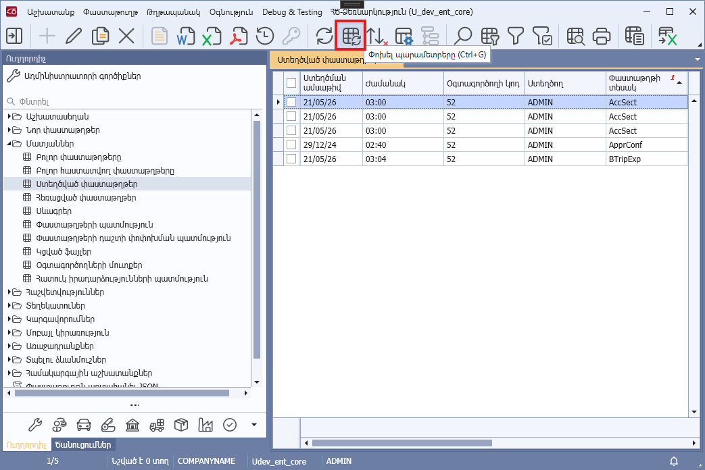
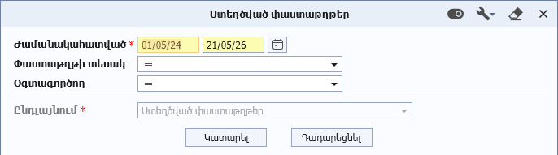

# DataView.CaptionRefreshColumns հատկություն

## Նկարագիր

**Դաս՝** [DataView](../DataView.md)

```c#
public virtual HashSet<string> CaptionRefreshColumns { get; }
```

Վերադարձնում է դիտելու ձևի այն սյուների ներքին անունների ցուցակը, որոնց վերնագրերը պետք է թարմացվեն ծրագրի Toolbar-ի **«Փոխել պարամետրերը»** կոճակով բացվող նախնական ֆիլտրման դիալոգի կատարման արդյունքում։ Հատկության լռությամբ արժեքը null է։

Սյուների նոր վերնագրերը հնարավոր է սահմանել AfterApplyDialog մեթդում։





**Օրինակ**

```c#
protected override void AfterApplyDialog(DocsDataDialog dialog, bool isRefreshMode)
{
    this.Columns[nameof(DataRow.DocsDataDialog)].Caption = "Փաստաթղթի անվանում";
}
```