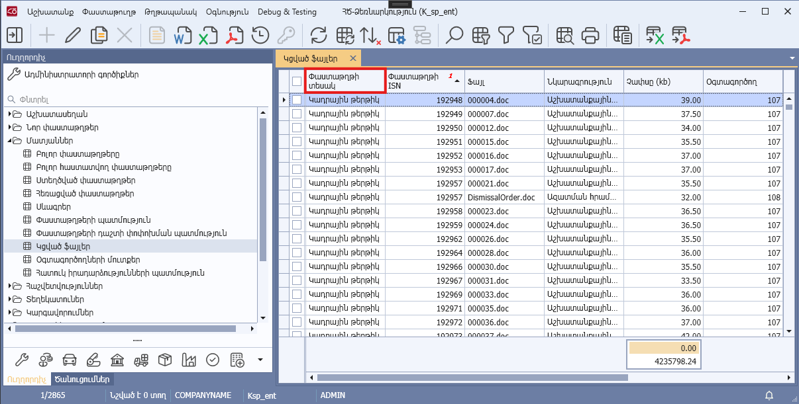
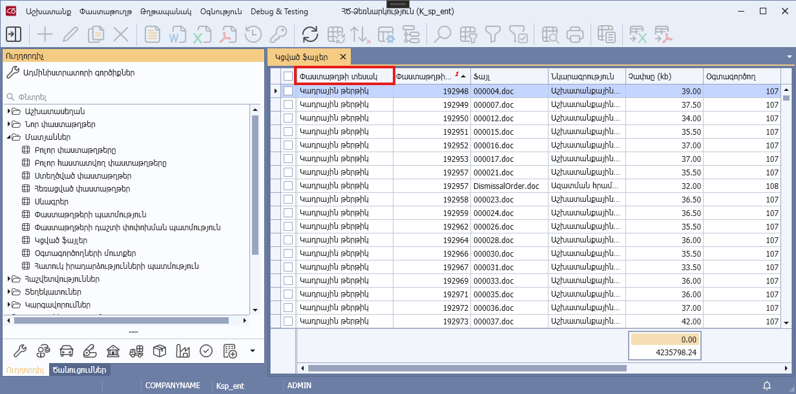

# DataView.Enable2LineHeaders հատկություն

## Նկարագիր

**Դաս՝** [DataView](../DataView.md)

```c#
public virtual bool Enable2LineHeaders { get; }
```

Սահմանում է, արդյոք դիտելու ձևում սյուների վերնագրերը ցուցադրվելու են 2 տողով։ Հատկության false արժեքի դեպքում վերնագրերը ցուցադրվում են մի տողով։ Հատկության լռությամբ արժեքը true է:

**Սյան վերնագրի ցուցադրում 2 տողով**



**Սյան վերնագրի ցուցադրում 1 տողով**



