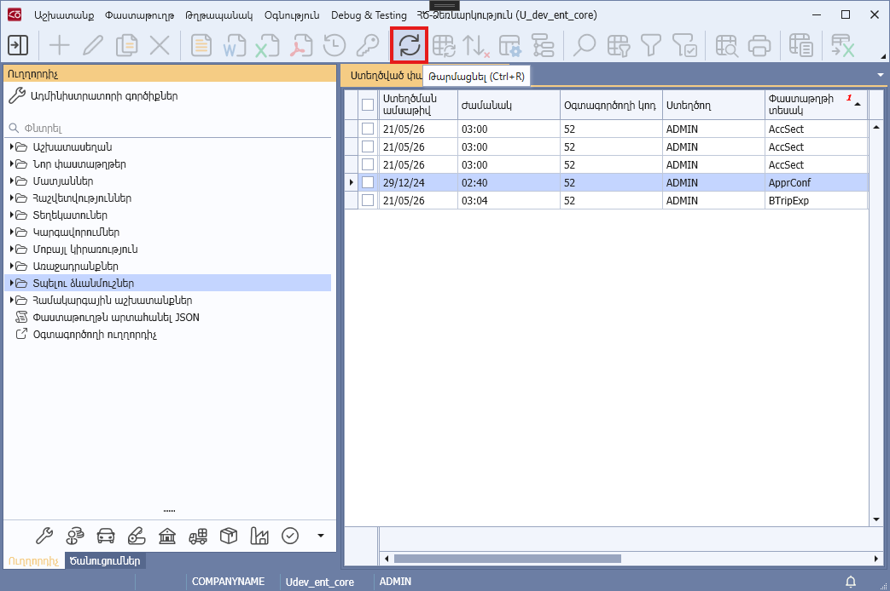
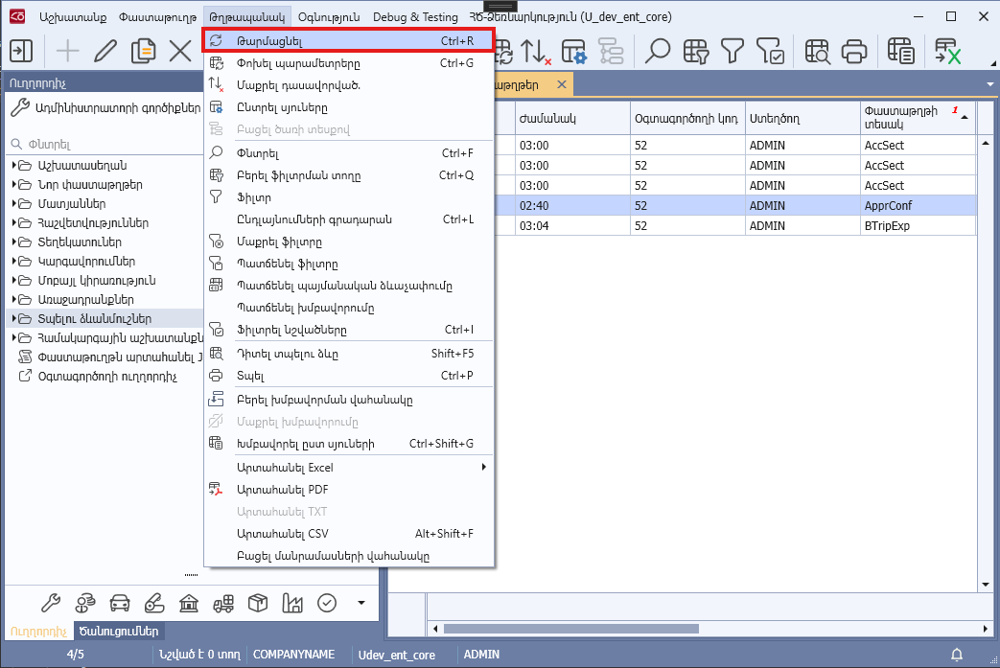

# DataView.IsUpdatable հատկություն

## Նկարագիր

**Դաս՝** [DataView](../DataView.md)

```c#
public virtual bool IsUpdatable { get; }
```

Սահմանում է դիտելու ձևի խմբագրված տվյալների թարմացման իրավասությունը։

Հատկության լռությամբ արժեքը true է, եթե՝ 
* Դիտելու ձևը տվյալները ստանում է տվյալների աղբյուրից, որի Definition.IsUpdatable=true և դիտելու ձևի տողերը ներկայացնող դասը իրականացնում է `IMatchedUpdateKey` ինտերֆեյսը։
* Կամ դիտելու ձևի տողերը ներկայացնող դասը իրականացնում է `IMatchedUpdateKey` ինտերֆեյսը։

Հատկության true արժեքի դեպքում ծրագրի Toolbar-ի «Թարմացնել» (Ctrl + R) կոճակը սեղմելիս, «Թղթապանակ» -> «Թարմացնել» (Ctrl + R) կոնտեքստային ֆունկցիան կանչելիս կամ տող(եր)ը խմբագրելիս, հեռացնելիս թարմացվում են դիտելու ձևի խմբագրված տողերը` թարմացված տվյալները արտացոլելու նպատակով։



