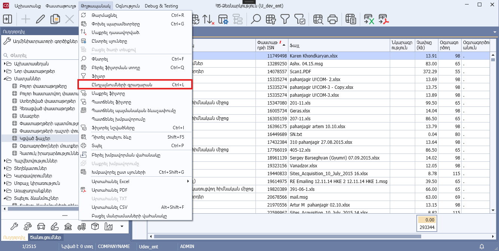
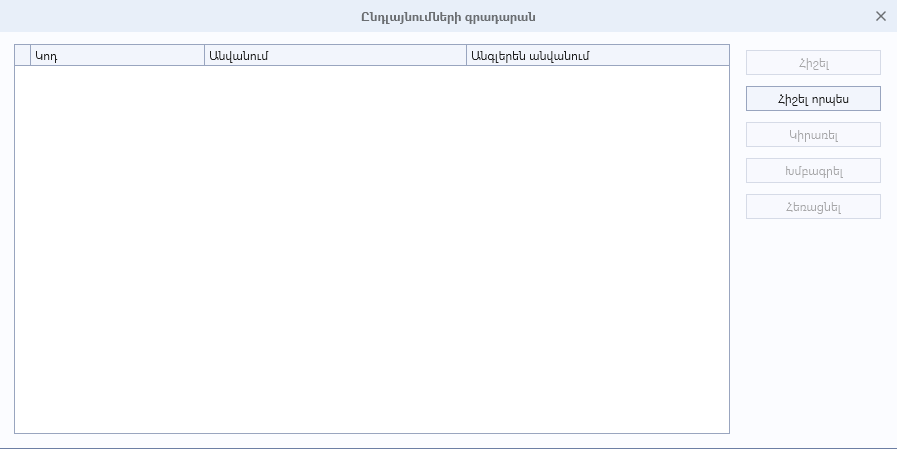

# DataView.SupportsExtensions հատկություն

## Նկարագիր

**Դաս՝** [DataView](../DataView.md)

```c#
public virtual bool SupportsExtensions { get; }
```

Սահմանում է դիտելու ձևի ընդլայնման իրավասությունը։ Հատկության լռությամբ արժեքը համընկնում է DataView ատրիբուտի SupportsExtensions հատկության արժեքի հետ։

Հատկության true արժեքի դեպքում **«Թղթապանակ»** կոնտեքստային մենյուում հասանելի է դառնում **«Ընդլայնումների գրադարան»** (Ctrl + L) կոնտեքստային ֆունկցիան։ Այն տալիս է հնարավորություն ավելացնել և կառավարել **«Օգտագործողի դիտելու ձևի ընդլայնում»**-ները (սյուների ավելացում, հեռացում, տվյալների աղբյուրի ընդլայնիչի կցում, ․․․):

**Օրինակ**

```c#
[DataView(nameof(Params), ArmenianCaption = "Պարաամետրեր",
                          EnglishCaption = "Parameters", SupportsExtensions = true)]
```



