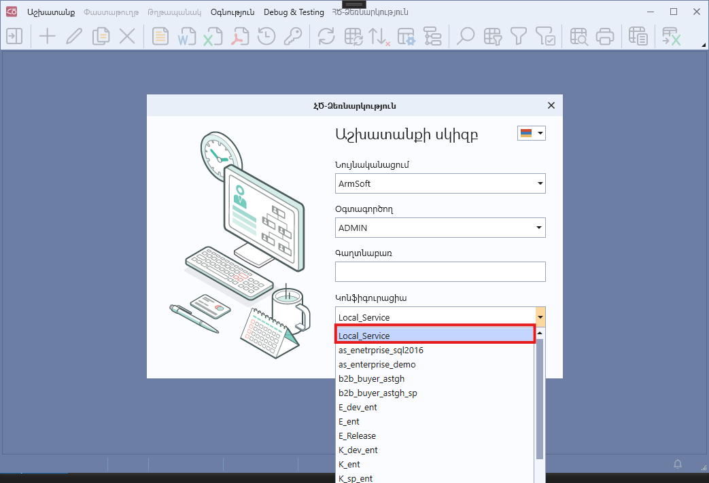

## Ներածություն

[appsettings.json](https://learn.microsoft.com/en-us/aspnet/core/fundamentals/configuration)-ը նախատեսված է 8X UI-ի աշխատանքի կարգավորման պարամետրերը սահմանելու համար, ինչպիսիք են կարգավորման սերվիսի հասցեն, OTLP մետրիկայի արտահանման կարգավորումները, ծրագրի գործարկման ռեժիմը։
Այստեղ ավելացվում են կարգավորումներ, որոնք պարունակում են գաղտնաբառ (password) կամ որոնք էականորեն փոխում են 8X սերվիսի պահվածքը։
Նման պարամետրերը նպատակահարմար չէ պահել 4X հարթակի համակարգային պարամետրերի մեջ։

## ConfigurationInfos

Այս բաժինը նախատեսված է 8X-ի կողմից օգտագործվող սերվիսների ցանկը սահմանելու համար։ Մուտքի ժամանակ օգտագործողը այս ցանկից ընտրում է, թե որ սերվիսին պիտի միանա։

```json
"ConfigurationInfos": [
    {
        "Name": "Local_Service",
        "Service": "https://localhost:1026/"
    }
]
```

**Պարամետրեր**

| Անվանում | Տվյալների տիպ | Պարտադիր/Ոչ պարտադիր | Լռությամբ արժեք | Նկարագրություն |
| --- | --- | --- | --- | --- |
| **ConfigurationInfos** | array | Պարտադիր |  | Այս բաժինը նախատեսված է սերվիսների ցանկը սահմանելու համար, որոնցից օգտագործողը ընտրում է միանալու տարբերակը։ |
| &nbsp;&nbsp;**Name** | string | Պարտադիր | — | Սերվիսի անվանումը, որը ցուցադրվում է մուտքի պատուհանում։ |
| &nbsp;&nbsp;**Service** | string | Պարտադիր | — | Սերվիսի հասցեն (URL)։ |



## OTLP

Այս բաժինը նախատեսված է OpenTelemetry Protocol-ով (OTLP) մետրիկայի հավաքագրման և արտահանման կարգավորումները սահմանելու համար։

```json
"OTLP": {
    "Metrics": {
        "PeriodicExporting": {
            "MaxExceptionLogCount": 5
        }
    }
}
```

**Պարամետրեր**

| Անվանում | Տվյալների տիպ | Պարտադիր/Ոչ պարտադիր | Լռությամբ արժեք | Նկարագրություն |
| --- | --- | --- | --- | --- |
| Metrics | object | Ոչ պարտադիր |  | Այս բաժինը նախատեսված է մետրիկաների կարգավորման համար։ |
| &nbsp;&nbsp;PeriodicExporting | object | Ոչ պարտադիր |  | Այս բաժինը նախատեսված է մետրիկաների պարբերական արտահանման կարգավորման համար։ |
| &nbsp;&nbsp;&nbsp;&nbsp;MaxExceptionLogCount | int | Ոչ պարտադիր | 5 | Մետրիկաները արտահանելիս առաջացող սխալների լոգավորման առավելագույն քանակը։ |

## ConfigurationService

Այս բաժինը նախատեսված է կոնֆիգուրացիոն սերվիսի հասցեն սահմանելու համար, որից 8X-ը ստանում է իր դինամիկ կարգավորումները (ծրագրի լոկալ թարմացման ճանապարհը, նույնականացման տվյալները, ․․․)։

```json
"ConfigurationService": "https://services8x/configuration"
```

**Պարամետրեր**

| Անվանում | Տվյալների տիպ | Պարտադիր/Ոչ պարտադիր | Լռությամբ արժեք | Նկարագրություն |
| --- | --- | --- | --- | --- |
| **ConfigurationService** | string | Պարտադիր | — | Կոնֆիգուրացիոն սերվիսի հասցեն (URL), որից ստացվում են դինամիկ կարգավորումները(ծրագրի լոկալ թարմացման ճանապարհը, նույնականացման տվյալները, ․․․)։ |

## Extensions

Այս բաժինը նախատեսված է կազմակերպության սեփական նկարագրությունները և ընդլայնումները պարունակող պրոյեկտ(ներ)ի սահմանման համար։  
Ընդլայնող պրոյեկտ(ներ)ը անհրաժեշտ է ստեղծել, կարգավորել, կառուցել dll-(ներ)ը, ապա dll-(ներ)ը տեղադրել սերվիսի ֆայլերի մոտ` ենթաթղթապանակում։

```json
"Extensions": [
  {
    "Name": "Organisation Specific Definitions project",
    "Location": "Organisation-DLLs",
    "MainAssembly": "Organisation.Specific.Definitions.dll",
    "Assemblies": [
      "Security.Authentication.dll",
      "Seq.Api.dll"
    ]
  }
],
```

**Պարամետրեր**

| Անվանում | Տվյալների տիպ | Պարտադիր/Ոչ պարտադիր | Լռությամբ արժեք | Նկարագրություն |
| --- | --- | --- | --- | --- |
| Name | string | Ոչ պարտադիր | MainAssembly | Ցուցադրվող անուն (մասնավորապես լոգերում)։ Փոխանցված չլինելու դեպքում օգտագործվում է `MainAssembly`-ն։ |
| **Location** | string | Պարտադիր | - | Ընդլայնումների dll-ի հարաբերական ճանապարհը սերվիսի թղթապանակի նկատմամբ, կամ ամբողջական ճանապարհը։ Օրինակ՝ եթե ընդլայնումների dll-ը տեղադրվել է սերվիսի թղթապանակի «Organisation-DLLs» անունով ենթաթղթապանակում, ապա **Location**-ի արժեքը պետք է լինի `"Organisation-DLLs"`։ **Համակարգի տարբերակը փոխելուց անհրաժեշտ է ընդլայնող պրոյեկտը կրկին կառուցել և ստացված dll-ով փոխարինել հինը։** |
| **MainAssembly** | string | Պարտադիր | - | Ընդլայնումների dll-ի անունը, որը պետք է տեղակայված լինի **Location**-ում նշված հասցեում։ Օրինակ՝ **"Organisation.Specific.Definitions.dll"**։ |
| Assemblies | string[] | Ոչ պարտադիր |  | dll-ների անունների զանգված, որոնք անհրաժեշտ են **MainAssembly**-ում նշված dll-ին աշխատանքի համար։ dll-ները պետք է տեղակայված լինեն **Location**-ում նշված հասցեում։ |

## UseServiceForUpdateProcess

Թարմացման գործընթացում կոնֆիգուրացիոն սերվիսի օգտագործման հայտանիշ։

```json
"UseServiceForUpdateProcess": true
```

**Պարամետրեր**

| Անվանում | Տվյալների տիպ | Պարտադիր/Ոչ պարտադիր | Լռությամբ արժեք | Նկարագրություն |
| --- | --- | --- | --- | --- |
| UseServiceForUpdateProcess | bool | Ոչ պարտադիր | true | Պարամետրի true արժեքի դեպքում թարմացման ընթացքը կազմակերպվում է կոնֆիգուրացիոն սերվիսի միջոցով, հակառակ դեպքում՝ ուղղակիորեն թարմացման աղբյուրից։ |

## DisableCertificateValidation

SSL/TLS սերտիֆիկատների վավերականացման անջատման հայտանիշ։ Նախատեսված է միայն թեստավորման միջավայրերի համար։

```json
"DisableCertificateValidation": false
```

**Պարամետրեր**

| Անվանում | Տվյալների տիպ | Պարտադիր/Ոչ պարտադիր | Լռությամբ արժեք | Նկարագրություն |
| --- | --- | --- | --- | --- |
| DisableCertificateValidation | bool | Ոչ պարտադիր | false | Պարամետրի true արժեքի դեպքում սերվերին միանալիս SSL/TLS սերտիֆիկատների վավերականացումը անջատվում է։ |

## UseRegistryForDialogValues

Երկխոսության պատուհանների դաշտերի վերջին արժեքները Windows registry-ում պահպանելու հայտանիշ։

```json
"UseRegistryForDialogValues": false
```

**Պարամետրեր**

| Անվանում | Տվյալների տիպ | Պարտադիր/Ոչ պարտադիր | Լռությամբ արժեք | Նկարագրություն |
| --- | --- | --- | --- | --- |
| UseRegistryForDialogValues | bool | Ոչ պարտադիր | false | Պարամետրի true արժեքի դեպքում երկխոսության պատուհանների դաշտերի վերջին արժեքները պահպանվում են Windows registry-ում, հակառակ դեպքում՝ տվյալների բազայում։ |

## DisableHWAcceleration

Ապարատային արագացման (hardware acceleration) անջատման հայտանիշ։

```json
"DisableHWAcceleration": false
```

**Պարամետրեր**

| Անվանում | Տվյալների տիպ | Պարտադիր/Ոչ պարտադիր | Լռությամբ արժեք | Նկարագրություն |
| --- | --- | --- | --- | --- |
| DisableHWAcceleration | bool | Ոչ պարտադիր | false | Պարամետրի true արժեքի դեպքում WPF UI-ի ապարատային արագացումը անջատվում է։ Օգտակար է վիդեոքարտի/դրայվերների խնդիրների առկայության դեպքում։ |

## ProcessLaunch

Այս բաժինը նախատեսված է ծրագրի գործարկման ռեժիմը կարգավորելու համար։

```json
"ProcessLaunch": {
    "Mode": "Default"
}
```

**Պարամետրեր**

| Անվանում | Տվյալների տիպ | Պարտադիր/Ոչ պարտադիր | Լռությամբ արժեք | Նկարագրություն |
| --- | --- | --- | --- | --- |
| ProcessLaunch | object | Ոչ պարտադիր | - | Այս բաժինը թույլ է տալիս սահմանափակել նույն ծրագրի բազմակի բացումը, եթե օգտագործողը մի քանի անգամ սեղմում է ծրագիրը։ |
| Mode | string | Ոչ պարտադիր | Default | Սահմանում է 8X համակարգի մեկնարկը ռեժիմը։ <br> Default – Սովորական վարքագիծ, սահմանափակում չկա։ <br> BlockDuringStartup – Եթե համակարգը նույն ճանապարհով արդեն գործարկվել է, բայց մուտքը դեռ չի կատարվել, նոր լոգինի պատուհան չի բացվում և ցուցադրվում է հետևյալ սխալի հաղորդագրությունը՝ «Արդեն առկա է համակարգի ակտիվ մուտքի պատուհան։ Խնդրում ենք ավարտել գործողությունը այդ պատուհանում»։ <br> BlockSecondInstanceFromSamePath – Եթե համակարգը նույն ճանապարհով արդեն գործարկվել է, երկրորդ instance գործարկել չի թույլատրվում և ցուցադրվում է հետևյալ սխալի հաղորդագրությունը՝ «Չի թույլատրվում գործարկել մեկից ավելի համակարգ»։ |

## Տե՛ս նաև
- [All About AppSettings In ASP.NET Core](https://www.c-sharpcorner.com/article/all-about-appsettings-in-asp-net-core/)
- [Configuration in .NET](https://learn.microsoft.com/en-us/dotnet/core/extensions/configuration)
- [Configuration in ASP.NET Core](https://learn.microsoft.com/en-us/aspnet/core/fundamentals/configuration/)
- [OpenTelemetry .NET — OTLP Exporter](https://opentelemetry.io/docs/languages/net/exporters/)