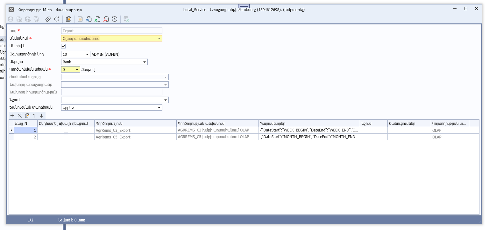
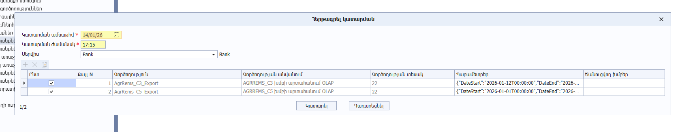
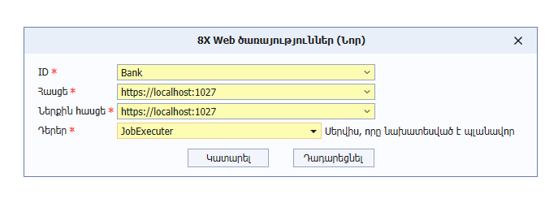
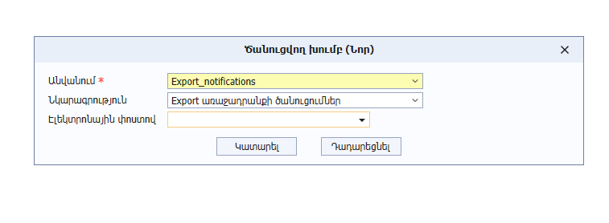

## Առաջադրանքի ձևանմուշ

| Անվանում               | Նկարագրություն                                                       |
| ---------------------- | -------------------------------------------------------------------- |
| Կոդ                    | Առաջադրանքի կոդը։ Առավելագույն երկարությունը 32 նիշ է։                   |
| Անվանում               | Առաջադրանքի անվանումը։ Առավելագույն երկարությունը 50 նիշ է։              |
| Ակտիվ է                | Առաջադրանքի ակտիվության հայտանիշ։        |
| Օգտագործողի կոդ        | Առաջադրանքը կատարող օգտագործողի կոդը։ Նշված օգտագործողի համար բացվում է սեսսիա, որը նախատեսված է առաջադրանքի կատարման համար։                               |
| Սերվիս                 | Այն վեբ ծառայության (սերվիսի) id-ն, որի վրա գործարկվել է տվյալ առաջադրանքը։   Վեբ ծառայությունները սահմանվում են «Ադմինիստրատորի աշտ» -> «Համակարգային աշխատանքներ» -> **«8X Web ծառայություններ»** հաշվետվության **Ավելացնել** կոնտեքստային ֆունկցիայով։   Սահմանվող վեբ ծառայության (սերվիսի) դերը անհրաժեշտ է նշել **JobExecuter**՝ ծառայության միջոցով առաջադրանքների գործարկումը թույլատրելու նպատակով:      |
| Գործարկման տեսակ       | Սահմանում է առաջադրանքի գործարկման եղանակը։ **0** - Ձեռքով,   **1** - ժամանակացույց,   **2** - Առաջադրանքից հետո,   **3** - Իրադարձությունից հետո։    |
| Ժամանակացույց          | Առաջադրանքի կատարման ժամանակացույցի կոդը։   Առաջադրանքի կատարման ժամանակացույցերը սահմանվում են «Ադմինիստրատորի աշտ» -> «Համակարգային աշխատանքներ» -> **«Առաջադրանքների ժամանակացույցներ»** հաշվետվության **Ավելացնել** կամ **Պատճենել** կոնտեքստային ֆունկցիայով:   **Կարևոր․** Առաջադրանքը հնարավոր է գործարկել Ձեռքով/ժամանակացույցով/Առաջադրանքից հետո/Իրադարձությունից հետո տարբերակներից միայն մեկով։              |
| Նախորդ առաջադրանք      | Այն առաջադրանքի կոդը, որի բարեհաջող ավարտից հետո գործարկվելու է ընթացիկ առաջադրանքը։                         |
| Նախորդ իրադարձություն  | Այն իրադարձության կոդը, որի բարեհաջող ավարտից հետո գործարկվելու է ընթացիկ առաջադրանքը։                          |
| Նշում                  | Նշումներ առաջադրանքի մասին։              |
| Ծանուցման տարբերակ     | Առաջադրանքի ծանուցման տարբերակը։   **0** - Երբեք։   **1** - Միայն սխալների դեպքում։   **2** - Միշտ։   **2** արժեքի դեպքում ծանուցումներ են ուղարկվում առաջադրանքի կատարման սկզբի, բարեհաջող ավարտի, սխալների առաջացման և ձախողման դեպքերում, իսկ **1** արժեքի դեպքում` միայն սխալների առաջացման և ձախողման դեպքերում։                                 |

Առաջադրանքի կատարման քայլեր

| Անվանում               | Նկարագրություն                                                       |
| ---------------------- | -------------------------------------------------------------------- |
| Քայլ N                 | Գործողության համարը։                                   |
| Ընդհատել սխալի դեպքում | Գործողությունում սխալների առաջացման դեպքում դադարեցման հայտանիշ։ |
| Գործողություն          | Գործողությունում կանչվող տվյալների մշակման հարցման (DPR) կոդը:                        |
| Գործողության անվանում  | Կանչվող տվյալների մշակման հարցման (DPR) հայերեն անվանումը: Լրացվում է ավտոմատ կերպով՝ «Գործողություն» դաշտը լրացնելիս և ենթակա չէ խմբագրման։          |
| Պարամետրեր             | Կանչվող տվյալների մշակման հարցման (DPR) պարամետրերը։                 |
| Գործողության տեսակ     | Կանչվող տվյալների մշակման հարցման (DPR) տեսակը (սատարվում են միայն **JobElement**, **Olap** տեսակները)։ Լրացվում է ավտոմատ կերպով՝ «Գործողություն» դաշտը լրացնելիս և ենթակա չէ խմբագրման։   |

## Հերթագրել կատարման

Այս փաստաթուղթը ստեղծվում է «առաջադրանքների ձևանմուշներ» դիտելու ձևի «Հերթագրել կատարման» կոնտեքստային ֆունկցիայի միջոցով։

| Անվանում               | Նկարագրություն                                                       |
| ---------------------- | -------------------------------------------------------------------- |
| Կատարման ամսաթիվ | առաջադրանքի կատարման ամսաթիվը։ |
| Կատարման ժամանակ | առաջադրանքի կատարման ժամանակը hh:mm ֆորմատով։ |
| Սերվիս                 | Այն վեբ ծառայության (սերվիսի) id-ն, որի վրա գործարկվել է տվյալ առաջադրանքը։   Վեբ ծառայությունները սահմանվում են «Ադմինիստրատորի աշտ» -> «Համակարգային աշխատանքներ» -> **«8X Web ծառայություններ»** հաշվետվության **«Ավելացնել»** կոնտեքստային ֆունկցիայով։   Սահմանվող վեբ ծառայության (սերվիսի) դերը անհրաժեշտ է նշել **JobExecuter**՝ ծառայության միջոցով առաջադրանքների գործարկումը թույլատրելու նպատակով:      |

Առաջադրանքի կատարման քայլեր

Այս աղյուսակի սյուները լրացվում են «Առաջադրանքի ձևանմուշ» փաստաթղթի համապատասխան սյուների արժեքներով։ Սյուների հիմնական մասը ենթակա չեն խմբագրման, խմբագրելի են միայն «Պարամետրեր», «Ծանուցվող խմբեր» և «Ընտ․» սյուները։

| Անվանում               | Նկարագրություն                                                       |
| ---------------------- | -------------------------------------------------------------------- |
| Ընտ․                   | Գործողության կատարման հայտանիշ։                                   |
| Քայլ N                 | Գործողության համարը։                                   |
| Ընդհատել սխալի դեպքում | Գործողությունում սխալների առաջացման դեպքում դադարեցման հայտանիշ։ |
| Գործողություն          | Գործողությունում կանչվող տվյալների մշակման հարցման (DPR) կոդը:                        |
| Գործողության անվանում  | Կանչվող տվյալների մշակման հարցման (DPR) հայերեն անվանումը: Լրացվում է ավտոմատ կերպով՝ «Գործողություն» դաշտը լրացնելիս և ենթակա չէ խմբագրման։          |
| Պարամետրեր             | Կանչվող տվյալների մշակման հարցման (DPR) պարամետրերը։                 |
| Գործողության տեսակ     | Կանչվող տվյալների մշակման հարցման (DPR) տեսակը (սատարվում են միայն **JobElement**, **Olap** տեսակները)։ Լրացվում է ավտոմատ կերպով՝ «Գործողություն» դաշտը լրացնելիս և ենթակա չէ խմբագրման։   |

## 8X վեբ ծառայություններ

վեբ ծառայությունները կիրառվում են «Առաջադրանքների ձևանմուշներ»-ում՝ նշելու համար այն սերվիսը որի վրա գործարկվել է տվյալ առաջադրանքը և «սերվիսային ասինխրոն պրոցեսներ»-ում՝ պրոցեսները ըստ սերվիսների տարանջատելու նպատակով։

| Անվանում | Նկարագրություն |
|---------|----------------|
| ID | Վեբ ծառայության (սերվիսի) նույնականացուցիչը (id): |
| Հասցե | Վեբ ծառայության (սերվիսի) հասցեն։ |
| Ներքին հասցե | Վեբ ծառայության (սերվիսի) լոկալ հասցեն։ |
| Դեր | Վեբ ծառայության (սերվիսի) դերը։ Վեբ ծառայությունը (սերվիսի) միաժամանակ կարող է ունենալ մեկ և ավելի դերեր։    **Desktop** - Սերվիս, որը սպասարկում է desktop-ից եկող հարցումները:   **Integration** - Սերվիս, որը կապ է ապահովում արտաքին համակարգերի կամ այլ սերվիսների հետ:   **JobExecutor** - Սերվիս, որը նախատեսված է պլանավորված կամ ֆոնային առաջադրանքների կատարման համար։   **Worker** - Ֆոնային պրոցես, որը կատարում է ծանր կամ երկարաժամկետ հաշվարկներ կամ հաղորդագրությունների մշակում։  |

# Ընդհատել առաջադրանքը

«Ընդհատել առաջադրանքը» կոնտեքստային ֆունկցիան կարելի է կանչել միայն այն հերթագրված առաջադրանքների համար, որոնք դեռ չեն գտնվում կատարման ընթացքում (միայն հերթագրված վիճակում գտնվող առաջադրանքների համար), հակառակ դեպքում կառաջանա սխալ։

# Ծանուցման խումբ

Ծանուցման խումբը նախատեսված է առաջադրանքներում կիրառման համար։ Աահմանում է այն օգտագործողների խումբը, որոնց առաջադրանքների կատարման ընթացքում ուղարկվելու են ծանուցումներ։ սահմանումից հետո ծանուցման խումբը անհրաժեշտ է կապակցել առաջադրանքին՝ «Առաջադրանքների ձևանմուշ» փաստաթղթի միջոցով։

| Անվանում | Նկարագրություն |
|---------|----------------|
| Անվանում | ծանուցման խմբի նույնականացուցիչը (id): |
| Նկարագրություն | ծանուցման խմբի նկարագրությունը։ |
| Էլեկտրոնային փոստով | այն օգտագործողների կոդերի ցուցակը, որոնք ստանալու են ծանուցում։ այս control-ում հնարա |

