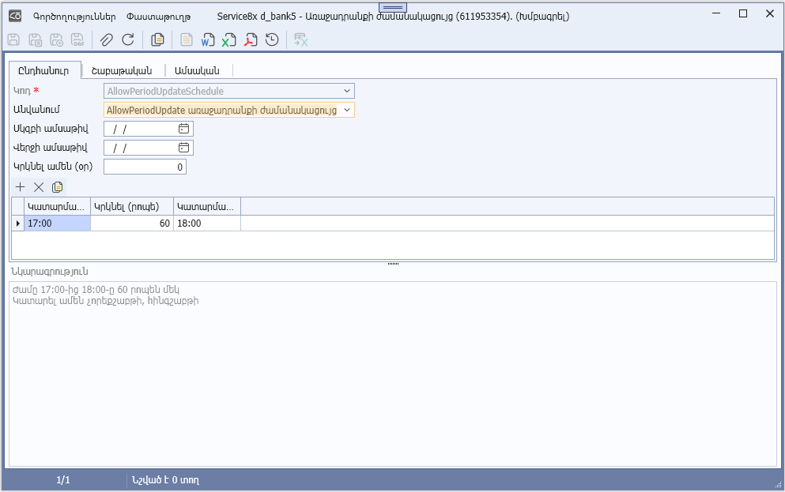
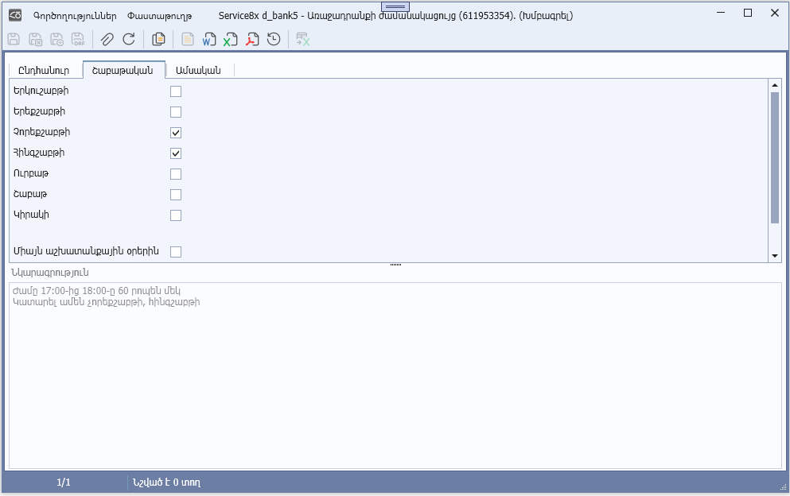
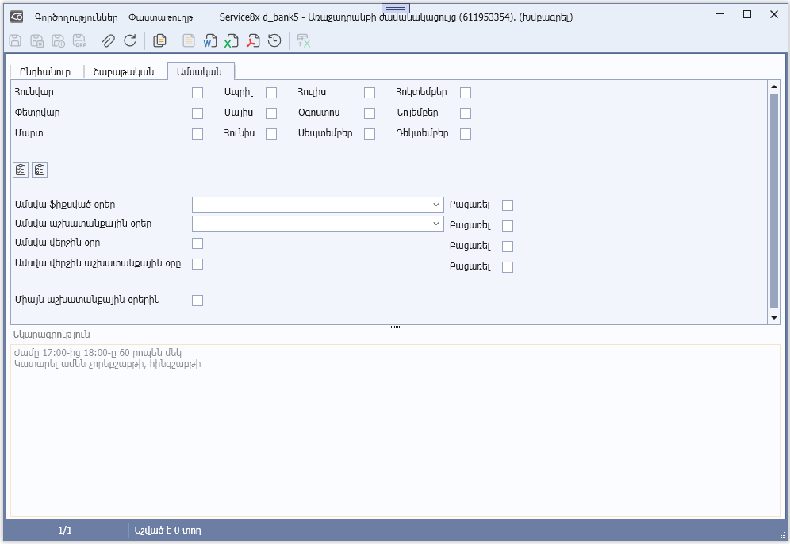
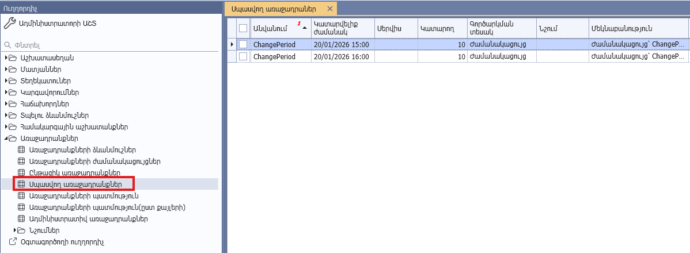
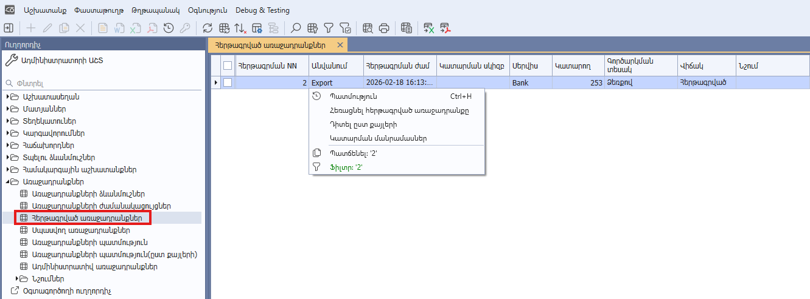
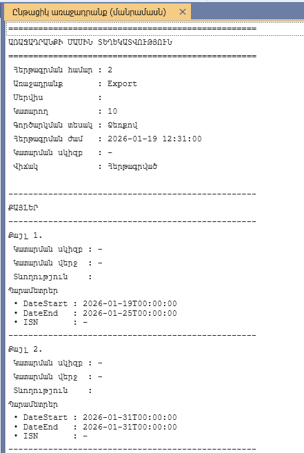
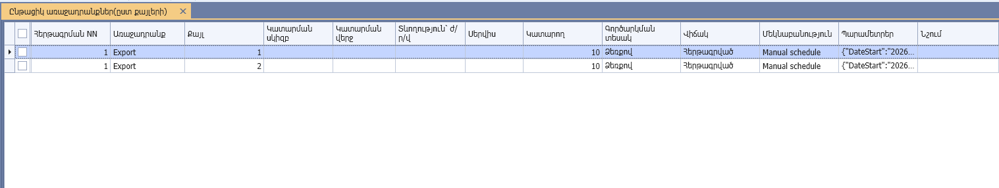
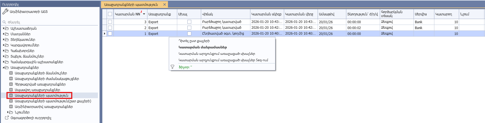
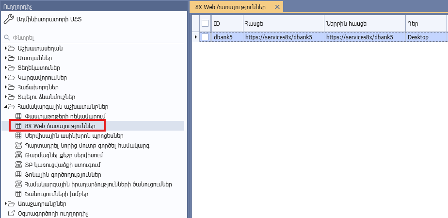

## Բովանդակություն

- [Առաջադրանքների ձևանմուշներ](#առաջադրանքների-ձևանմուշներ)
  - [Առաջադրանքի ձևանմուշ](#առաջադրանքի-ձևանմուշ)
  - [Առաջադրանքի կատարման քայլեր](#առաջադրանքի-կատարման-քայլեր)
  - [Ծանուցումներ](#ծանուցումներ)
  - [Հերթագրել կատարման](#հերթագրել-կատարման)
- [Առաջադրանքի ժամանակացույց](#առաջադրանքի-ժամանակացույց)
- [Սպասվող առաջադրանքներ](#սպասվող-առաջադրանքներ)
- [Հերթագրված առաջադրանքներ](#հերթագրված-առաջադրանքներ)
  - [Ընդհատել առաջադրանքը](#ընդհատել-առաջադրանքը)
  - [Կատարման մանրամասներ](#կատարման-մանրամասներ)
  - [Դիտել ըստ քայլերի](#դիտել-ըստ-քայլերի)
- [Առաջադրանքների պատմություն](#առաջադրանքների-պատմություն)
  - [Կատարման մանրամասներ](#կատարման-մանրամասներ)
  - [Դիտել ըստ քայլերի](#դիտել-ըստ-քայլերի)
  - [Կատարման ընթացքում առաջացած սխալներ](#կատարման-ընթացքում-առաջացած-սխալներ)
  - [Կատարման ընթացքում առաջացած սխալներ Seq-ում](#կատարման-ընթացքում-առաջացած-սխալներ-seq-ում)
- [8X վեբ ծառայություններ](#8x-վեբ-ծառայություններ)
- [Ծանուցման խումբ](#ծանուցման-խումբ)
- [Համակարգային իրադարձությունների ծանուցումներ](#համակարգային-իրադարձությունների-ծանուցումներ)

## Առաջադրանքների ձևանմուշներ

Այս դիտելու ձևը գտնվում է «Ադմինիստրատորի աշտ» -> «Համակարգային աշխատանքներ» -> «Առաջադրանքներ» թղթապանակում: Նախատեսված է [առաջադրանքի ձևանմուշների](#առաջադրանքի-ձևանմուշ) ստեղծման, խմբագրման, հեռացման և [հերթագրման](#հերթագրել-կատարման) համար։

### Առաջադրանքի ձևանմուշ

Այս փաստաթուղթը ստեղծվում է [«Առաջադրանքների ձևանմուշներ»](#առաջադրանքների-ձևանմուշներ) դիտելու ձևի «Ավելացնել» կոնտեքստային ֆունկցիայի միջոցով։

| Անվանում               | Նկարագրություն                                                       |
| ---------------------- | -------------------------------------------------------------------- |
| Կոդ                    | Առաջադրանքի կոդը։ Առավելագույն երկարությունը 32 նիշ է։                   |
| Անվանում               | Առաջադրանքի անվանումը։ Առավելագույն երկարությունը 50 նիշ է։              |
| Ակտիվ է                | Առաջադրանքի ակտիվության հայտանիշ։        |
| Օգտագործողի կոդ        | Առաջադրանքը կատարող օգտագործողի կոդը։ Նշված օգտագործողի համար բացվում է սեսիա, որը նախատեսված է առաջադրանքի կատարման համար։                               |
| Սերվիս                 | Այն վեբ ծառայության (սերվիսի) id-ն, որի վրա գործարկվել է տվյալ առաջադրանքը։   Վեբ ծառայությունները սահմանվում են «Ադմինիստրատորի աշտ» -> «Համակարգային աշխատանքներ» -> **«8X Web ծառայություններ»** հաշվետվության **Ավելացնել** կոնտեքստային ֆունկցիայով։   Սահմանվող վեբ ծառայության (սերվիսի) դերը անհրաժեշտ է նշել **JobExecuter**՝ ծառայության միջոցով առաջադրանքների գործարկումը թույլատրելու նպատակով:      |
| Գործարկման տեսակ       | Սահմանում է առաջադրանքի գործարկման եղանակը։   **0** - Ձեռքով,   **1** - ժամանակացույց,   **2** - Առաջադրանքից հետո,   **3** - Իրադարձությունից հետո։    |
| Ժամանակացույց          | Առաջադրանքի կատարման ժամանակացույցի կոդը։   Առաջադրանքի կատարման ժամանակացույցերը սահմանվում են «Ադմինիստրատորի աշտ» -> «Համակարգային աշխատանքներ» -> **«Առաջադրանքների ժամանակացույցներ»** հաշվետվության **Ավելացնել** կամ **Պատճենել** կոնտեքստային ֆունկցիայով:   **Կարևոր․** Առաջադրանքը հնարավոր է գործարկել Ձեռքով/ժամանակացույցով/Առաջադրանքից հետո/Իրադարձությունից հետո տարբերակներից միայն մեկով։              |
| Նախորդ առաջադրանք      | Այն առաջադրանքի կոդը, որի բարեհաջող ավարտից հետո գործարկվելու է ընթացիկ առաջադրանքը։                         |
| Նախորդ իրադարձություն  | Այն իրադարձության կոդը, որի բարեհաջող ավարտից հետո գործարկվելու է ընթացիկ առաջադրանքը։                          |
| Նշում                  | Նշումներ առաջադրանքի մասին։ Նշումները սահմանվում են «Ադմինիստրատորի աշտ» -> «Առաջադրանքներ» -> «Նշումներ» -> **«Նշումներ առաջադրանքների համար»** հաշվետվության **Ավելացնել** կոնտեքստային ֆունկցիայով։            |
| Ծանուցման տարբերակ     | Առաջադրանքի ծանուցման [կարգավորումները](#ծանուցումներ)։    |

### Առաջադրանքի կատարման քայլեր

| Անվանում               | Նկարագրություն                                                       |
| ---------------------- | -------------------------------------------------------------------- |
| Քայլ N                 | Գործողության համարը։                                   |
| Ընդհատել սխալի դեպքում | Գործողությունում սխալների առաջացման դեպքում դադարեցման հայտանիշ։ |
| Գործողություն          | Գործողությունում կանչվող տվյալների մշակման հարցման (DPR) կոդը:                        |
| Գործողության անվանում  | Կանչվող տվյալների մշակման հարցման (DPR) հայերեն անվանումը: Լրացվում է ավտոմատ կերպով՝ «Գործողություն» դաշտը լրացնելիս և ենթակա չէ խմբագրման։          |
| Պարամետրեր             | Կանչվող տվյալների մշակման հարցման (DPR) պարամետրերը։                 |
| Նշում                  | Նշումներ առաջադրանքի քայլի մասին։ Նշումները սահմանվում են «Ադմինիստրատորի աշտ» -> «Առաջադրանքներ» -> «Նշումներ» -> **«Նշումներ առաջադրանքների քայլերի համար»** հաշվետվության **Ավելացնել** կոնտեքստային ֆունկցիայով։                |
| Ծանուցումներ           | Գործողության ծանուցման [կարգավորումները](#ծանուցումներ)։   |
| Գործողության տեսակ     | Կանչվող տվյալների մշակման հարցման (DPR) տեսակը (սատարվում են միայն **JobElement**, **Olap** տեսակները)։ Լրացվում է ավտոմատ կերպով՝ «Գործողություն» դաշտը լրացնելիս և ենթակա չէ խմբագրման։   |

### Ծանուցումներ

| Անվանում               | Նկարագրություն                                                       |
| ---------------------- | -------------------------------------------------------------------- |
| Ծանուցման տարբերակ     | Առաջադրանքի ծանուցման տարբերակը։   **0** - Երբեք։   **1** - Միայն սխալների դեպքում։   **2** - Միշտ։   **2** արժեքի դեպքում ծանուցումներ են ուղարկվում առաջադրանքի կատարման սկզբի, բարեհաջող ավարտի, սխալների առաջացման և ձախողման դեպքերում, իսկ **1** արժեքի դեպքում` միայն սխալների առաջացման և ձախողման դեպքերում։      |
| Ծանուցվող խմբեր     | Ծանուցվող խմբերի կոդերի ցուցակը։ Ծանուցվող խմբերը սահմանվում են «Ադմինիստրատորի աշտ» -> «Համակարգային աշխատանքներ» -> [**«Ծանուցումների խմբեր»**](#ծանուցման-խումբ) հաշվետվության **Ավելացնել** կոնտեքստային ֆունկցիայով:     |

### Հերթագրել կատարման

Այս դիալոգը ստեղծվում է [«Առաջադրանքների ձևանմուշներ»](#առաջադրանքների-ձևանմուշներ) դիտելու ձևի «Հերթագրել կատարման» կոնտեքստային ֆունկցիայի միջոցով։

| Անվանում               | Նկարագրություն                                                       |
| ---------------------- | -------------------------------------------------------------------- |
| Կատարման ամսաթիվ | Առաջադրանքի կատարման ամսաթիվը։ |
| Կատարման ժամանակ | Առաջադրանքի կատարման ժամանակը՝ **hh:mm** ֆորմատով։ |
| Սերվիս                 | Այն վեբ ծառայության (սերվիսի) id-ն, որի վրա գործարկվել է տվյալ առաջադրանքը։   Վեբ ծառայությունները սահմանվում են «Ադմինիստրատորի աշտ» -> «Համակարգային աշխատանքներ» -> **«8X Web ծառայություններ»** հաշվետվության **«Ավելացնել»** կոնտեքստային ֆունկցիայով։   Սահմանվող վեբ ծառայության (սերվիսի) դերը անհրաժեշտ է նշել **JobExecuter**՝ ծառայության միջոցով առաջադրանքների գործարկումը թույլատրելու նպատակով:      |

### Առաջադրանքի կատարման քայլեր

Այս աղյուսակի սյուները լրացվում են [«Առաջադրանքի ձևանմուշ»](#առաջադրանքի-ձևանմուշ) փաստաթղթի համապատասխան սյուների արժեքներով։ Սյուների հիմնական մասը ենթակա չեն խմբագրման, խմբագրելի են միայն «Պարամետրեր», «Ծանուցվող խմբեր» և «Ընտ․» սյուները։

| Անվանում               | Նկարագրություն                                                       |
| ---------------------- | -------------------------------------------------------------------- |
| Ընտ․                   | Գործողության կատարման հայտանիշ։                                   |
| Քայլ N                 | Գործողության համարը։                                   |
| Ընդհատել սխալի դեպքում | Գործողությունում սխալների առաջացման դեպքում դադարեցման հայտանիշ։ |
| Գործողություն          | Գործողությունում կանչվող տվյալների մշակման հարցման (DPR) կոդը:                        |
| Գործողության անվանում  | Կանչվող տվյալների մշակման հարցման (DPR) հայերեն անվանումը: Լրացվում է ավտոմատ կերպով՝ «Գործողություն» դաշտը լրացնելիս և ենթակա չէ խմբագրման։          |
| Պարամետրեր             | Կանչվող տվյալների մշակման հարցման (DPR) պարամետրերը։                 |
| Գործողության տեսակ     | Կանչվող տվյալների մշակման հարցման (DPR) տեսակը (սատարվում են միայն **JobElement**, **Olap** տեսակները)։ Լրացվում է ավտոմատ կերպով՝ «Գործողություն» դաշտը լրացնելիս և ենթակա չէ խմբագրման։   |

## Առաջադրանքի ժամանակացույց

Այս փաստաթուղթը նախատեսված է առաջադրանքների կատարման ժամանակացույցերի սահմանման համար։ Ավելացվում է **«Ադմինիստրատորի աշտ» -> «Առաջադրանքներ» -> «Առաջադրանքների ժամանակացույցեր»** հաշվետվության **Ավելացնել** կոնտեքստային ֆունկցիայով։ Սահմանումից հետո այն անհրաժեշտ է կապակցել [առաջադրանքի ձևանմուշին](#առաջադրանքի-ձևանմուշ)՝ ընտրելով գործարկման ժամանակացույցային տարբերակը և համապատասխան ժամանակացույցը։

#### Ընդհանուր էջ

| Սյան անվանում | Նկարագրություն |
| --- | --- |
| Կոդ	         | Առաջադրանքի կատարման ժամանակացույցի կոդը։    |
| Անվանում	     | Առաջադրանքի կատարման ժամանակացույցի անվանումը։    |
| Սկզբի ամսաթիվ	 | Առաջադրանքի կատարման սկզբի ամսաթիվը։     |
| Վերջի ամսաթիվ	 | Առաջադրանքի կատարման վերջի ամսաթիվը։    |
| Կրկնել ամեն (օր)	|    Ամեն օր առաջադրանքը կրկնելու հայտանիշ։    |
| Կատարման սկիզբ | Առաջադրանքի կատարման սկզբի ժամանակը։     |
| Կատարման ավարտ | Առաջադրանքի կատարման վերջի ժամանակը։    |
| Կրկնել (րոպե) | Առաջադրանքի կատարման պարբերականությունը րոպեներով։      |
| Նկարագրություն	 | Առաջադրանքի կատարման ժամանակացույցի նկարագրությունը։ Լրացվում է ավտոմատ կերպով՝ գործարկման ամսաթիվը/ժամանակը ընտրելիս (օրինակ Կատարել ամեն հինգշաբթի, ժամը 18:30-ից սկսած)։    |

#### Շաբաթական էջ

| Երկուշաբթի	 |    Առաջադրանքի յուրաքանչյուր երկուշաբթի կատարելու հայտանիշ։    |
| Երեքշաբթի	     |    Առաջադրանքի յուրաքանչյուր երեքշաբթի կատարելու հայտանիշ։    |
| Չորեքշաբթի	 |    Առաջադրանքի յուրաքանչյուր չորեքշաբթի կատարելու հայտանիշ։    |
| Հինգշաբթի	     |    Առաջադրանքի յուրաքանչյուր հինգշաբթի կատարելու հայտանիշ։    |
| Ուրբաթ	     |    Առաջադրանքի յուրաքանչյուր ուրբաթ կատարելու հայտանիշ։    |
| Շաբաթ	         |    Առաջադրանքի յուրաքանչյուր շաբաթ կատարելու հայտանիշ։    |
| Կիրակի	     |    Առաջադրանքի յուրաքանչյուր կիրակի կատարելու հայտանիշ։    |
| Միայն աշխատանքային օրերին	     |    Միայն աշխատանքային օրերին կատարելու հայտանիշ։    |

#### Ամսական էջ

| Հունվար	     |    Առաջադրանքի հունվար ամսին կատարելու հայտանիշ։    |
| Փետրվար	     |    Առաջադրանքի փետրվար ամսին կատարելու հայտանիշ։    |
| Մարտ	         |    Առաջադրանքի մարտ ամսին կատարելու հայտանիշ։    |
| Ապրիլ	         |    Առաջադրանքի ապրիլ ամսին կատարելու հայտանիշ։    |
| Մայիս	     |    Առաջադրանքի մայիս ամսին կատարելու հայտանիշ։    |
| Հունիս	     |    Առաջադրանքի հունիս ամսին կատարելու հայտանիշ։    |
| Հուլիս	     |    Առաջադրանքի հուլիս ամսին կատարելու հայտանիշ։    |
| Օգոստոս	     |    Առաջադրանքի օգոստոս ամսին կատարելու հայտանիշ։    |
| Սեպտեմբեր	     |    Առաջադրանքի սեպտեմբեր ամսին կատարելու հայտանիշ։    |
| Հոկտեմբեր	     |    Առաջադրանքի հոկտեմբեր ամսին կատարելու հայտանիշ։    |
| Նոյեմբեր	     |    Առաջադրանքի նոյեմբեր ամսին կատարելու հայտանիշ։    |
| Դեկտեմբեր	     |    Առաջադրանքի դեկտեմբեր ամսին կատարելու հայտանիշ։    |
| Ամսվա վերջին օրը	         |    Յուրաքանչյուր ամսվա վերջին օրը առաջադրանքի կատարելու հայտանիշ։    |
| Ամսվա վերջին աշխատանքային օրը	         |    Յուրաքանչյուր ամսվա վերջին աշխատանքային օրը առաջադրանքի կատարելու հայտանիշ։    |

## Սպասվող առաջադրանքներ

Այս դիտելու ձևը գտնվում է «Ադմինիստրատորի աշտ» -> «Համակարգային աշխատանքներ» -> «Առաջադրանքներ» թղթապանակում: Դիտելու ձևում ցուցադրվում են ժամանակացույցով գործարկվող բոլոր այն առաջադրանքները, որոնք դեռևս չեն իրականացվել։

## Հերթագրված առաջադրանքներ

Այս դիտելու ձևը գտնվում է «Ադմինիստրատորի աշտ» -> «Համակարգային աշխատանքներ» -> «Առաջադրանքներ» թղթապանակում: Դիտելու ձևում ցուցադրվում են բոլոր հերթագրված, կատարման ընթացքում գտնվող և ավարտված առաջադրանքները։ Նախատեսված է առաջադրանքների [ընդհատման](#ընդհատել-առաջադրանքը), [կատարման մանրամասների](#կատարման-մանրամասներ) և կատարման [քայլերի դիտման](#դիտել-ըստ-քայլերի) համար։

### Ընդհատել առաջադրանքը

«Հերթագրված առաջադրանքներ» -> «Ընդհատել առաջադրանքը» կոնտեքստային ֆունկցիան կարելի է կանչել միայն այն հերթագրված առաջադրանքների համար, որոնք դեռ չեն գտնվում կատարման ընթացքում (միայն հերթագրված վիճակում գտնվող առաջադրանքների համար), հակառակ դեպքում կառաջանա սխալ։

### Կատարման մանրամասներ

[«Հերթագրված առաջադրանքներ»](#հերթագրված-առաջադրանքներ)/[«Առաջադրանքների պատմություն»](#առաջադրանքների-պատմություն) -> «Կատարման մանրամասներ» կոնտեքստային ֆունկցիայի կանչի արդյունքում բացվում է տեքստային հաշվետվություն, որտեղ ցուցադրվում են առաջադրանքի (սերվիս, կատարող, վիճակ) և կատարման քայլերի մանրամասները (կատարման սկիզբ, վերջ, տևողություն, ...)։ Առաջադրանքի ամբողջական նկարագրությունը ներկայացված է [Առաջադրանքի ձևանմուշ](#առաջադրանքի-ձևանմուշ) բաժնում, իսկ կատարման քայլերինը՝ [Առաջադրանքի կատարման քայլեր](#առաջադրանքի-կատարման-քայլեր) բաժնում։

### Դիտել ըստ քայլերի

[«Հերթագրված առաջադրանքներ»](#հերթագրված-առաջադրանքներ)/[«Առաջադրանքների պատմություն»](#առաջադրանքների-պատմություն) -> «Դիտել ըստ քայլերի» կոնտեքստային ֆունկցիայի կանչի արդյունքում բացվում է «Հերթագրված առաջադրանքներ (ըստ քայլերի)» դիտելու ձևը, որտեղ ցուցադրվում են առաջադրանքի կատարման քայլերի մանրամասները (կատարման սկիզբ, վերջ, տևողություն, ...)։ Կատարման քայլերի ամբողջական նկարագրությունը ներկայացված է [Առաջադրանքի կատարման քայլեր](#առաջադրանքի-կատարման-քայլեր) բաժնում։

## Առաջադրանքների պատմություն

Այս դիտելու ձևը գտնվում է «Ադմինիստրատորի աշտ» -> «Համակարգային աշխատանքներ» -> «Առաջադրանքներ» թղթապանակում: Դիտելու ձևում ցուցադրվում են բոլոր ավարտված առաջադրանքները։ Նախատեսված է առաջադրանքների [կատարման մանրամասների](#կատարման-մանրամասներ), կատարման [քայլերի](#դիտել-ըստ-քայլերի), [կատարման ընթացքում առաջացած սխալների](#կատարման-ընթացքում-առաջացած-սխալներ), [կատարման ընթացքում առաջացած սխալներ Seq-ում](#կատարման-ընթացքում-առաջացած-սխալներ-seq-ում) դիտման համար։

### Կատարման ընթացքում առաջացած սխալներ

[«Առաջադրանքների պատմություն»](#առաջադրանքների-պատմություն)/«Առաջադրանքների պատմություն (ըստ քայլերի)» -> «Կատարման ընթացքում առաջացած սխալներ» կոնտեքստային ֆունկցիայի կանչի արդյունքում բացվում է «Հերթագրված առաջադրանքներ (ըստ քայլերի)» դիտելու ձևը, որտեղ ցուցադրվում են առաջադրանքի կատարման քայլերի մանրամասները (կատարման սկիզբ, վերջ, տևողություն, ...)։ Կատարման քայլերի ամբողջական նկարագրությունը ներկայացված է [Առաջադրանքի կատարման քայլեր](#առաջադրանքի-կատարման-քայլեր) բաժնում։

### Կատարման ընթացքում առաջացած սխալներ Seq-ում

[«Առաջադրանքների պատմություն»](#առաջադրանքների-պատմություն)/«Առաջադրանքների պատմություն (ըստ քայլերի)» -> «Կատարման ընթացքում առաջացած սխալներ Seq-ում» կոնտեքստային ֆունկցիայի կանչի արդյունքում բացվում է կատարման սխալների լոգերը պարունակող Seq սերվերը։ Seq սերվերի հասցեն նշանակվում է SEQREADURL համակարգային պարամետրի միջոցով։         

## 8X վեբ ծառայություններ

Այս դիտելու ձևը գտնվում է «Ադմինիստրատորի աշտ» -> «Համակարգային աշխատանքներ» թղթապանակում: Նախատեսված է վեբ ծառայությունների ստեղծման, խմբագրման, հեռացման և ծառայության ասինխրոն պրոցեսների դիտման համար։

Վեբ ծառայությունները կիրառվում են [«Առաջադրանքների ձևանմուշներ»](#առաջադրանքի-ձևանմուշ)-ում՝ նշելու համար այն սերվիսը որի վրա գործարկվել է տվյալ առաջադրանքը և «Ադմինիստրատորի աշտ» -> «Համակարգային աշխատանքներ» -> «Սերվիսային ասինխրոն պրոցեսներ»-ում՝ պրոցեսները ըստ սերվիսների տարանջատելու նպատակով։

| Անվանում | Նկարագրություն |
|---------|----------------|
| ID | Վեբ ծառայության (սերվիսի) նույնականացուցիչը (id): |
| Հասցե | Վեբ ծառայության (սերվիսի) հասցեն։ |
| Ներքին հասցե | Վեբ ծառայության (սերվիսի) լոկալ հասցեն։ |
| Դեր | Վեբ ծառայության (սերվիսի) դերը։ Վեբ ծառայությունը (սերվիսի) միաժամանակ կարող է ունենալ մեկ և ավելի դերեր։    **Desktop** - Սերվիս, որը սպասարկում է desktop-ից եկող հարցումները:   **Integration** - Սերվիս, որը կապ է ապահովում արտաքին համակարգերի կամ այլ սերվիսների հետ:   **JobExecutor** - Սերվիս, որը նախատեսված է պլանավորված կամ ֆոնային առաջադրանքների կատարման համար։   **Worker** - Ֆոնային պրոցես, որը կատարում է ծանր կամ երկարաժամկետ հաշվարկներ կամ հաղորդագրությունների մշակում։  |

## Ծանուցման խումբ

Ծանուցման խումբը ստեղծվում է «Ադմինիստրատորի աշտ» -> «Համակարգային աշխատանքներ» -> **«Ծանուցումների խմբեր»** հաշվետվության **Ավելացնել** կոնտեքստային ֆունկցիայով։

Սահմանում է այն օգտագործողների խումբը, որոնց առաջադրանքների կատարման ընթացքում ուղարկվելու են ծանուցումներ։ Առաջադրանքի գործողությունների ծանուցումները կարգավորվում են **«Առաջադրանքի ձևանմուշ»** փաստաթղթի միջոցով, իսկ ամբողջ առաջադրանքի վերաբերյալ ծանուցումները միացվում են **«Համակարգային իրադարձությունների ծանուցումներ»** դիալոգում։

| Անվանում | Նկարագրություն |
|---------|----------------|
| Անվանում | Ծանուցման խմբի կոդը (id): |
| Նկարագրություն | Ծանուցման խմբի նկարագրությունը։ |
| Էլեկտրոնային փոստով | Այն օգտագործողների կոդերի ցուցակը, որոնք ստանալու են ծանուցում։ Այս control-ում ցուցադրվում են այն օգտագործողները, որոնց Էլեկտրոնային հասցեները ավելացված են **EMAILADDRESS** համակարգային պարամետրում։ |

## Համակարգային իրադարձությունների ծանուցումներ

Այս դիալոգը գտնվում է «Ադմինիստրատորի աշտ» -> «Համակարգային աշխատանքներ» թղթապանակում։ Այն տալիս է հնարավորություն ընտրելու այն ծանուցման խմբերը, որոնք ծանուցվելու են առաջադրանքի կատարման ընթացքում։ Արդյունքում ընտրված խմբերի կոդերը ավելացվում են **8XJOBNOTIFICATION** համակարգային պարամետրում։

