# Առաջադրանքների փաստաթղթեր և դիտելու ձևեր

Առաջադրանքների սահմանման և կատարման գործընթացը իրականացվում է «Ադմինիստրատորի ԱՇՏ»-ի **«Առաջադրանքներ»** թղթապանակից։ Թղթապանակը նախատեսված է առաջադրանքների ձևանմուշների և ժամանակացույցերի սահմանման, ինչպես նաև դրանց կատարման ընթացքի և պատմության դիտման համար։

Առաջադրանքների կարգավորումները սահմանվում են [appsettings.json](../Project/appsettings_json.md) կոնֆիգուրացիոն ֆայլի [BackgroundJobs](../Project/appsettings_json.md#backgroundjobs) բաժնում, որի **Enabled** կարգավորումը ակտիվացնում է առաջադրանքների հերթագրման և կատարման մեխանիզմը։

## Բովանդակություն

- [Առաջադրանքների ձևանմուշներ](#առաջադրանքների-ձևանմուշներ)
  - [Առաջադրանքի ձևանմուշ](#առաջադրանքի-ձևանմուշ)
  - [Առաջադրանքի քայլեր](#առաջադրանքի-քայլեր)
  - [Առաջադրանքի ընթացիկ քայլի պարամետրեր](#առաջադրանքի-ընթացիկ-քայլի-պարամետրեր)
  - [Հերթագրել կատարման](#հերթագրել-կատարման)
  - [SEQ-ի իրադարձություններ](#seq-ի-իրադարձություններ)
- [Առաջադրանքի ժամանակացույց](#առաջադրանքի-ժամանակացույց)
- [Հերթագրված առաջադրանքներ](#հերթագրված-առաջադրանքներ)
  - [Հեռացնել հերթագրված առաջադրանքը](#հեռացնել-հերթագրված-առաջադրանքը)
  - [Կատարման մանրամասներ](#կատարման-մանրամասներ)
  - [Դիտել ըստ քայլերի](#դիտել-ըստ-քայլերի)
  - [Կատարման ընթացք](#կատարման-ընթացք)
- [Առաջադրանքների առաջիկա օրացույց](#առաջադրանքների-առաջիկա-օրացույց)
- [Առաջադրանքների պատմություն](#առաջադրանքների-պատմություն)
  - [Կատարման մանրամասներ](#կատարման-մանրամասներ)
  - [Դիտել ըստ քայլերի](#դիտել-ըստ-քայլերի)
  - [Կատարման ընթացքում առաջացած սխալներ](#կատարման-ընթացքում-առաջացած-սխալներ)
- [Առաջադրանքների պատմություն (ըստ քայլերի)](#առաջադրանքների-պատմություն-ըստ-քայլերի)
- [8X վեբ ծառայություններ](#8x-վեբ-ծառայություններ)
- [Ծանուցման խումբ](#ծանուցման-խումբ)
- [Համակարգային իրադարձությունների ծանուցումներ](#համակարգային-իրադարձությունների-ծանուցումներ)

## Առաջադրանքների ձևանմուշներ

Այս դիտելու ձևը գտնվում է «Ադմինիստրատորի ԱՇՏ» -> «Առաջադրանքներ» թղթապանակում: Դիտելու ձևում ցուցադրվում են համակարգում սահմանված առաջադրանքի ձևանմուշները։ Նախատեսված է [առաջադրանքի ձևանմուշների](#առաջադրանքի-ձևանմուշ) ստեղծման, խմբագրման, հեռացման և [հերթագրման](#հերթագրել-կատարման) համար։

Դիտելու ձևից հասանելի են հետևյալ կոնտեքստային ֆունկցիաները՝
- [«Հերթագրել կատարման»](#հերթագրել-կատարման) — Ընթացիկ ձևանմուշը հերթագրում է կատարման։
- [«SEQ-ի իրադարձություններ»](#seq-ի-իրադարձություններ) — Ցուցադրում է ընթացիկ ձևանմուշի Seq սերվերի իրադարձությունների live պատուհանը (հասանելի է միայն ակտիվ և **«1 - Ժամանակացույցով»** գործարկման տեսակի ձևանմուշների համար)։

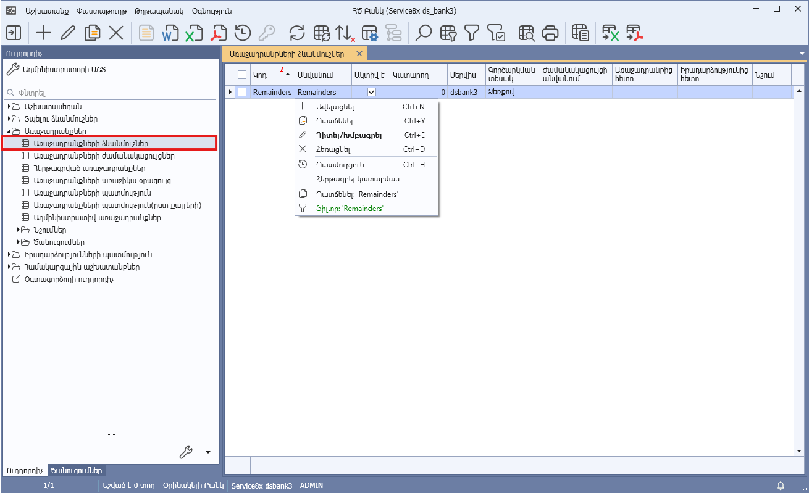

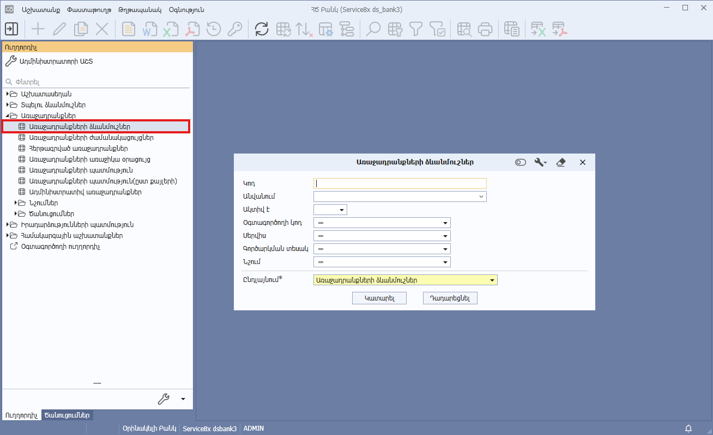

**Նախնական ֆիլտրման դիալոգում** հնարավոր է ֆիլտրել առաջադրանքների ձևանմուշները ըստ ստորև նշված դաշտերի։

| Անվանում         | Նկարագրություն                                                                                                  |
| ---------------- | --------------------------------------------------------------------------------------------------------------- |
| Կոդ              | Առաջադրանքի կոդը։                                                                                              |
| Անվանում         | Առաջադրանքի անվանումը։                                                                                         |
| Ակտիվ է          | Առաջադրանքի ակտիվության հայտանիշը։                                                                              |
| Օգտագործողի կոդ  | Այն օգտագործող(ներ)ի կոդ(եր)ը, որի անունից կատարվում է առաջադրանքը։ |
| Սերվիս           | Այն վեբ ծառայության (սերվիսի) id-(ներ)ը, որի վրա կատարվում է առաջադրանքը։ <br> DropDown-ում ցուցադրվում են միայն **JobExecuter** դեր ունեցող սերվիսները։ |
| Գործարկման տեսակ | Առաջադրանք(ներ)ի գործարկման տեսակ(ներ)ը։                                                                      |
| Նշում            | Առաջադրանք(ներ)ի նշում(ներ)ը։                                                                                |

### Առաջադրանքի ձևանմուշ

Այս փաստաթուղթը ստեղծվում է «Ադմինիստրատորի ԱՇՏ» -> «Առաջադրանքներ» -> [«Առաջադրանքների ձևանմուշներ»](#առաջադրանքների-ձևանմուշներ) դիտելու ձևի **«Ավելացնել»** կամ **«Պատճենել»** կոնտեքստային ֆունկցիայի միջոցով։

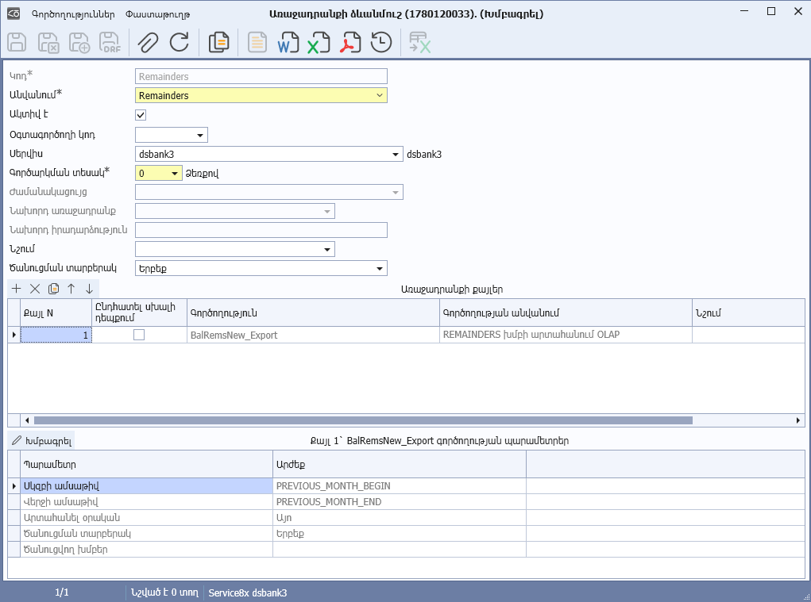

| Անվանում               | Պարտադիր/Ոչ պարտադիր | Նկարագրություն                                                       |
| ---------------------- | -------------------- | -------------------------------------------------------------------- |
| **Կոդ**                | Պարտադիր             | Առաջադրանքի կոդը։ Առավելագույն երկարությունը 32 նիշ է։ <br> Փաստաթղթի առաջին պահպանումից հետո դաշտը ոչ խմբագրելի է։ |
| **Անվանում**           | Պարտադիր             | Առաջադրանքի անվանումը։ Առավելագույն երկարությունը 50 նիշ է։ |
| Ակտիվ է                | Ոչ պարտադիր          | Առաջադրանքի ակտիվության հայտանիշ։ Միայն ակտիվ առաջադրանքները կարող են կատարվել, ոչ ակտիվները չեն մշակվում սերվիսի կողմից։        |
| Օգտագործողի կոդ        | Ոչ պարտադիր          | Այն օգտագործողի կոդը, որի անունից կատարվելու է առաջադրանքը: Նշված օգտագործողի համար բացվում է սեսիա, որը նախատեսված է առաջադրանքի կատարման համար։ <br> Դատարկ արժեքի դեպքում առաջադրանքը կատարվում է այն օգտագործողի անունից, որը հերթագրել է առաջադրանքը կատարման։ Օգտագործողի կոդը կարող է դատարկ լինել միայն **«0 - Ձեռքով»** գործարկման տեսակի դեպքում, մնացած տեսակների համար դաշտը պարտադիր է։                               |
| Սերվիս                 | Ոչ պարտադիր          | Այն վեբ ծառայության (սերվիսի) id-ն, որի վրա պետք է գործարկվի տվյալ առաջադրանքը։ Եթե սերվիս ընտրված չէ, ապա առաջադրանքը կկատարվի այն սերվիսով, որն այդ պահին կստանա կանչը։ <br> Վեբ ծառայությունները սահմանվում են «Ադմինիստրատորի ԱՇՏ» -> «Համակարգային աշխատանքներ» -> [«8X Web ծառայություններ»](#8x-վեբ-ծառայություններ) դիտելու ձևի **«Ավելացնել»** կոնտեքստային ֆունկցիայով։ <br> Սահմանվող վեբ ծառայության (սերվիսի) դերը անհրաժեշտ է նշել **JobExecuter**՝ ծառայության միջոցով առաջադրանքների գործարկումը թույլատրելու նպատակով։ <br> Եթե նշված սերվիսին համապատասխանող ակտիվ ծառայություն չկա, առաջադրանքը մնում է **«Հերթագրված»** վիճակում մինչև համապատասխան սերվիսի ակտիվացումը։ |
| **Գործարկման տեսակ**   | Պարտադիր             | Սահմանում է առաջադրանքի գործարկման եղանակը։ <br> **0** - Ձեռքով, <br> **1** - Ժամանակացույցով, <br> **2** - Առաջադրանքից հետո, <br> **3** - Իրադարձությունից հետո։ <br> **Կարևոր․** Առաջադրանքը հնարավոր է գործարկել այս տարբերակներից միայն մեկով, սակայն ցանկացած տեսակի դեպքում առաջադրանքը կարելի է նաև ձեռքով հերթագրել կատարման՝ [«Հերթագրել կատարման»](#հերթագրել-կատարման) կոնտեքստային ֆունկցիայով։ <br> Տեսակի փոփոխման դեպքում **«Ժամանակացույց»**, **«Նախորդ առաջադրանք»** և **«Նախորդ իրադարձություն»** դաշտերը մաքրվում են, և ակտիվանում է միայն ընտրված տեսակին համապատասխան դաշտը, մնացած երկուսը դառնում են ոչ խմբագրելի։    |
| Ժամանակացույց          | Ոչ պարտադիր          | Առաջադրանքի կատարման ժամանակացույցի կոդը։ Ակտիվանում է և դառնում պարտադիր **«1 - Ժամանակացույցով»** գործարկման տեսակի դեպքում։ <br> Առաջադրանքի կատարման ժամանակացույցները սահմանվում են «Ադմինիստրատորի ԱՇՏ» -> «Առաջադրանքներ» -> [**«Առաջադրանքների ժամանակացույցներ»**](#առաջադրանքի-ժամանակացույց) դիտելու ձևի **«Ավելացնել»** կամ **«Պատճենել»** կոնտեքստային ֆունկցիայով:              |
| Նախորդ առաջադրանք      | Ոչ պարտադիր          | Այն առաջադրանք(ներ)ի կոդ(եր)ը, որի բարեհաջող ավարտից հետո գործարկվելու է ընթացիկ առաջադրանքը։ Ակտիվանում է և դառնում պարտադիր **«2 - Առաջադրանքից հետո»** գործարկման տեսակի դեպքում։ <br> Մի քանի առաջադրանքների նշման դեպքում ընթացիկ առաջադրանքը գործարկվում է, երբ ցուցակում նշված **բոլոր** առաջադրանքները բարեհաջող ավարտվել են։ Հերթագրումը կատարվում է բարեհաջող ավարտից մեկ րոպե հետո։  |
| Նախորդ իրադարձություն  | Ոչ պարտադիր          | Այն իրադարձության կոդը, որի առաջանալուց հետո գործարկվելու է ընթացիկ առաջադրանքը։ Ակտիվանում է և դառնում պարտադիր **«3 - Իրադարձությունից հետո»** գործարկման տեսակի դեպքում։                          |
| Նշում                  | Ոչ պարտադիր          | Նշումներ առաջադրանքի մասին։ Նշումները սահմանվում են «Ադմինիստրատորի ԱՇՏ» -> «Առաջադրանքներ» -> «Նշումներ» -> **«Նշումներ առաջադրանքների համար»** դիտելու ձևի **«Ավելացնել»** կոնտեքստային ֆունկցիայով։            |
| Ծանուցման տարբերակ     | Ոչ պարտադիր          | Առաջադրանքի ծանուցման տարբերակը։ <br> **0** - Երբեք։ <br> **1** - Միայն սխալների դեպքում։ <br> **2** - Միշտ։ <br> **2** արժեքի դեպքում ծանուցումներ են ուղարկվում առաջադրանքի կատարման սկզբի, բարեհաջող ավարտի, սխալների առաջացման և ձախողման դեպքերում, իսկ **1** արժեքի դեպքում` միայն սխալների առաջացման և ձախողման դեպքերում։ <br> Նոր փաստաթղթում լռությամբ արժեքն է **«1 - Միայն սխալների դեպքում»**։ <br> Ձևանմուշի ծանուցման խմբերը կարգավորվում են [«Համակարգային իրադարձությունների ծանուցումներ»](#համակարգային-իրադարձությունների-ծանուցումներ) դիալոգում։      |

Փաստաթղթի պահպանման ժամանակ կիրառվում են հետևյալ ստուգումները՝
- Առաջադրանքը պետք է պարունակի առնվազն մեկ քայլ։ Չլրացված լինելու դեպքում ցուցադրվում է **«Առաջադրանքում անհրաժեշտ է լրացնել առնվազն մեկ քայլ»** սխալի հաղորդագրությունը։
- Յուրաքանչյուր քայլի համար, որի կանչվող DPR-ը պարտադիր պարամետրեր ունի, պարամետրերի արժեքները պետք է լրացված լինեն։ Չլրացման դեպքում ցուցադրվում է **«Առաջադրանքի {0} քայլի պարամետրերը լրացված չեն»** սխալի հաղորդագրությունը, որտեղ **{0}**-ն քայլի համարն է (1-ին, 2-րդ և այլն)։

### Առաջադրանքի քայլեր

«Առաջադրանքի քայլեր» աղյուսակում սահմանվում են առաջադրանքում կատարվող գործողությունները (տվյալների մշակման հարցում - DPR): 

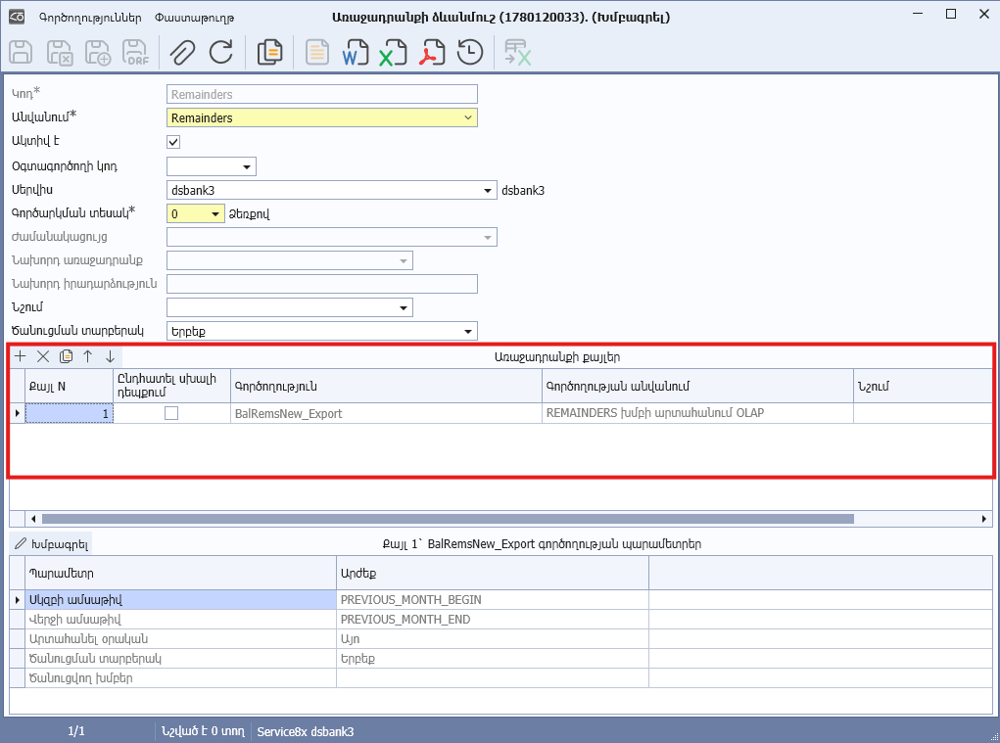

| Անվանում               | Նկարագրություն                                                       |
| ---------------------- | -------------------------------------------------------------------- |
| Քայլ N                 | Գործողության համարը, որը սահմանում է դրա կատարման հաջորդականությունը։                                   |
| Ընդհատել սխալի դեպքում | Գործողությունում սխալների առաջացման դեպքում առաջադրանքի դադարեցման հայտանիշ։ |
| Գործողություն          | Գործողությունում կանչվող տվյալների մշակման հարցման (DPR) կոդը: <br> Դաշտի վրա սեղմելիս բացվում է **JobElement** և **OLAP** տեսակների DPR-ների ընտրման պատուհանը։ <br> Արժեքի փոփոխման դեպքում նախկինում մուտքագրված պարամետրերը և ծանուցումների կարգավորումները մաքրվում են։                       |
| Գործողության անվանում  | Կանչվող տվյալների մշակման հարցման (DPR) հայերեն անվանումը: Լրացվում է ավտոմատ կերպով՝ «Գործողություն» դաշտը լրացնելիս և ենթակա չէ խմբագրման։          |
| Նշում                  | Նշումներ առաջադրանքի քայլի մասին։ Նշումները սահմանվում են «Ադմինիստրատորի ԱՇՏ» -> «Առաջադրանքներ» -> «Նշումներ» -> **«Նշումներ առաջադրանքների քայլերի համար»** դիտելու ձևի **«Ավելացնել»** կոնտեքստային ֆունկցիայով։                |
| Գործողության տեսակ     | Կանչվող տվյալների մշակման հարցման (DPR) տեսակը (սատարվում են միայն **JobElement**, **Olap** տեսակները)։ Լրացվում է ավտոմատ կերպով՝ «Գործողություն» դաշտը լրացնելիս և ենթակա չէ խմբագրման։   |

«Առաջադրանքի ընթացիկ քայլի պարամետրեր» աղյուսակում սահմանվում են [«Առաջադրանքի քայլեր»](#առաջադրանքի-քայլեր) աղյուսակում ավելացված յուրաքանչյուր գործողության (տվյալների մշակման հարցում - DPR) կատարման պարամետրերը, ծանուցման կարգավորումները։ Աղյուսակի վերնագիրը ակտիվ քայլ ընտրվելիս փոխվում է «Քայլ N` <գործողություն> գործողության պարամետրեր» տեսքով՝ արտացոլելու համար այն քայլը, որի պարամետրերը խմբագրվում են։

### Առաջադրանքի ընթացիկ քայլի պարամետրեր

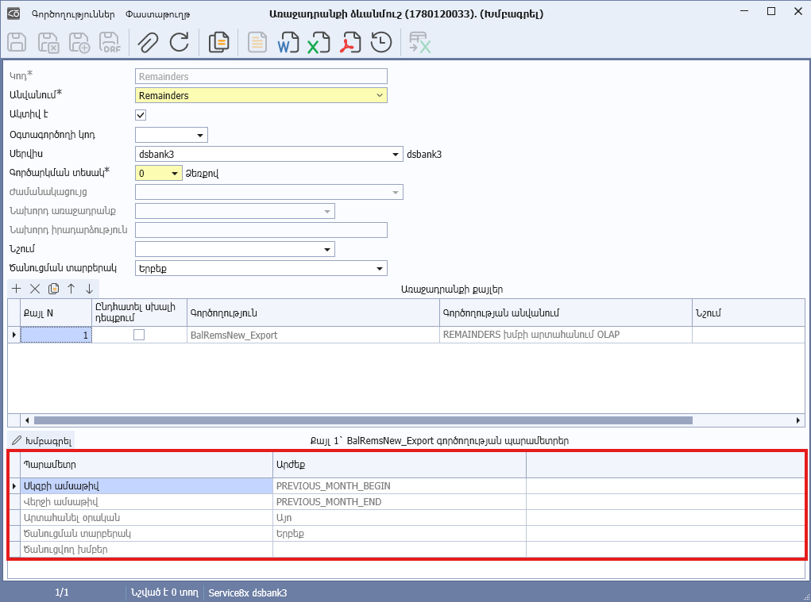

Կատարման պարամետրերի արժեքները կարելի է փոփոխել հետևյալ եղանակներից որևէ մեկով.
- սեղմել **«Խմբագրել»** կոճակը,
- կրկնակի սեղմել «Արժեք» սյան համապատասխան դաշտի վրա,
- ընտրել «Արժեք» դաշտը և սեղմել ստեղնաշարի որևէ տառ, թիվ, **Enter** կամ **Space** ստեղնը։

| Անվանում               | Նկարագրություն                                                       |
| ---------------------- | -------------------------------------------------------------------- |
| Պարամետրեր             | Կանչվող տվյալների մշակման հարցման (DPR) պարամետրերը։                 |
| Ծանուցման տարբերակ     | Քայլի ծանուցման տարբերակը։ <br> **0** - Երբեք։ <br> **1** - Միայն սխալների դեպքում։ <br> **2** - Միշտ։ <br> **2** արժեքի դեպքում ծանուցումներ են ուղարկվում քայլի կատարման սկզբի, բարեհաջող ավարտի, սխալների առաջացման և ձախողման դեպքերում, իսկ **1** արժեքի դեպքում` միայն սխալների առաջացման և ձախողման դեպքերում։ <br> Եթե և Առաջադրանքի ձևանմուշում, և քայլերի «Ծանուցման տարբերակ» դաշտում լրացված է **«Միայն սխալների դեպքում»** կամ **«Միշտ»** արժեքը, ապա ծանուցումը կկատարվի յուրաքանչյուրի համար առանձին–առանձին։      |
| Ծանուցվող խմբեր     | Ծանուցվող խմբերի կոդերի ցուցակը։ Ծանուցվող խմբերը սահմանվում են «Ադմինիստրատորի ԱՇՏ» -> «Համակարգային աշխատանքներ» -> [**«Ծանուցումների խմբեր»**](#ծանուցման-խումբ) դիտելու ձևի **«Ավելացնել»** կոնտեքստային ֆունկցիայով:     |

### Հերթագրել կատարման

Այս դիալոգը բացվում է «Ադմինիստրատորի ԱՇՏ» -> «Առաջադրանքներ» -> [«Առաջադրանքների ձևանմուշներ»](#առաջադրանքների-ձևանմուշներ) դիտելու ձևի **«Հերթագրել կատարման»** կոնտեքստային ֆունկցիայի միջոցով։ Դիալոգի դաշտերը լրացվում են [«Առաջադրանքի ձևանմուշից»](#առաջադրանքի-ձևանմուշ)։

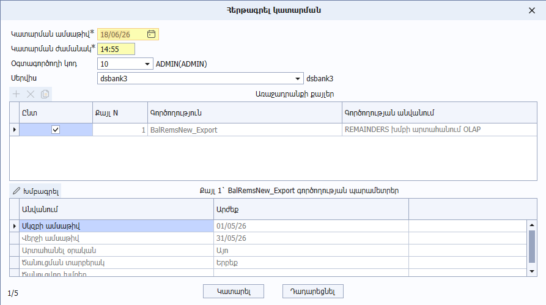

| Անվանում               | Նկարագրություն                                                       |
| ---------------------- | -------------------------------------------------------------------- |
| Կատարման ամսաթիվ       | Առաջադրանքի կատարման ամսաթիվը։ <br> Լռությամբ լրացվում է ընթացիկ ամսաթվով։ |
| Կատարման ժամանակ       | Առաջադրանքի կատարման ժամանակը։ <br> Լռությամբ լրացվում է ընթացիկ ժամանակով։ |
| Օգտագործողի կոդ        | Այն օգտագործողի կոդը, որի անունից կատարվում է առաջադրանքը։ <br> Լռությամբ լրացվում է ընթացիկ ձևանմուշի [«Օգտագործողի կոդ»](#առաջադրանքի-ձևանմուշ) դաշտի արժեքով, իսկ դատարկ լինելու դեպքում՝ ընթացիկ սեսիայի օգտագործողի կոդով։ |
| Սերվիս                 | Այն վեբ ծառայության (սերվիսի) id-ն, որի վրա գործարկվելու է առաջադրանքը։ <br> Լռությամբ լրացվում է ընթացիկ ձևանմուշի [«Սերվիս»](#առաջադրանքի-ձևանմուշ) դաշտի արժեքով։ |
| Ընտ․                   | Գործողության կատարման հայտանիշ։                                   |
| Քայլ N                 | Գործողության համարը, որը սահմանում է դրա կատարման հաջորդականությունը։                                   |
| Գործողություն          | Գործողությունում կանչվող տվյալների մշակման հարցման (DPR) կոդը:                        |
| Գործողության անվանում  | Կանչվող տվյալների մշակման հարցման (DPR) հայերեն անվանումը: Լրացվում է ավտոմատ կերպով՝ «Գործողություն» դաշտը լրացնելիս և ենթակա չէ խմբագրման։          |

Գործողության պարամետրերի, ծանուցման տարբերակի և ծանուցվող խմբերի նկարագրությունը ներկայացված է [«Առաջադրանքի ընթացիկ քայլի պարամետրեր»](#առաջադրանքի-ընթացիկ-քայլի-պարամետրեր) բաժնում։

Ձևանմուշի հեռացման ժամանակ, եթե համապատասխան առաջադրանքն ունի դեռ չկատարված և հերթագրված օրինակ, ցուցադրվում է **«{ISN}-ով առաջադրանքը հերթագրված է կատարման, հնարավոր չէ ջնջել։»** սխալի հաղորդագրությունը, և հեռացումը չի իրականացվում։

### SEQ-ի իրադարձություններ

«Ադմինիստրատորի ԱՇՏ» -> «Առաջադրանքներ» -> [«Առաջադրանքների ձևանմուշներ»](#առաջադրանքների-ձևանմուշներ) դիտելու ձևի «SEQ-ի իրադարձություններ» կոնտեքստային ֆունկցիան հասանելի է միայն այն ձևանմուշների համար, որոնք **ակտիվ** են և գործարկման տեսակը **«1 - Ժամանակացույցով»** է։

Կանչի արդյունքում բացվում է «Ժամանակահատվածի սկիզբ» դաշտով դիալոգը (լռությամբ՝ ընթացիկ ամսաթիվ)։ Արժեքի ընտրումից հետո բացվում է live պատուհան, որտեղ ընթացիկ ձևանմուշի համար բեռնվում են Seq սերվերի իրադարձությունները նշված ամսաթվից հետո։

## Առաջադրանքի ժամանակացույց

Այս փաստաթուղթը նախատեսված է առաջադրանքների կատարման ժամանակացույցերի սահմանման համար։ Ավելացվում է **«Ադմինիստրատորի ԱՇՏ» -> «Առաջադրանքներ» -> «Առաջադրանքների ժամանակացույցեր»** դիտելու ձևի **«Ավելացնել»** կամ **«Պատճենել»** կոնտեքստային ֆունկցիայով։ Սահմանված ժամանակացույցերը հետագայում օգտագործվում են [առաջադրանքի ձևանմուշներում](#առաջադրանքի-ձևանմուշ)՝ որպես **«Ժամանակացույց»** դաշտի արժեք։

Ժամանակացույցի հեռացման ժամանակ, եթե այն օգտագործվում է որևէ առաջադրանքի ձևանմուշում, ցուցադրվում է **«Ժամանակացույցը ջնջելու ենթակա չէ, քանի որ օգտագործված է {առաջադրանքի կոդ} առաջադրանքում»** սխալի հաղորդագրությունը, և հեռացումը չի իրականացվում։


### Ընդհանուր էջ

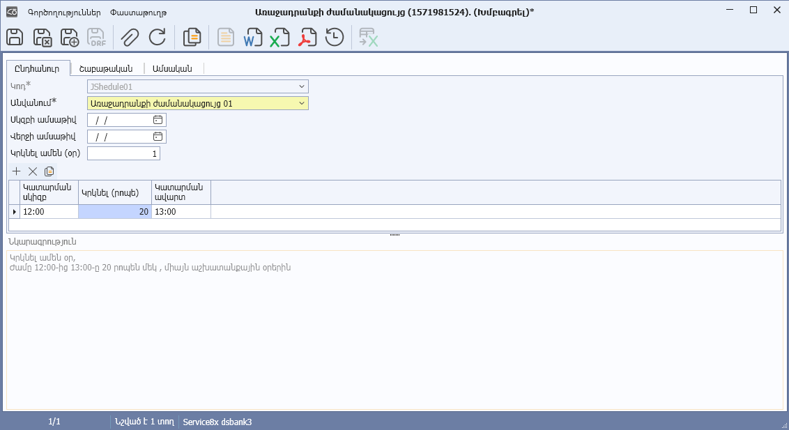

| Սյան անվանում | Պարտադիր/Ոչ պարտադիր | Նկարագրություն |
| --- | --- | --- |
| **Կոդ**	         | Պարտադիր     | Առաջադրանքի կատարման ժամանակացույցի կոդը։ <br> Փաստաթղթի առաջին պահպանումից հետո դաշտը ոչ խմբագրելի է։    |
| **Անվանում**	     | Պարտադիր     | Առաջադրանքի կատարման ժամանակացույցի անվանումը։    |
| Սկզբի ամսաթիվ	 | Ոչ պարտադիր | Առաջադրանքի կատարման սկզբի ամսաթիվը։     |
| Վերջի ամսաթիվ	 | Ոչ պարտադիր | Առաջադրանքի կատարման վերջի ամսաթիվը։    |
| Կրկնել ամեն (օր)	| Ոչ պարտադիր |    «Սկզբի ամսաթիվ» և «Վերջի ամսաթիվ» դաշտերում նշված ժամանակահատվածում քանի օրը մեկ կրկնել առաջադրանքը։    |
| Կատարման սկիզբ | Ոչ պարտադիր | Առաջադրանքի կատարման սկզբի ժամանակը։     |
| Կատարման ավարտ | Ոչ պարտադիր | Առաջադրանքի կատարման վերջի ժամանակը։    |
| Կրկնել (րոպե) | Ոչ պարտադիր | Առաջադրանքի կատարման պարբերականությունը րոպեներով։      |
| Նկարագրություն	 | Ոչ պարտադիր | Առաջադրանքի կատարման ժամանակացույցի նկարագրությունը։ Լրացվում է ավտոմատ կերպով՝ գործարկման ամսաթիվը/ժամանակը ընտրելիս (օրինակ՝ Կատարել ամեն հինգշաբթի, ժամը 18:30-ից սկսած)։ <br> Դաշտը ոչ խմբագրելի է. արժեքը վերահաշվարկվում է «Ընդհանուր», «Շաբաթական» և «Ամսական» էջերի որևէ դաշտի փոփոխման ժամանակ։    |

Ժամանակացույցի դաշտերի համատեղման հատուկ դեպքերը՝

- Եթե «Սկզբի ամսաթիվ» և «Վերջի ամսաթիվ» դաշտերը լրացված չեն, սակայն «Կրկնել ամեն (օր)» դաշտում նշված է **1** արժեք, ապա առաջադրանքը կաշխատի անվերջ՝ «Կրկնել ամեն (օր)» դաշտում լրացված պարբերականությամբ։ **1**-ից մեծ արժեքի դեպքում «Սկզբի ամսաթիվը» պարտադիր է, քանի որ կրկնման հաշվարկը կատարվում է դրանից։
- Եթե «Կրկնել ամեն (օր)» դաշտում արժեք լրացված չէ, ապա առաջադրանքի կատարման հաճախականությունը որոշվում է մյուս ֆիլտրներով («Շաբաթական», «Ամսական» էջեր, «Սկզբի/Վերջի ամսաթիվ»)։ Այլ ֆիլտրի բացակայության դեպքում առաջադրանքը կաշխատի ամեն օր։
- Եթե նշված է միայն «Կատարման սկիզբը» առանց «Կրկնել (րոպե)» դաշտի, ապա առաջադրանքը կաշխատի միայն կատարման սկզբին, իսկ «Կատարման ավարտը» անտեսվում է։
- «Կրկնել (րոպե)» դաշտի **0** արժեքի սահմանման դեպքում «Կատարման ավարտ» դաշտը ավտոմատ կերպով մաքրվում է։

### Շաբաթական էջ

«Շաբաթական» և [«Ամսական»](#ամսական-էջ) էջերը միաժամանակ չեն օգտագործվում՝ կարող է լրացվել միայն մեկը։

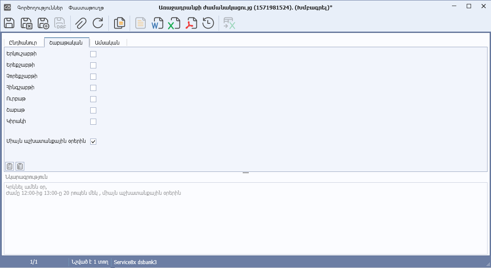

| Սյան անվանում | Նկարագրություն |
| --- | --- |
| Երկուշաբթի, Երեքշաբթի, Չորեքշաբթի, Հինգշաբթի, Ուրբաթ, Շաբաթ, Կիրակի | Շաբաթվա համապատասխան օրը առաջադրանքը կատարելու հայտանիշ։ |
| Միայն աշխատանքային օրերին	     |    Միայն աշխատանքային օրերին կատարելու հայտանիշ։    |

### Ամսական էջ

«Ամսական» և [«Շաբաթական»](#շաբաթական-էջ) էջերը միաժամանակ չեն օգտագործվում՝ կարող է լրացվել միայն մեկը։

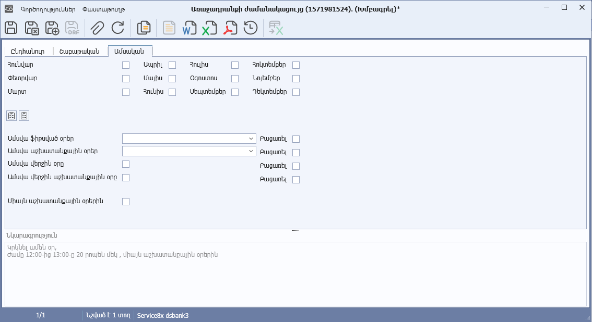

| Սյան անվանում | Նկարագրություն |
| --- | --- |
| Հունվար, Փետրվար, Մարտ, Ապրիլ, Մայիս, Հունիս, Հուլիս, Օգոստոս, Սեպտեմբեր, Հոկտեմբեր, Նոյեմբեր, Դեկտեմբեր | Համապատասխան ամսում առաջադրանքը կատարելու հայտանիշ։ |
| Ամսվա վերջին օրը	         |    Յուրաքանչյուր ամսվա վերջին օրը առաջադրանքը կատարելու հայտանիշ։ Կողքի **«Բացառել»** նշիչը նշված լինելու դեպքում առաջադրանքը կկատարվի ընտրված ամիսների բոլոր օրերին՝ բացառությամբ վերջին օրվա։  |
| Ամսվա վերջին աշխատանքային օրը	         |    Յուրաքանչյուր ամսվա վերջին աշխատանքային օրը առաջադրանքը կատարելու հայտանիշ։ Կողքի **«Բացառել»** նշիչը նշված լինելու դեպքում առաջադրանքը կկատարվի ընտրված ամիսների բոլոր օրերին՝ բացառությամբ վերջին աշխատանքային օրվա։    |
| Ամսվա ֆիքսված օրեր | Ամսվա այն օրերը, երբ կկատարվի առաջադրանքը։ Արժեքները լրացվում են ստորակետով տարանջատված (օրինակ՝ 1,15,28)։ Կողքի **«Բացառել»** նշիչը նշված լինելու դեպքում առաջադրանքը կկատարվի ընտրված ամիսների բոլոր օրերին՝ բացառությամբ նշված օրերի։ |
| Ամսվա աշխատանքային օրեր | Ամսվա այն աշխատանքային օրերը (հաշվարկն արվում է աշխատանքային օրացույցով), երբ կկատարվի առաջադրանքը։ Արժեքները լրացվում են ստորակետով տարանջատված։ Կողքի **«Բացառել»** նշիչը նշված լինելու դեպքում առաջադրանքը կկատարվի ընտրված ամիսների բոլոր օրերին՝ բացառությամբ նշված օրերի։ |
| Միայն աշխատանքային օրերին | Միայն աշխատանքային օրերին առաջադրանքը կատարելու հայտանիշ։ |

## Հերթագրված առաջադրանքներ

Այս դիտելու ձևը գտնվում է «Ադմինիստրատորի ԱՇՏ» -> «Առաջադրանքներ» թղթապանակում: Դիտելու ձևում ցուցադրվում են արդեն հերթագրված և կատարման ընթացքում գտնվող առաջադրանքները։ Նախատեսված է առաջադրանքների կատարման ընթացքի դիտման և ընդհատման համար։

Դիտելու ձևից հասանելի են հետևյալ կոնտեքստային ֆունկցիաները՝
- [«Հեռացնել հերթագրված առաջադրանքը»](#հեռացնել-հերթագրված-առաջադրանքը) — Ընդհատում է հերթագրված, բայց դեռևս չկատարվող առաջադրանքը։
- [«Կատարման մանրամասներ»](#կատարման-մանրամասներ) — Ցուցադրում է առաջադրանքի և կատարման քայլերի մանրամասները ներկայացնող տեքստային հաշվետվությունը։
- [«Դիտել ըստ քայլերի»](#դիտել-ըստ-քայլերի) — Ցուցադրում է «Ընթացիկ առաջադրանքներ (ըստ քայլերի)» դիտելու ձևը։
- [«Կատարման ընթացք»](#կատարման-ընթացք) — Ցուցադրում է կատարվող կամ արդեն ավարտված առաջադրանքի DPR-ի կատարման պրոգրեսի պատուհանը։
- «Դիտել» — Ցուցադրում է հերթագրված առաջադրանքի փաստաթուղթը՝ readonly ռեժիմով, ընթացիկ քայլերի և պարամետրերի արժեքները դիտելու համար։

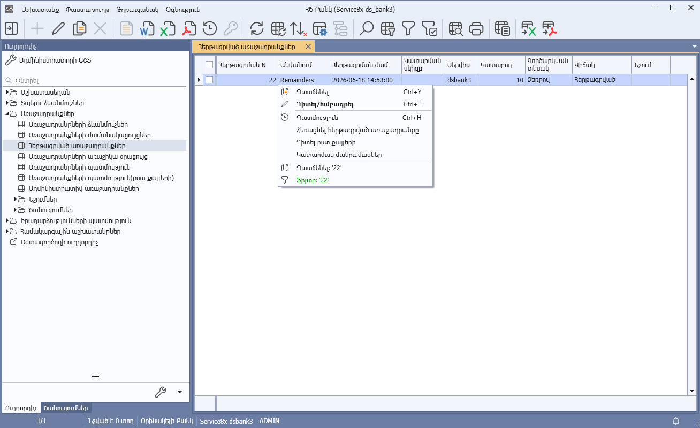

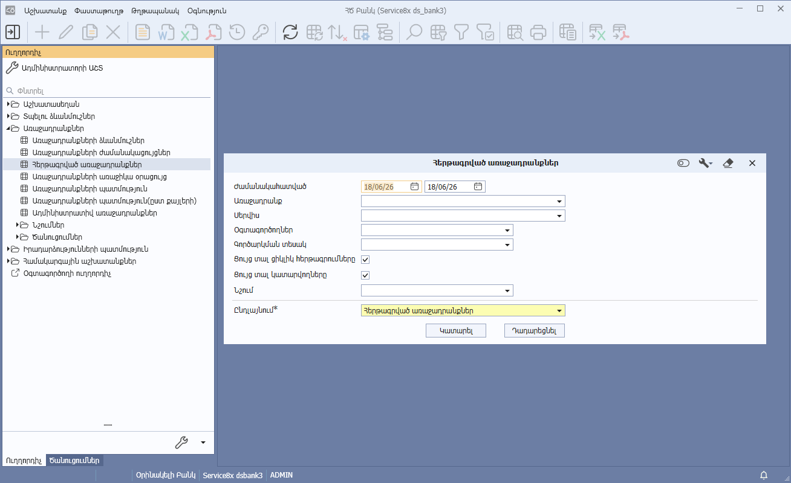

**Նախնական ֆիլտրման դիալոգում** հնարավոր է ֆիլտրել հերթագրված առաջադրանքները ըստ ստորև նշված դաշտերի։

| Անվանում           | Նկարագրություն                                                                                                                                  |
| ------------------ | ----------------------------------------------------------------------------------------------------------------------------------------------- |
| Ժամանակահատված     | Հերթագրման ամսաթվի ընդգրկած ժամանակահատվածը (սկզբից/մինչև)։ <br> Լռությամբ լրացվում է ընթացիկ աշխատանքային ամսաթվով։                              |
| Առաջադրանք         | Առաջադրանք(ներ)ի կոդ(եր)ը։ <br> Բացվող ցուցակում ցուցադրվում են առաջադրանքի ձևանմուշները։       |
| Սերվիս             | Այն վեբ ծառայության (սերվիսի) id-(ներ)ը, որի վրա գործարկվում է առաջադրանքը։                |
| Օգտագործողներ      | Այն օգտագործող(ներ)ի կոդ(եր)ը, որի անունից կատարվում է առաջադրանքը։                            |
| Գործարկման տեսակ   | Առաջադրանք(ներ)ի գործարկման տեսակ(ներ)ը։                                                      |
| Ցույց տալ ցիկլիկ հերթագրումները | **«Հերթագրված»** վիճակում գտնվող առաջադրանքները ցուցադրելու հայտանիշ։ <br> Լռությամբ՝ նշված։                                          |
| Ցույց տալ կատարվողները | **«Կատարման ընթացքում»** գտնվող առաջադրանքները ցուցադրելու հայտանիշ։ <br> Լռությամբ՝ նշված։                                                  |
| Նշում              | Առաջադրանք(ներ)ի նշում(ներ)ը։                                                                |

### Հեռացնել հերթագրված առաջադրանքը

«Ադմինիստրատորի ԱՇՏ» -> «Առաջադրանքներ» -> [«Հերթագրված առաջադրանքներ»](#հերթագրված-առաջադրանքներ) դիտելու ձևի «Հեռացնել հերթագրված առաջադրանքը» կոնտեքստային ֆունկցիան կարելի է կանչել միայն այն առաջադրանքների համար, որոնք դեռ չեն գտնվում կատարման ընթացքում (միայն հերթագրված վիճակում գտնվող առաջադրանքների համար):

Ֆունկցիայի հաջող կանչի դեպքում ցուցադրվում է **«Առաջադրանքի ընդհատում»** հաղորդագրությունը։ Սխալի դեպքում ցուցադրվում է սերվերի կողմից վերադարձված սխալի տեքստը՝ **«Կատարման սխալ»** վերնագրով։

### Կատարման մանրամասներ

«Ադմինիստրատորի ԱՇՏ» -> «Առաջադրանքներ» -> [«Հերթագրված առաջադրանքներ»](#հերթագրված-առաջադրանքներ) / [«Առաջադրանքների պատմություն»](#առաջադրանքների-պատմություն) դիտելու ձևերի «Կատարման մանրամասներ» կոնտեքստային ֆունկցիայի կանչի արդյունքում բացվում է տեքստային հաշվետվություն, որտեղ ցուցադրվում են առաջադրանքի (սերվիս, կատարող, վիճակ) և կատարման քայլերի մանրամասները (կատարման սկիզբ, վերջ, տևողություն, ...)։ 

Առաջադրանքի ամբողջական նկարագրությունը ներկայացված է [Առաջադրանքի ձևանմուշ](#առաջադրանքի-ձևանմուշ) բաժնում, իսկ կատարման քայլերինը՝ [Առաջադրանքի կատարման քայլեր](#առաջադրանքի-ընթացիկ-քայլի-պարամետրեր) բաժնում։

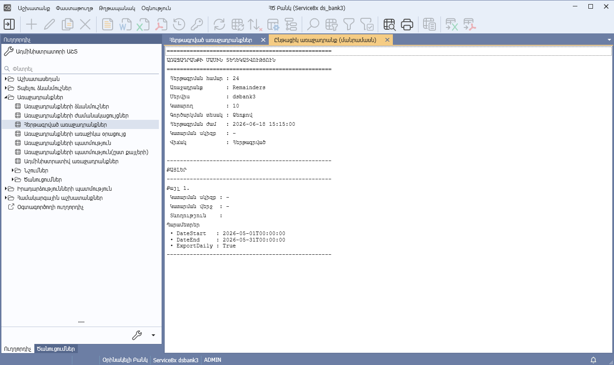

### Դիտել ըստ քայլերի

«Ադմինիստրատորի ԱՇՏ» -> «Առաջադրանքներ» -> [«Հերթագրված առաջադրանքներ»](#հերթագրված-առաջադրանքներ) / [«Առաջադրանքների պատմություն»](#առաջադրանքների-պատմություն) դիտելու ձևերի «Դիտել ըստ քայլերի» կոնտեքստային ֆունկցիայի կանչի արդյունքում բացվում է «Ընթացիկ առաջադրանքներ (ըստ քայլերի)» դիտելու ձևը, որտեղ ցուցադրվում են առաջադրանքի կատարման քայլերի մանրամասները (կատարման սկիզբ, վերջ, տևողություն, ...)։ 

Կատարման քայլերի ամբողջական նկարագրությունը ներկայացված է [Առաջադրանքի կատարման քայլեր](#առաջադրանքի-ընթացիկ-քայլի-պարամետրեր) բաժնում։

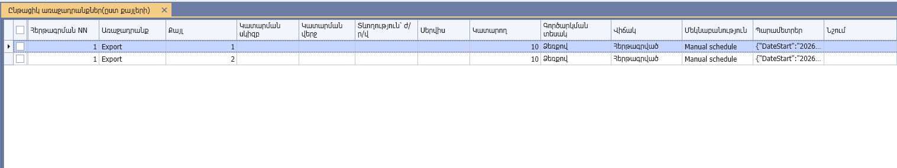

### Կատարման ընթացք

«Ադմինիստրատորի ԱՇՏ» -> «Առաջադրանքներ» -> [«Հերթագրված առաջադրանքներ»](#հերթագրված-առաջադրանքներ) դիտելու ձևի «Կատարման ընթացք» կոնտեքստային ֆունկցիան հասանելի է այն առաջադրանքների համար, որոնք գտնվում են ոչ «Հերթագրված» վիճակում (այսինքն՝ կատարման ընթացքում, ինչպես նաև ավարտված/ընդհատված)։ Կանչի արդյունքում բացվում է առաջադրանքի կողմից գործարկվող DPR-ի կատարման պրոգրեսի պատուհանը, ինչպես նաև Status bar-ում ցուցադրվում է status text-ը։

Կատարման պրոգրեսի պատուհանի «Ընդհատել» կոճակի միջոցով հնարավոր է ընդհատել առաջադրանքի կատարումը։

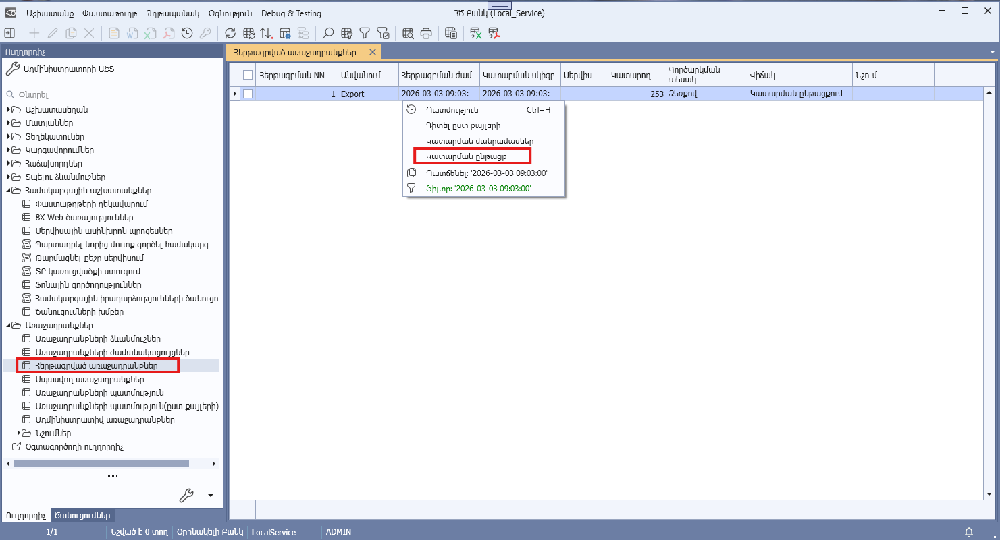

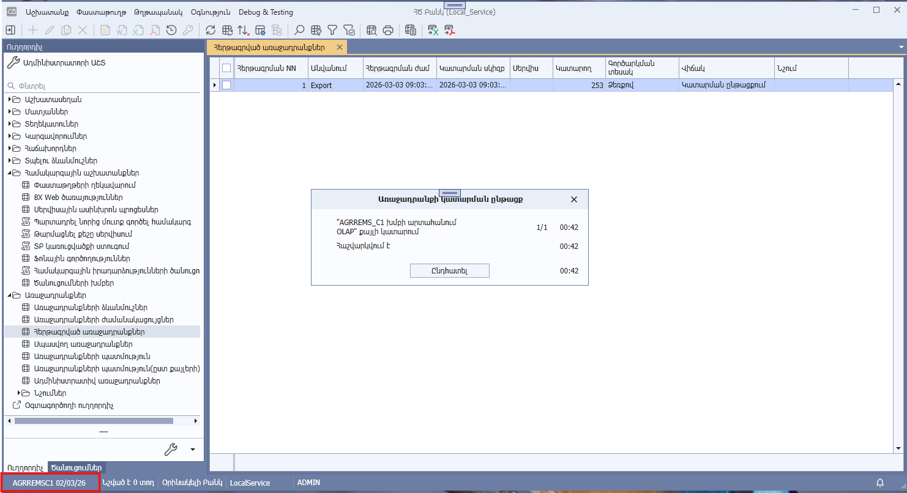

## Առաջադրանքների առաջիկա օրացույց

Այս դիտելու ձևը գտնվում է «Ադմինիստրատորի ԱՇՏ» -> «Առաջադրանքներ» թղթապանակում: Դիտելու ձևում ցուցադրվում են **«Ժամանակացույցով»** կամ **«Առաջադրանքից հետո»** գործարկման տեսակով այն առաջադրանքները, որոնք դեռևս չեն հերթագրվել կատարման, ինչպես նաև [«Հերթագրել կատարման»](#հերթագրել-կատարման) կոնտեքստային ֆունկցիայով ձեռքով հերթագրված, բայց դեռևս չկատարված առաջադրանքները (ի տարբերություն [«Հերթագրված առաջադրանքների»](#հերթագրված-առաջադրանքներ), որտեղ արդեն հերթագրված կամ կատարման ընթացքում գտնվող առաջադրանքներն են)։ Նախատեսված է առաջադրանքների կատարման առաջիկա օրացույցի դիտման համար։

**«Առաջադրանքից հետո»** գործարկման տեսակով առաջադրանքների համար «Կատարվելիք ժամանակ» դաշտը չի լրացվում, քանի որ այն կախված է նախորդ առաջադրանքի ավարտից։

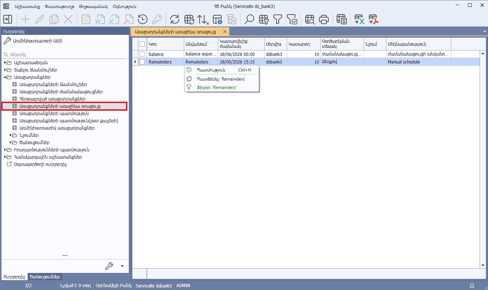

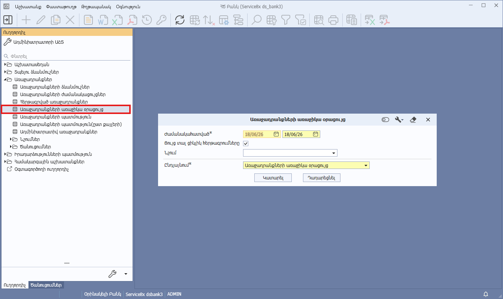

**Նախնական ֆիլտրման դիալոգում** հնարավոր է ֆիլտրել առաջիկա առաջադրանքները ըստ ստորև նշված դաշտերի։

| Անվանում                       | Նկարագրություն                                                                                                  |
| ------------------------------ | --------------------------------------------------------------------------------------------------------------- |
| Ժամանակահատված                 | Ընդգրկվող ժամանակահատվածը (սկզբից/մինչև), որի համար հաշվարկվում են առաջիկա հերթագրումները։ <br> Լռությամբ լրացվում է ընթացիկ աշխատանքային ամսաթվով։ |
| Ցույց տալ ցիկլիկ հերթագրումները | Ցիկլիկ կրկնման ենթակա ժամանակացույցները ընտրված ժամանակահատվածի համար բացելու հայտանիշ։ <br> Լռությամբ՝ նշված։     |
| Նշում                          | Առաջադրանք(ներ)ի նշում(ներ)ը։                                                                                |

## Առաջադրանքների պատմություն

Այս դիտելու ձևը գտնվում է «Ադմինիստրատորի ԱՇՏ» -> «Առաջադրանքներ» թղթապանակում: Դիտելու ձևում ցուցադրվում են բոլոր արդեն գործարկված առաջադրանքները (կատարման ընթացքում, բարեհաջող ավարտված, սխալով ավարտված, ընդհատված)։ Նախատեսված է կատարված առաջադրանքների մանրամասների և կատարման ընթացքում առաջացած սխալների դիտման համար։

Դիտելու ձևից հասանելի են հետևյալ կոնտեքստային ֆունկցիաները՝
- [«Կատարման մանրամասներ»](#կատարման-մանրամասներ) — Ցուցադրում է առաջադրանքը և կատարման քայլերի մանրամասները ներկայացնող տեքստային հաշվետվությունը։
- [«Դիտել ըստ քայլերի»](#դիտել-ըստ-քայլերի) — Ցուցադրում է [«Առաջադրանքների պատմություն (ըստ քայլերի)»](#առաջադրանքների-պատմություն-ըստ-քայլերի) դիտելու ձևը։
- [«Կատարման ընթացքում առաջացած սխալներ»](#կատարման-ընթացքում-առաջացած-սխալներ) — Ցուցադրում է **«Առաջադրանքի կատարման մանրամասներ»** դիտելու ձևը՝ կատարման ընթացքում գրանցված լոգերը ցուցադրելու համար։

Դիտելու ձևում տողի կրկնակի սեղմումը լռությամբ բացում է [«Կատարման մանրամասներ»](#կատարման-մանրամասներ) տեքստային հաշվետվությունը։

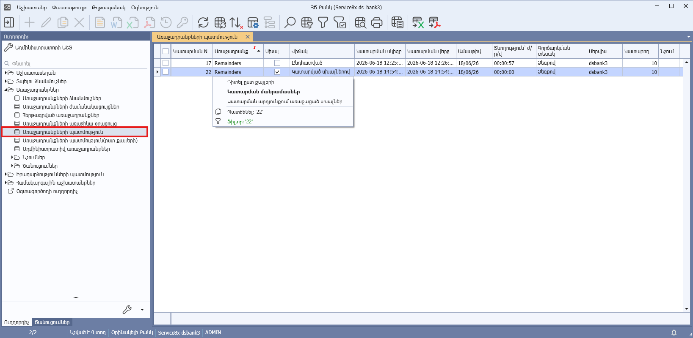

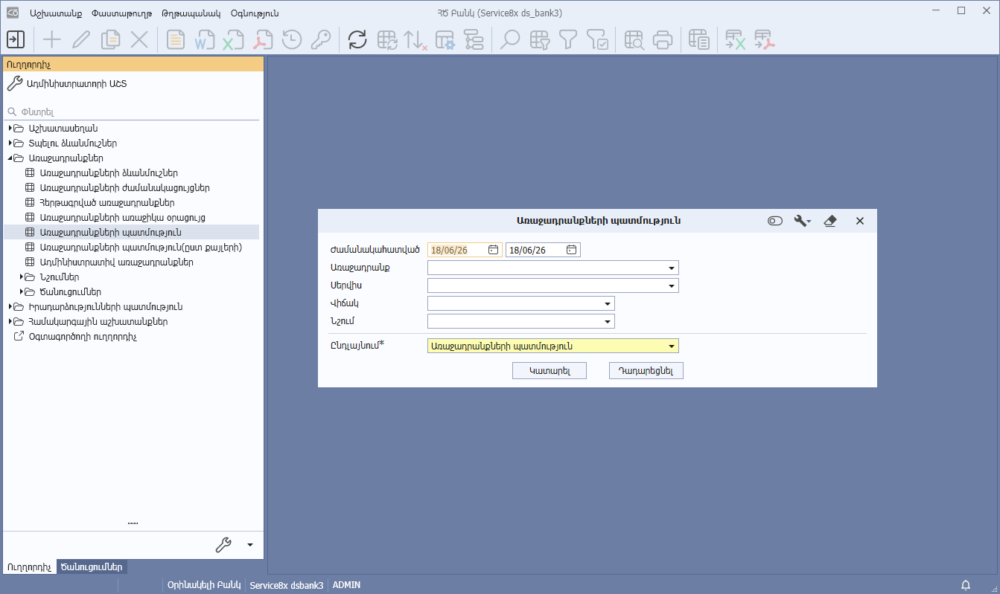

**Նախնական ֆիլտրման դիալոգում** հնարավոր է ֆիլտրել գործարկված առաջադրանքները ըստ ստորև նշված դաշտերի։

| Անվանում        | Նկարագրություն                                                                                                |
| --------------- | ------------------------------------------------------------------------------------------------------------- |
| Ժամանակահատված  | Կատարման ամսաթվի ընդգրկած ժամանակահատվածը (սկզբից/մինչև)։ <br> Լռությամբ լրացվում է ընթացիկ աշխատանքային ամսաթվով։ |
| Առաջադրանք      | Առաջադրանքի կոդը։ <br> Բացվող ցուցակում ցուցադրվում են առաջադրանքի ձևանմուշները։                                |
| Սերվիս          | Այն վեբ ծառայության (սերվիսի) id-ն, որի վրա կատարվել է առաջադրանքը։                                            |
| Վիճակ           | Առաջադրանք(ներ)ի վիճակ(ներ)ը։ <br> Հնարավոր արժեքները՝ Հերթագրված, Կատարման ընթացքում, Բարեհաջող ավարտված, Սխալով ավարտված, Ընդհատված։ |
| Նշում           | Առաջադրանք(ներ)ի նշում(ներ)ը։                                                                                |

## Առաջադրանքների պատմություն (ըստ քայլերի)

Այս դիտելու ձևը բացվում է [«Առաջադրանքների պատմություն»](#առաջադրանքների-պատմություն) դիտելու ձևի [«Դիտել ըստ քայլերի»](#դիտել-ըստ-քայլերի) կոնտեքստային ֆունկցիայի միջոցով։ Դիտելու ձևում ցուցադրվում են առաջադրանքների կատարման քայլերի մանրամասները (քայլ, գործողություն, սկիզբ, վերջ, տևողություն, ...):

Դիտելու ձևից հասանելի են հետևյալ կոնտեքստային ֆունկցիաները՝
- [«Դիտել պարամետրերը»](#դիտել-պարամետրերը) — Ցուցադրում է տվյալ քայլի պարամետրերի դիալոգը՝ readonly ռեժիմով։
- [«Կատարման ընթացքում առաջացած սխալներ»](#կատարման-ընթացքում-առաջացած-սխալներ) — Ցուցադրում է **«Առաջադրանքի կատարման մանրամասներ»** դիտելու ձևը՝ տվյալ քայլի լոգերը դիտելու համար։

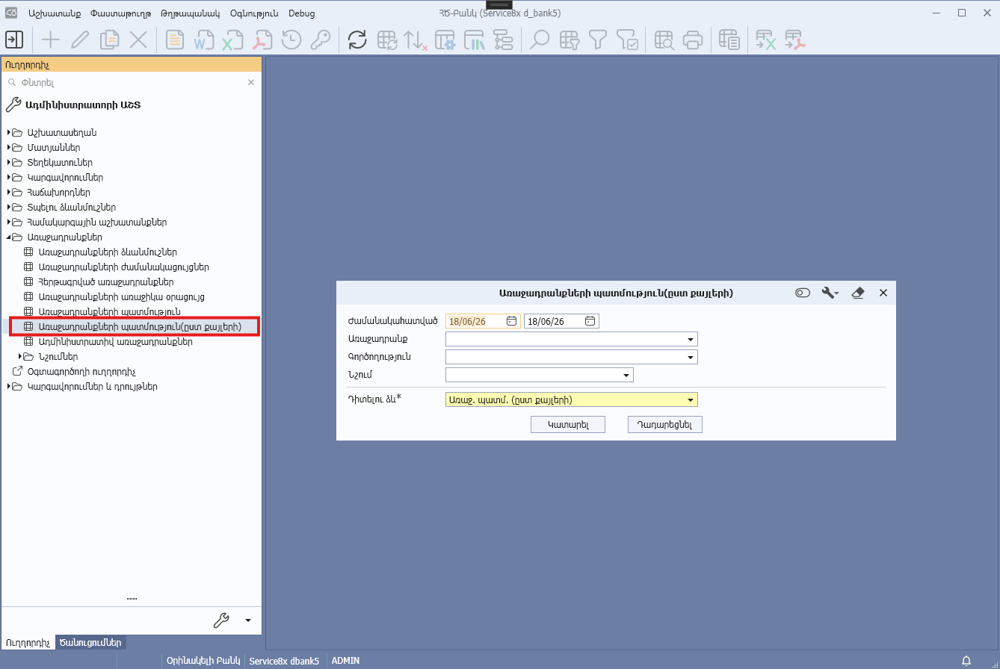

**Նախնական ֆիլտրման դիալոգում** հնարավոր է ֆիլտրել առաջադրանքների կատարման քայլերը ըստ ստորև նշված դաշտերի։

| Անվանում        | Նկարագրություն                                                                                                |
| --------------- | ------------------------------------------------------------------------------------------------------------- |
| Ժամանակահատված  | Քայլի կատարման ամսաթվի ընդգրկած ժամանակահատվածը (սկզբից/մինչև)։ <br> Լռությամբ լրացվում է ընթացիկ աշխատանքային ամսաթվով։ |
| Առաջադրանք      | Առաջադրանքի կոդը։                                                                                            |
| Գործողություն   | Քայլի կողմից կանչվող տվյալների մշակման հարցման (DPR) կոդը։ <br> Բացվող ցուցակում ցուցադրվում են միայն **JobElement** և **OLAP** տեսակի DPR-ները։ |
| Նշում           | Քայլի նշումը։                                                                                                |

### Կատարման ընթացքում առաջացած սխալներ

«Ադմինիստրատորի ԱՇՏ» -> «Առաջադրանքներ» -> [«Առաջադրանքների պատմություն»](#առաջադրանքների-պատմություն) / «Առաջադրանքների պատմություն (ըստ քայլերի)» դիտելու ձևերի «Կատարման ընթացքում առաջացած սխալներ» կոնտեքստային ֆունկցիայի կանչի արդյունքում բացվում է **«Առաջադրանքի կատարման մանրամասներ»** դիտելու ձևը, որտեղ ցուցադրվում են առաջադրանքի կատարման ընթացքում գրանցված բոլոր լոգերը։

Նշված դիտելու ձևից հասանելի են [«Արտահանել»](#արտահանել), [«Դիտել/խմբագրել»](#դիտելխմբագրել) կոնտեքստային ֆունկցիաները։


## Արտահանել

**«Արտահանել»** կոնտեքստային ֆունկցիան տալիս է հնարավորություն արտահանել առաջադրանքի կատարման ընթացքում գրանցված լոգը [clef](https://clef-json.org) ֆորմատով։

Արտահանված լոգերը կարելի է դիտել [Compact Log Viewer](https://www.softpedia.com/get/Programming/Other-Programming-Files/Compact-Log-Viewer.shtml) ծրագրի միջոցով։

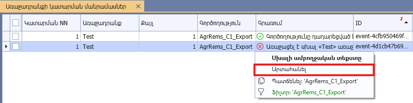

**Օրինակ**

```json
{
    "@t": "2026-02-12T05:40:59.4689147Z",
    "@m": "Առաջացել է սխալ «Test» առաջադրանքի «1» քայլում  «AgrRems_C1_Export» գործողությունը կատարելիս՝ Հաշվետվության հաշվարկը ընդհատված է օգտագործողի կողմից",
    "@i": "event-4d1cb47b69f908de2665b11f00000000",
    "@l": "Error",
    "@tr": null,
    "@sp": null,
    "@x": "System.Exception: гßí»ïíáõÃÛ³Ý Ñ³ßí³ñÏÁ Áݹѳïí³Í ¿ û·ï³·áñÍáÕÇ ÏáÕÙÇó\r\n ---> System.Exception: The operation was canceled.\r\n   at ArmSoft.AS8X.Core.DS.DataSourceService.ExecuteDataSource[T](String dsName, Dictionary`2 parameters, CancellationToken cancellationToken, Boolean suppressProgress) in D:\\TFS\\W\\AS-8X\\Core\\ArmSoft.AS8X.Core\\DS\\DataSourceService.cs:line 86\r\n   at ArmSoft.AS8X.Bank.OLAP.ExportProviders.ExportAgrRems_C1.ExportToOlapAsync(OLAPExpSelectedISNParams expParam, CancellationToken stoppingToken, IExecutionProgress progress) in D:\\TFS\\W\\Bank\\AS-8X\\ArmSoft.AS8X.Bank\\OLAP\\ExportProviders\\ExportAgrRems_C1.cs:line 152\r\n   --- End of inner exception stack trace",
    "ApiClientId": 8,
    "Application": "Bank",
    "Database": "d_bank4",
    "JobCode": "Export",
    "JobExecutionId": 1,
    "JobStep": 1,
    "JobStepName": "AgrRems_C1_Export",
    "MachineName": "TEST",
    "OlapExport": ". ISN: 423644202, Code: TV0965, Type: C1Univer, Date: 18/02/2026 0:00:00",
    "Server": "TEST-SERVER",
    "ServiceVersion": "26.115.0",
    "SourceContext": "ArmSoft.AS8X.Core.Process.ExecutionProgress"
}
```

## Դիտել/խմբագրել

«Ադմինիստրատորի ԱՇՏ» -> «Առաջադրանքներ» -> [«Առաջադրանքների պատմություն»](#առաջադրանքների-պատմություն) դիտելու ձևի [«Կատարման ընթացքում առաջացած սխալներ»](#կատարման-ընթացքում-առաջացած-սխալներ) կոնտեքստային ֆունկցիայով բացված «Առաջադրանքի կատարման մանրամասներ» դիտելու ձևի «Դիտել/խմբագրել» կոնտեքստային ֆունկցիան ցուցադրում է առաջադրանքի կատարման ընթացքում գրանցված լոգի ամբողջական նկարագրությունը։

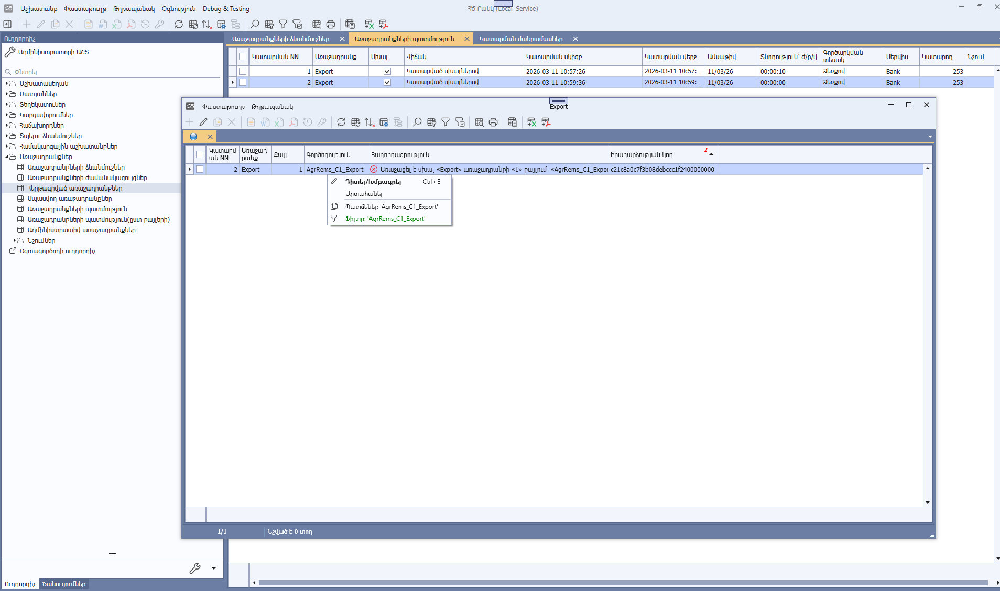

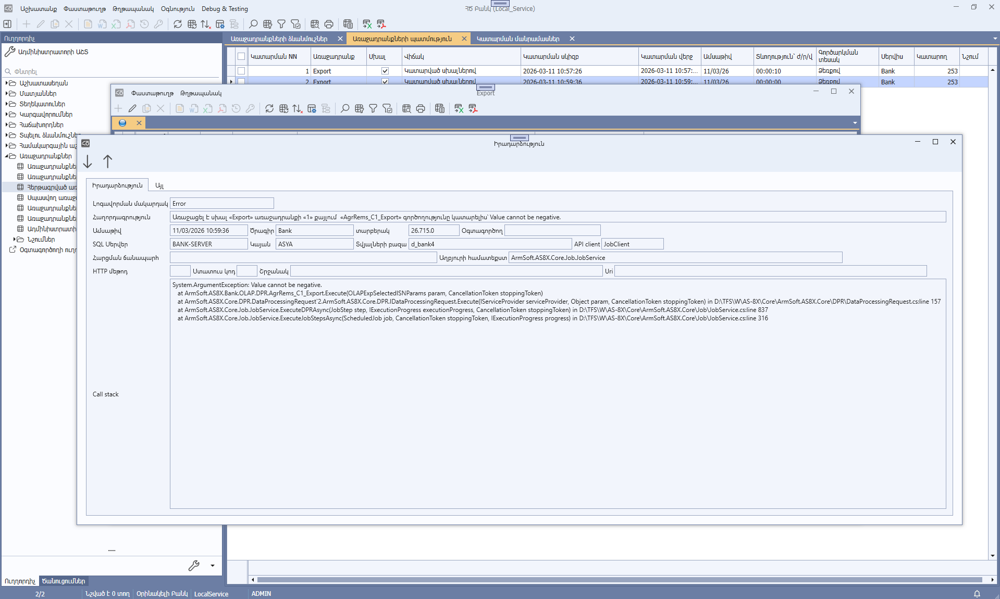

| Անվանում | Նկարագրություն |
|---|---|
| Լոգավորման մակարդակ | Գրանցված հաղորդագրության լոգավորման մակարդակը (Error, Warning, Info)։ |
| Հաղորդագրություն | Լոգում գրանցված հաղորդագրությունը, որը նկարագրում է տեղի ունեցած իրադարձությունը։ |
| Ամսաթիվ | Լոգի գրանցման ամսաթիվը և ժամանակը։ |
| Ծրագիր | Այն ծրագրի անունը, որի կողմից ստեղծվել է տվյալ լոգի գրառումը։ |
| Տարբերակ | Ծրագրի տարբերակը։ |
| Օգտագործող | Օգտագործողի անունը, որի գործողության ընթացքում առաջացել է տվյալ գրառումը։ |
| SQL Սերվեր | Ծրագրի կողմից օգտագործվող SQL Server-ի անունը: |
| Կայան | Այն համակարգչի անունը, որից կատարվել է գործողությունը։ |
| Տվյալների բազա | Ծրագրի կողմից օգտագործվող տվյալների բազայի անունը: |
| API client | Այն կլիենտ ծրագրի ներքին նույնականացման համարը (id), որի շրջանակներում գրանցվել է լոգը։ |
| Հարցման ճանապարհ | HTTP հարցման մասնակի հասցեն։ |
| Աղբյուրի համատեքստ | Լոգի [կոնտեքստը](https://github.com/serilog/serilog/wiki/Writing-Log-Events#source-contexts), որը ներկայացնում է լոգը : |
| HTTP մեթոդ | HTTP հարցման [մեթոդը](https://en.wikipedia.org/wiki/HTTP#Method) (օր.` GET`, `POST`, `PUT`, `DELETE`)։ |
| Ստատուս կոդ | HTTP հարցման պատասխանի [ստատուս կոդը](https://en.wikipedia.org/wiki/HTTP#response-status-code)։ |
| Շրջանակ | Լոգի scope-ը։ |
| Uri | HTTP հարցման ամբողջական URI հասցեն։ |
| Call stack | Call stack, որը ցույց է տալիս մեթոդների կանչման հերթականությունը մինչև սխալի առաջանալը։ Ցուցադրվում է միայն Error լոգավորման մակարդակով լոգերի դեպքում։ |

## Դիտել պարամետրերը

«Ադմինիստրատորի ԱՇՏ» -> «Առաջադրանքներ» -> «Առաջադրանքների պատմություն (ըստ քայլերի)» դիտելու ձևի «Դիտել պարամետրերը» կոնտեքստային ֆունկցիայի կանչի արդյունքում բացվում է դիալոգ՝ readonly ռեժիմով, որտեղ ցուցադրվում են առաջադրանքի կատարման պարամետրերը։

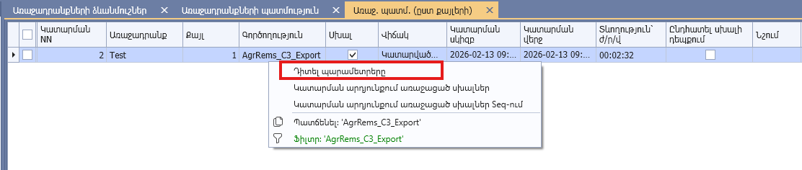

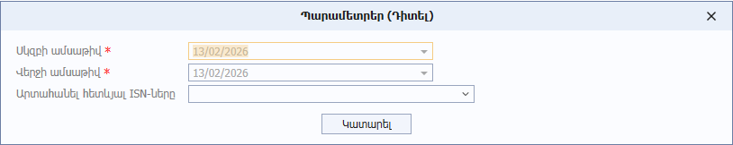

## 8X վեբ ծառայություններ

Այս դիտելու ձևը գտնվում է «Ադմինիստրատորի ԱՇՏ» -> «Համակարգային աշխատանքներ» թղթապանակում: Դիտելու ձևում ցուցադրվում են համակարգում սահմանված վեբ ծառայությունները (սերվիսները)։ Նախատեսված է վեբ ծառայությունների ստեղծման, խմբագրման, հեռացման և ծառայության ասինխրոն պրոցեսների դիտման համար։

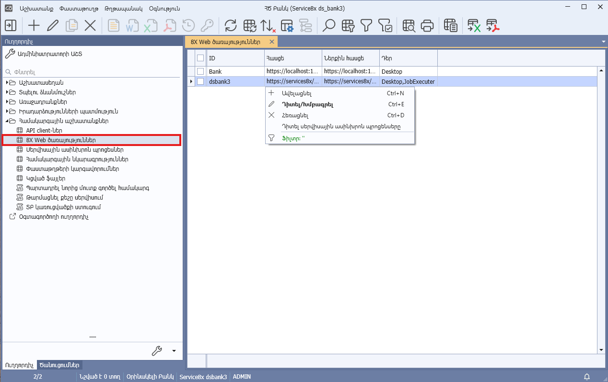

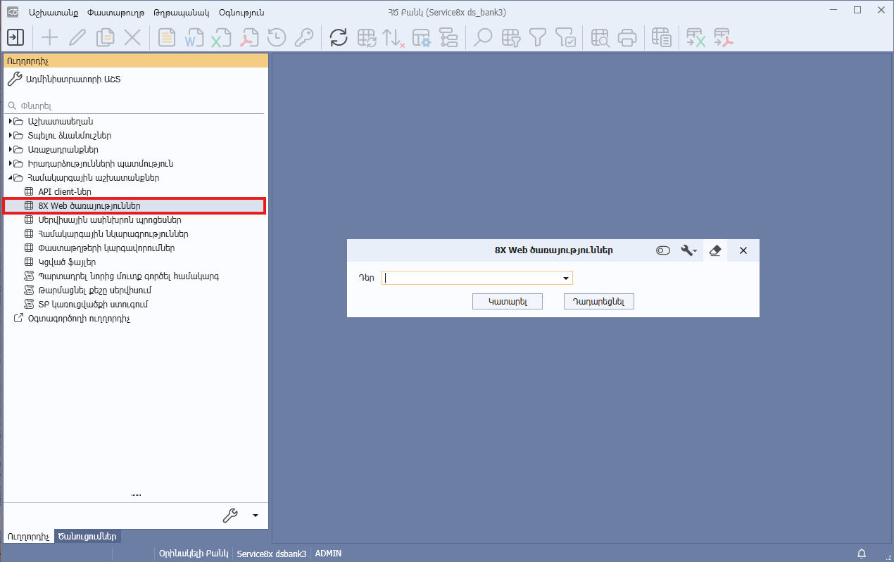

Վեբ ծառայությունները կիրառվում են [«Առաջադրանքի ձևանմուշներում»](#առաջադրանքի-ձևանմուշ)՝ նշելու համար այն սերվիսը, որի վրա պետք է գործարկվի տվյալ առաջադրանքը և «Ադմինիստրատորի ԱՇՏ» -> «Համակարգային աշխատանքներ» -> «Սերվիսային ասինխրոն պրոցեսներ»-ում՝ պրոցեսները ըստ սերվիսների տարանջատելու նպատակով։

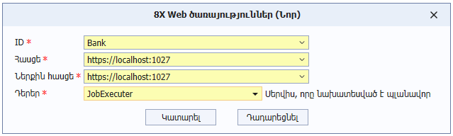

| Անվանում | Նկարագրություն |
|---------|----------------|
| ID | Վեբ ծառայության (սերվիսի) նույնականացուցիչը (id): |
| Հասցե | Վեբ ծառայության (սերվիսի) հասցեն։ |
| Ներքին հասցե | Վեբ ծառայության (սերվիսի) լոկալ հասցեն։ |
| Դեր | Վեբ ծառայության (սերվիսի) դերը։ Վեբ ծառայությունը (սերվիսի) միաժամանակ կարող է ունենալ մեկ և ավելի դերեր։  <br> **Desktop** - Սերվիս, որը սպասարկում է desktop-ից եկող հարցումները: <br> **Integration** - Սերվիս, որը կապ է ապահովում արտաքին համակարգերի կամ այլ սերվիսների հետ: <br> **JobExecuter** - Սերվիս, որը նախատեսված է առաջադրանքների, ֆոնային առաջադրանքների կատարման համար։ <br> **Worker** - Ֆոնային պրոցես, որը կատարում է ծանր կամ երկարաժամկետ հաշվարկներ կամ հաղորդագրությունների մշակում։  |

## Ծանուցման խումբ

Ծանուցման խումբը ստեղծվում է «Ադմինիստրատորի ԱՇՏ» -> «Համակարգային աշխատանքներ» -> **«Ծանուցումների խմբեր»** դիտելու ձևի **«Ավելացնել»** կոնտեքստային ֆունկցիայով։

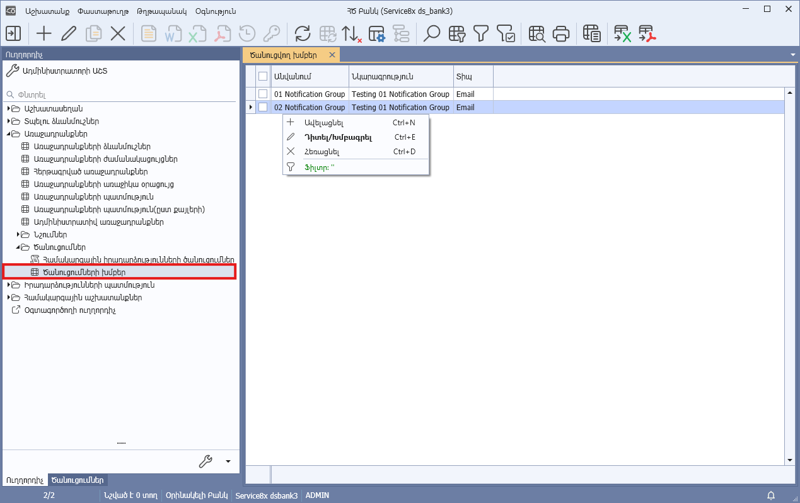

Սահմանում է այն օգտագործողների խումբը, որոնց առաջադրանքների կատարման ընթացքում ուղարկվելու են ծանուցումներ։ Առաջադրանքի գործողությունների (քայլերի) ծանուցումները կարգավորվում են [«Առաջադրանքի ձևանմուշ»](#առաջադրանքի-ձևանմուշ) փաստաթղթի միջոցով, իսկ ամբողջ առաջադրանքի վերաբերյալ ծանուցումները միացվում են **«Համակարգային իրադարձությունների ծանուցումներ»** դիալոգում։

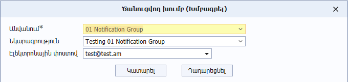

| Անվանում | Նկարագրություն |
|---------|----------------|
| Անվանում | Ծանուցման խմբի կոդը (id): |
| Նկարագրություն | Ծանուցման խմբի նկարագրությունը։ |
| Էլեկտրոնային փոստով | Այն օգտագործողների էլ․ փոստերի ցուցակը, որոնք ստանալու են ծանուցում։ <br> Control-ի DropDown-ում ցուցադրվում են **EMAILADDRESS** համակարգային պարամետրում ավելացված էլ․ փոստի հասցեները։ <br> Հնարավոր է նաև ձեռքով մուտքագրել էլ․ փոստերի հասցեները՝ իրարից տարանջատելով `;` սիմվոլներով։ <br> Մուտքագրված հասցեների վրա կիրառվում է ձևաչափի ստուգում, և սխալ ձևաչափով հասցեի դեպքում ցուցադրվում է **«Սխալ էլ. փոստի հասցե` "{հասցե}"»** սխալի հաղորդագրությունը։  |

## Համակարգային իրադարձությունների ծանուցումներ

Այս դիալոգը գտնվում է «Ադմինիստրատորի ԱՇՏ» -> «Համակարգային աշխատանքներ» թղթապանակում։ Այն տալիս է հնարավորություն ընտրելու այն ծանուցման խմբերը, որոնք ծանուցվելու են առաջադրանքի կատարման ընթացքում։ Արդյունքում ընտրված խմբերի կոդերը ավելացվում են **8XJOBNOTIFICATION** համակարգային պարամետրում։

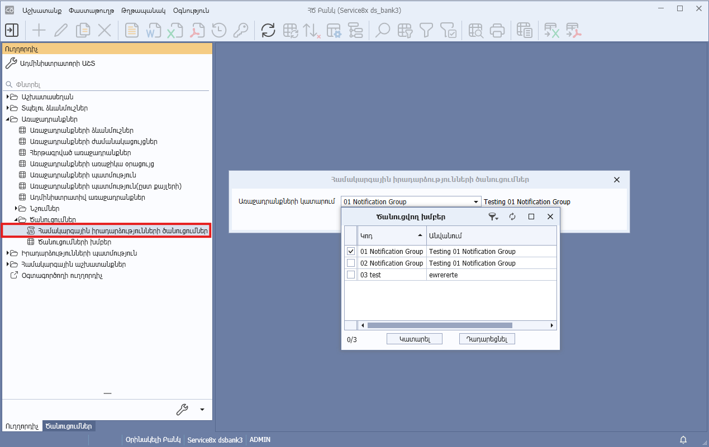
