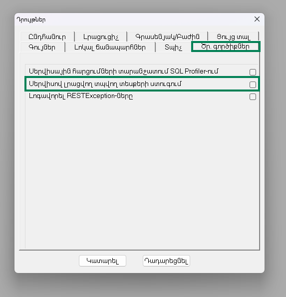
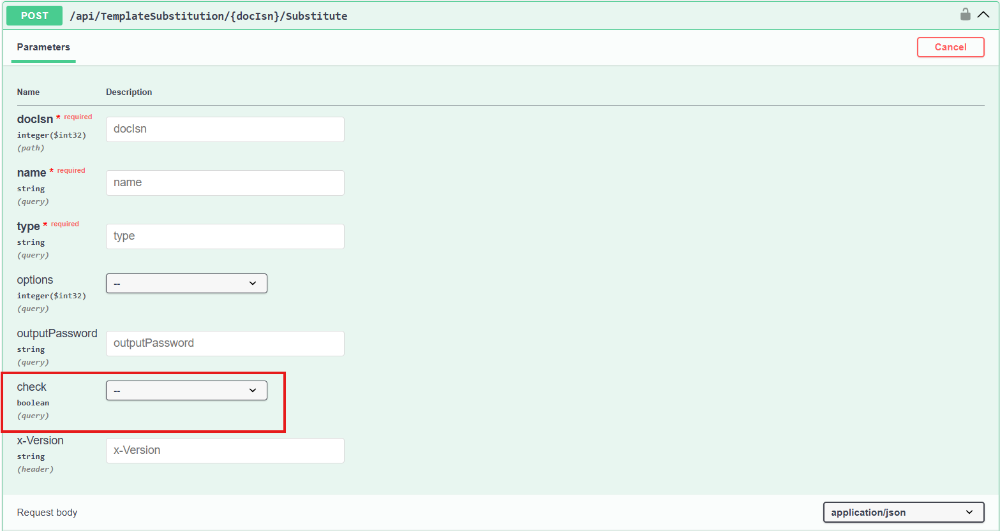

# Դրույթներ

Այս դիալոգը նախատեսված է ընթացիկ սեսիայի և ծրագրի աշխատանքային վարքագծի կարգավորման համար։ Կարգավորումները բաժանված են էջերի (tab) միջև։

Դիալոգը բացվում է **Ctrl + O** shortcut-ով կամ գլխավոր մենյուի **«Աշխատանք»** → **«Դրույթներ»** կետից։

## Բովանդակություն

- [Ընդհանուր](#ընդհանուր)
- [Ծրագրավորողի գործիքներ](#ծրագրավորողի-գործիքներ)
  - [Տպվող տեսքերի ստուգում](#տպվող-տեսքերի-ստուգում)

## Ընդհանուր

Այս էջում կարգավորվում են ընթացիկ սեսիայի ամսաթվերը, հարցումների կատարման առավելագույն ժամանակները, ինտերֆեյսի տեսքը (թեմա, տառատեսակի չափ, պատկերակների չափ) և արտահանման հետ կապված դրույթները։

| Անվանում | Պարտադիր/Ոչ պարտադիր | Լռությամբ արժեք | Նկարագրություն |
| --- | --- | --- | --- |
| **Ընթացիկ ամսաթիվ** | Պարտադիր | համակարգչային ամսաթիվ | Ընթացիկ սեսիայի աշխատանքային ամսաթիվը։ Կիրառվում է որպես լռությամբ արժեք փաստաթղթերի և գործողությունների ամսաթվային դաշտերի համար։ |
| **Աշխատանքային ժամանակահատված** | Պարտադիր | ընթացիկ ամսվա մեկնարկ — համակարգչային ամսաթիվ | Ընթացիկ սեսիայի աշխատանքային ժամանակահատվածի մեկնարկի և ավարտի ամսաթվերը։ Մեկնարկի ամսաթիվը չպետք է գերազանցի ավարտի ամսաթվին։ Ժամանակահատվածի կողքի կոճակի միջոցով հնարավոր է արագ ընտրել ստանդարտ ժամանակահատվածներ (ընթացիկ օր, ամիս, քառորդ, տարի և այլն)։ |
| Հարցման կատարման առավելագույն ժամանակ (վայրկյան) | Ոչ պարտադիր | 30 | SQL հարցումների կատարման առավելագույն թույլատրելի տևողությունը՝ վայրկյաններով։ Կիրառվում է որպես ընդհանուր ժամանակի սահման տվյալների բազայի հարցումների համար։ |
| Հաշվետվության հարցման կատարման առավելագույն ժամանակ (վայրկյան) | Ոչ պարտադիր | 300 | Դիտելու ձևերի և տվյալների մշակման հարցումների (DataSource) կատարման առավելագույն թույլատրելի տևողությունը՝ վայրկյաններով։ Կիրառվում է «Հարցման կատարման առավելագույն ժամանակ» դաշտից առանձին՝ քանի որ հաշվետվությունների հարցումները սովորաբար ավելի երկար են տևում։ |
| Պահանջել հաստատում փաստաթղթի պատուհանը փակելիս | Ոչ պարտադիր | `true` | Փաստաթղթի կամ այլ պատուհանը փակելիս հաստատման հարցում ցուցադրելու հայտանիշ։ Միացված վիճակում փակելու դեպքում օգտագործողից հարցում է կատարվում՝ հաստատելու համար փակումը։ |
| Օգտագործել մուգ գունային թեման | Ոչ պարտադիր | `false` | Ծրագրի մուգ գունային թեմայի (dark theme) միացման հայտանիշ։ Փոփոխությունը կիրառվում է ծրագիրը վերագործարկելուց հետո։ |
| Օգտագործել մեծ պատկերակներ գործիքների վահանակում | Ոչ պարտադիր | `false` | Գործիքների վահանակում (toolbar) մեծ չափի պատկերակների (icon) օգտագործման հայտանիշ։ |
| Ցույց տալ պատկերակները ուղղորդիչում | Ոչ պարտադիր | `true` | Ուղղորդիչի (Navigator) ծառում թղթապանակների և տարրերի կողքին պատկերակների ցուցադրման հայտանիշ։ Փոփոխությունը կիրառվում է ծրագիրը վերագործարկելուց հետո։ |
| Թույլատրել աշխատանքը հաշվետվության բեռնման ժամանակ | Ոչ պարտադիր | `true` | Հաշվետվությունների բեռնման ժամանակ ծրագրի այլ պատուհաններում աշխատելու թույլտվության հայտանիշ։ |
| Տառատեսակի չափ | Ոչ պարտադիր | 12 | Ինտերֆեյսի տառատեսակի չափը։ Հնարավոր արժեքներն են՝ **10**, **11**, **12**, **13**, **14**։ Փոփոխությունը կիրառվում է ծրագիրը վերագործարկելուց հետո։ |
| Excel արտահանման տառատեսակ | Ոչ պարտադիր | — | Տվյալների Excel ֆայլերի արտահանման ժամանակ կիրառվող տառատեսակը։ Ցուցակում ներառվում են համակարգում տեղադրված տառատեսակները։ Դատարկ արժեքի դեպքում օգտագործվում է լռությամբ տառատեսակը։ |
| Դիտելու ձևն Excel և PDF արտահանելիս պահպանել ֆայլը | Ոչ պարտադիր | `true` | Տվյալների Excel կամ PDF արտահանելիս ֆայլի պահպանման հասցեն ընտրելու դիալոգի ցուցադրման հայտանիշ։ Անջատված վիճակում ֆայլը պահպանվում է լռությամբ թղթապանակում՝ առանց հարցման։ |
| Սեղմել հաշվետվության հիշողությունը | Ոչ պարտադիր | `true` | Հաշվետվությունների բեռնման ընթացքում տվյալների աղբյուրի (DataSource) կատարման արդյունքի սեղմման հայտանիշ։ Միացված վիճակում սյունակի կրկնվող արժեքներից պահվում է միայն մեկը՝ արժեքի հանդիպման ինդեքսների ցուցակի հետ, ինչը օպտիմիզացնում է հաշվետվությունների կողմից օգտագործվող հիշողության ծավալը։ Անջատված վիճակում սյունակների արժեքները պահվում են առանց սեղմման։ |

## Ծրագրավորողի գործիքներ

Այս էջը նախատեսված է ծրագրավորողի գործիքների միացման և անջատման համար, որոնք օգնում են հայտնաբերել, վերլուծել և շտկել համակարգում առաջացած խնդիրները։

| Անվանում | Լռությամբ արժեք | Նկարագրություն |
| --- | --- | --- |
| Տպվող տեսքերի ստուգում | `false` | Տպելու ձևանմուշների (print template) վալիդացիայի հայտանիշ։ Միացված վիճակում փաստաթուղթը ձևանմուշով լրացնելուց հետո ստուգվում է չփոխարինված ատոմիկների և աղյուսակային արժեքների առկայությունը, և հայտնաբերման դեպքում առաջանում է սխալ՝ չլրացված արժեքի անվանումով։ Անջատված վիճակում նման արժեքները մնում են արդյունքի մեջ առանց սխալի։ Միացման եղանակները և ձևանմուշի տեսակից կախված ստուգման մանրամասները՝ [«Տպվող տեսքերի ստուգում»](#տպվող-տեսքերի-ստուգում) բաժնում։ |
| Լոգավորել RESTException-ները | `false` | API հարցումների ընթացքում առաջացած և չմշակված **RESTException** տիպի սխալների լոգավորման հայտանիշ։ Միացված վիճակում սխալները գրանցվում են լոգում՝ խնդիրների վերլուծության համար։ |

### Տպվող տեսքերի ստուգում

Վալիդացիան հնարավորություն է տալիս ստուգել տպելու ձևանմուշի լրացման արդյունքում չփոխարինված ատոմիկների և աղյուսակային արժեքների առկայությունը։

Միացման եղանակները՝

- **«Դրույթներ»** → **«Ծրագրավորողի գործիքներ»** → **«Տպվող տեսքերի ստուգում»** նշիչի միջոցով։ Ազդում է միայն UI-ից տպելու ձևանմուշի կանչի դեպքում; նշիչի լռությամբ արժեքը `false` է։
- [ITemplateSubstitutionService](../server_api/Services/ITemplateSubstitution/ITemplateSubstitutionService.md) (և համապատասխան **TemplateSubstitutionController**) մեթոդների **check** պարամետրի `true` արժեքով։

Միացված վիճակում, ձևանմուշի տեսակից կախված, կատարվում են հետևյալ ստուգումները՝

- **Text** (`.txt`) և **Doc** (`.doc`, `.docx`) տեսակի տպելու ձևանմուշներում, եթե լրացման արդյունքում մնում են չփոխարինված ատոմիկներ (**Text** դեպքում՝ ցանկացած տեսակի, օրինակ՝ `#21`, `#CurrentDate`; **Doc** դեպքում՝ `^` և `$` տեսակների, օրինակ՝ `^105`, `$Code`), առաջանում է սխալ՝ չլրացված ատոմիկի անվանումով։
- **Doc** (`.doc`, `.docx`) և **Excel** (`.xlsx`, `.xlsm`) տեսակի տպելու ձևանմուշներում, եթե լրացման արդյունքում մնում են չփոխարինված ատոմիկներ (**Doc** դեպքում՝ `#` տեսակի, օրինակ՝ `#Acc`; **Excel** դեպքում՝ ցանկացած տեսակի, օրինակ՝ `#Acc`, `^16`), ապա ստուգվում է տվյալ ատոմիկի առկայությունը նկարների բազմությունում (**TemplateSubstitution.imagesubstitutions**)։ Բացակայության դեպքում առաջանում է սխալ՝ չլրացված ատոմիկի անվանումով։
- **Doc** (`.doc`, `.docx`) տեսակի տպելու ձևանմուշներում, եթե լրացման արդյունքում մնում են չփոխարինված աղյուսակային արժեքներ (օրինակ՝ `%T1.C1`), առաջանում է սխալ՝ չլրացված արժեքի անվանումով։