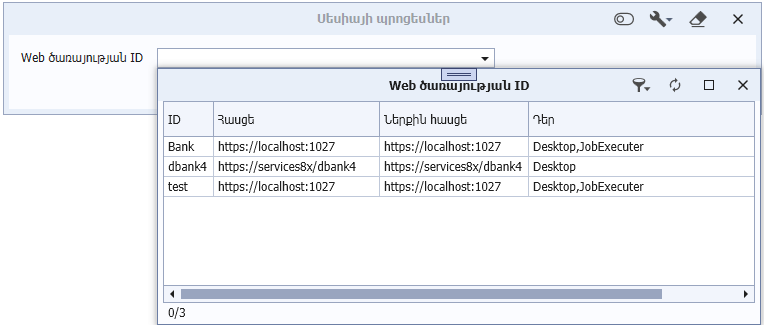
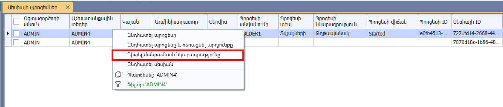

# Սերվիսային ասինխրոն պրոցեսներ դիտելու ձև

## Ներածություն

8X սերվիսում կատարվող պրոցեսների դիտարկման և կառավարման համար ավելացվել են՝ «8X Web ծառայություններ» և «Սերվիսային ասինխրոն պրոցեսներ» դիտելու ձևերը։ Նշված դիտելու ձևերը հասանելի են «Ադմինիստրատորի աշտ» -> «Համակարգային աշխատանքներ» թղթապանակից։

{: .note }
«Սերվիսային ասինխրոն պրոցեսներ» դիտելու ձևը տալիս է հնարավորություն դիտել և ընդհատել սերվիսների պրոցեսները (տվյալների աղբյուրի, տվյալների մշակման հարցման (DPR) առաջադրանքների կատարում, փաստաթղթի հեռացում և գրանցում, ․․․)։

Վերոնշյալ դիտելու ձևի նախնական ֆիլտրման պատուհանում հնարավոր է ֆիլտրել ըստ վեբ ծառայության (սերվիսի) id-ի։ Չֆիլտրելու դեպքում կատարման արդյունքում կցուցադրվեն բոլոր սերվիսների ասինխրոն պրոցեսները։



{: .note }
Դիտելու ձևում նաև ցուցադրվում են տողեր, որտեղ բացակայում է պրոցեսի ինֆորմացիան (id, անվանում, տիպ ...): Դրանք ներկայացնում են սերվիսներում առկա ընթացիկ սեսսիաները։

## Սյուների նկարագրություն

| Անվանում | Նկարագրություն |
|-----------|----------------|
| Օգտագործողի անուն | Պրոցեսը գործարկող օգտագործողի ներքին անունը (օրինակ՝ ADMIN): |
| Աշխատանքային տեղեր | Պրոցեսը գործարկող օգտագործողի լռությամբ աշխատանքային տեղի (աշտ) կոդը (օրինակ՝ )։ |
| Կայան | Օգտագործողի համակարգչի անունը։ |
| Ադմինիստրատոր | Նշում է՝ տվյալ ծառայությունը ակտիվ է, թե ոչ (Boolean արժեք) |
| Սերվիս | Այն սերվերի անվանումը, որտեղ տեղակայված կամ գործարկված է ծառայությունը |
| Պրոցեսի անվանումը | Պրոցեսի անվանումը։ |
| Պրոցես տիպ | Պրոցեսի տեսակը (Օրինակ՝ փաստաթուղթ)։ |
| Պրոցես նկարագրություն | Պրոցեսի նկարագրությունը։ |
| Պրոցես վիճակ | Պրոցեսի ընթացիկ վիճակը։ <br>  |
| Պրոցես ID | Պրոցեսի ներքին նույնականացման համարը (Guid)։  |
| Սեսիայի ID | Այն սեսսիայի ներքին նույնականացման համարը (Guid), որում գործարկվել է պրոցեսը։ |
| Վերջին գործարկման ամսաթիվ | Սեսսիայի վերջին գործարկման ամսաթիվը/ժամանակը։ |
| Ժամկետի ավարտ | Սեսսիայի վավերականության ավարտի ամսաթիվը/ժամանակը։ |
| API Client ID | API հաճախորդի եզակի նույնականացուցիչը, որով կատարվել է գործողությունը |

## Կոնտեքստային ֆունկցիաներ

### Ընդհատել պրոցեսը

Այս կոնտեքստային ֆունկցիան տալիս է հնարավորություն ընդհատել սերվիսային ասինխրոն պրոցեսը (տվյալների աղբյուրի, տվյալների մշակման հարցման (DPR), առաջադրանքի կատարում, փաստաթղթի հեռացում և գրանցում, ․․․)։ 

Այն կիրառելի է «Սերվիսային ասինխրոն պրոցեսներ» դիտելու ձևի այն տողերի համար, որոնց համար նշված է պրոցեսի Id-ն (պրոցես Id չունեցող տողերը հանդիսանում են ընթացիկ սեսսիաներ)։


Ֆունկցիայի կանչի արդյունքում պրոցեսը գործարկող օգտագործողը ստանում է սխալի հաղորդագրություն, որտեղ նշվում է X օգտագործողի կողմից ընդհատման փաստը։


### Ընդհատել պրոցեսները

Այս կոնտեքստային ֆունկցիան տալիս է հնարավորություն ընդհատել ընտրված տողերի սերվիսային ասինխրոն պրոցեսները (տվյալների աղբյուրի, տվյալների մշակման հարցման (DPR), առաջադրանքի կատարում, փաստաթղթի հեռացում և գրանցում, ․․․)։ 

Այն կիրառելի է «Սերվիսային ասինխրոն պրոցեսներ» դիտելու ձևի այն տողերի համար, որոնց համար նշված է պրոցեսի Id-ն (պրոցես Id չունեցող տողերը հանդիսանում են ընթացիկ սեսսիաներ)։

Ֆունկցիայի կանչի արդյունքում պրոցեսը գործարկող օգտագործողը ստանում է սխալի հաղորդագրություն, որտեղ նշվում է X օգտագործողի կողմից ընդհատման փաստը։


### Դիտել մանրամասն նկարագրությունը

Վերադարձնում է «Սերվիսային ասինխրոն պրոցեսներ» դիտելու ձևի տողին համապատասխան պրոցեսի նկարագրությունը (վիճակ, վիճակի անվանում, կատարման սկզբի ամսաթիվ/ժամանակ, ․․․)։ Նկարագրությունը պահվում է json ֆորմատի ֆայլում և ցուցադրվում։



```json
{
    "State": 4,
    "StateName": "Started",
    "StartDate": "2026-02-11T12:35:54.4411466+04:00",
    "Details": []
}
```


