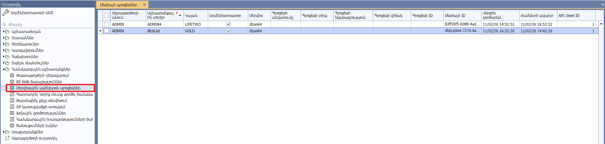
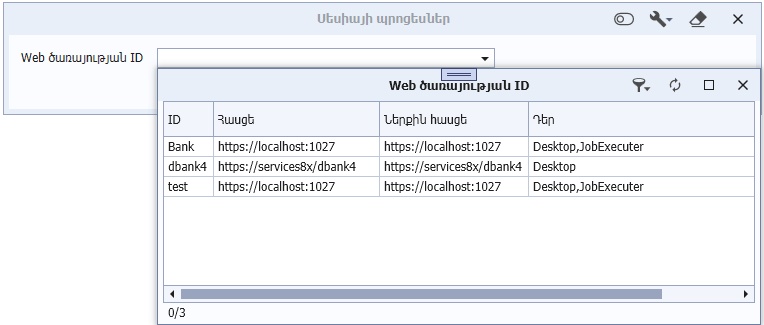
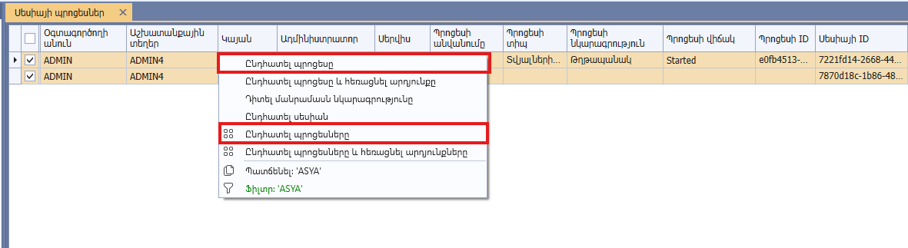
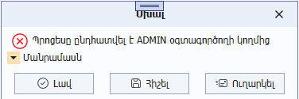
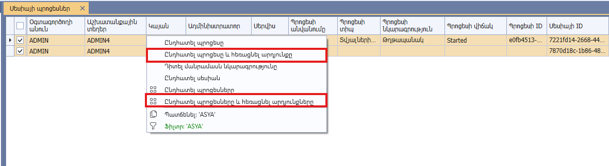
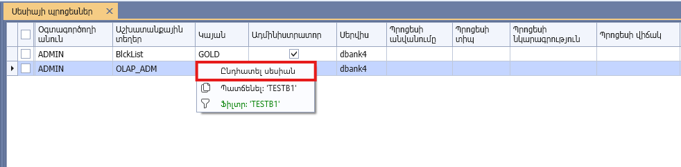
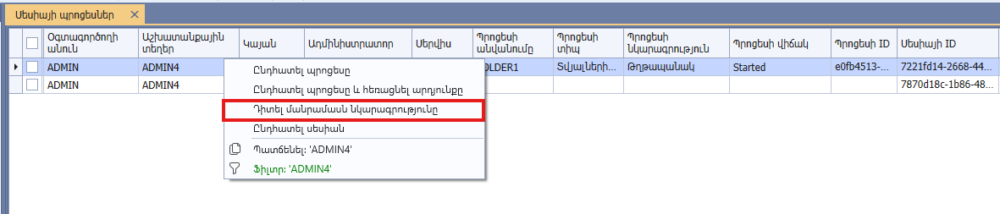

# Սերվիսային ասինխրոն պրոցեսներ դիտելու ձև

## Ներածություն

8X սերվիսում կատարվող պրոցեսների դիտարկման և կառավարման համար ավելացվել են՝ **«8X Web ծառայություններ»** և **«Սերվիսային ասինխրոն պրոցեսներ»** դիտելու ձևերը։ Նշված դիտելու ձևերը հասանելի են **«Ադմինիստրատորի աշտ» -> «Համակարգային աշխատանքներ»** թղթապանակից։



{: .note }
**«Սերվիսային ասինխրոն պրոցեսներ»** դիտելու ձևը տալիս է հնարավորություն դիտել և ընդհատել սերվիսների պրոցեսները (տվյալների աղբյուրի, տվյալների մշակման հարցման (DPR) առաջադրանքների կատարում, փաստաթղթի հեռացում և գրանցում, ․․․)։

Վերոնշյալ դիտելու ձևի նախնական ֆիլտրման պատուհանում հնարավոր է ֆիլտրել այն ըստ վեբ ծառայության (սերվիսի) id-ի։ Չֆիլտրելու դեպքում կատարման արդյունքում կցուցադրվեն բոլոր սերվիսների ասինխրոն պրոցեսները։



{: .note }
Դիտելու ձևում նաև ցուցադրվում են տողեր, որտեղ բացակայում է պրոցեսի ինֆորմացիան (id, անվանում, տիպ ...): Դրանք ներկայացնում են սերվիսներում առկա ընթացիկ սեսսիաները։

## Սյուների նկարագրություն


| Անվանում | Նկարագրություն |
|-----------|----------------|
| Օգտագործողի անուն | Պրոցեսը գործարկող օգտագործողի ներքին անունը (օրինակ՝ ADMIN): |
| Աշխատանքային տեղեր | Պրոցեսը գործարկող օգտագործողի լռությամբ աշխատանքային տեղի (աշտ) կոդը (օրինակ՝ Account)։ |
| Կայան | Օգտագործողի համակարգչի անունը։ |
| Ադմինիստրատոր | Օգտագործողի ադմինիստրատոր հանդիանալու հայտանիշ։ |
| Սերվիս | Այն սերվիսի անվանումը, որտեղ գործարկվում է պրոցեսը։ |
| Պրոցեսի անվանումը | Պրոցեսի անվանումը։ |
| Պրոցեսի տիպ | Պրոցեսի տեսակը (Օրինակ՝ փաստաթուղթ)։ |
| Պրոցեսի նկարագրություն | Պրոցեսի նկարագրությունը։ |
| Պրոցեսի վիճակ | Պրոցեսի ընթացիկ վիճակը։  |
| Պրոցեսի ID | Պրոցեսի ներքին նույնականացման համարը (Guid)։  |
| Սեսիայի ID | Այն սեսսիայի ներքին նույնականացման համարը (Guid), որում գործարկվել է պրոցեսը։ |
| Վերջին գործարկման ամսաթիվ | Սեսսիայի վերջին գործարկման ամսաթիվը/ժամանակը։ |
| Ժամկետի ավարտ | Սեսսիայի վավերականության ավարտի ամսաթիվը/ժամանակը։ |
| API Client ID | API կլիենտի id-ն։ |

## Կոնտեքստային ֆունկցիաներ

### Ընդհատել պրոցես(ներ)ը

«Ընդհատել պրոցեսը», «Ընդհատել պրոցեսները» կոնտեքստային ֆունկցիաները տալիս են հնարավորություն ընդհատել ընտրված սերվիսային ասինխրոն պրոցես(ներ)ը (տվյալների աղբյուրի, տվյալների մշակման հարցման (DPR), առաջադրանքի կատարում, փաստաթղթի հեռացում և գրանցում, ․․․)։ 

Ֆունկցիաների կանչի արդյունքում կընդհատվեն այն պրոցեսները, որոնց համար նշված է պրոցեսի Id-ն (պրոցես Id չունեցող տողերը հանդիսանում են ընթացիկ սեսսիաներ)։



Պրոցեսը գործարկող օգտագործողը ֆունկցիայի կանչի արդյունքում ստանում է սխալի հաղորդագրություն, որտեղ նշվում է X օգտագործողի կողմից ընդհատման փաստը։



### Ընդհատել պրոցես(ներ)ը և հեռացնել արդյունք(ներ)ը

«Ընդհատել պրոցեսը և հեռացնել արդյունքը», «Ընդհատել պրոցեսները և հեռացնել արդյունքները» կոնտեքստային ֆունկցիաները տալիս են հնարավորություն ընդհատել սերվիսային ասինխրոն պրոցես(ներ)ը (տվյալների աղբյուրի, տվյալների մշակման հարցման (DPR), առաջադրանքի կատարում, փաստաթղթի հեռացում և գրանցում, ․․․) և հեռացնել պրոցես(ներ)ի քեշը սերվիսից։

Կոնտեքստային ֆունկցիաները կիրառելի են «Սերվիսային ասինխրոն պրոցեսներ» դիտելու ձևի այն տողերի համար, որոնց համար նշված է պրոցեսի Id-ն (պրոցես Id չունեցող տողերը հանդիսանում են ընթացիկ սեսսիաներ)։



Պրոցեսը գործարկող օգտագործողը ֆունկցիայի կանչի արդյունքում ստանում է սխալի հաղորդագրություն, որտեղ նշվում է X օգտագործողի կողմից ընդհատման փաստը։


### Ընդհատել սեսիան

Այս կոնտեքստային ֆունկցիան տալիս է հնարավորություն ընդհատել օգտագործողի սեսիան։ Սեսիայի ընդհատման արդյունքում հեռացվում են սեսսիայի ընթացքում ստեղծված ժամանակավոր ֆայլերը, ընդհատվում ընթացիկ բոլոր պրոցեսսները (տվյալների աղբյուրի, տվյալների մշակման հարցման (DPR), առաջադրանքի կատարում, փաստաթղթի հեռացում և գրանցում, ․․․)։



### Դիտել մանրամասն նկարագրությունը

Վերադարձնում է «Սերվիսային ասինխրոն պրոցեսներ» դիտելու ձևի տողին համապատասխան պրոցեսի նկարագրությունը (վիճակ, վիճակի անվանում, կատարման սկզբի ամսաթիվ/ժամանակ, ․․․)։ Նկարագրությունը պահվում է json ֆորմատի ֆայլում և ցուցադրվում։



```json
{
    "State": 4,
    "StateName": "Started",
    "StartDate": "2026-02-11T12:35:54.4411466+04:00",
    "Details": []
}
```

