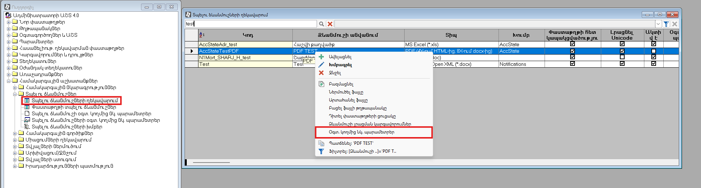
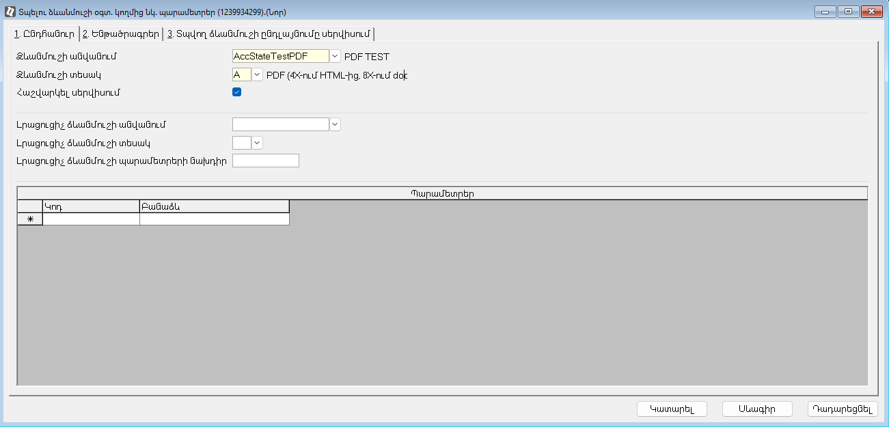
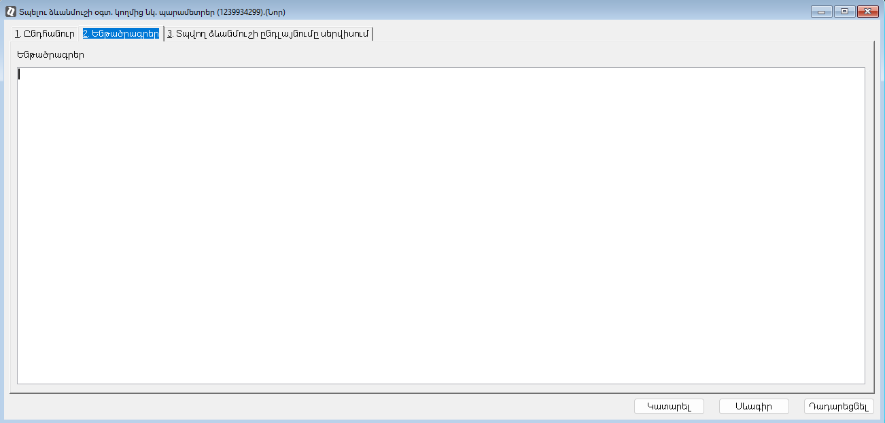
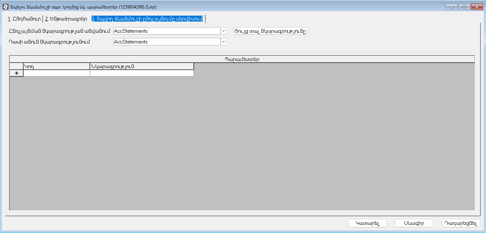

Այս փաստաթուղթը նախատեսված է տպելու ձևանմուշը 4x-ական կամ 8x-ական ընդլայնմանը կապակցելու համար։

Փաստաթուղթը ստեղծելու համար անհրաժեշտ է`
* բացել «Ադմինիստրատորի աշտ» -> «Տպելու ձևանմուշներ» -> **«Տպելու ձևանմուշների ղեկավարում»** հաշվետվությունը,
* տպելու ձևանմուշի վրայից կանչել **«Oգտ․ կողմից նկ․ պարամետրեր»** կոնտեքստային ֆունկցիան։

Ստորև բերված են փաստաթղթի էջերի և դաշտերի նկարագրությունները։

## Ընդհանուր էջ

Այս էջը նախատեսված է տպելու ձևանմուշի հիմնական տվյալների նկարագրման համար։

| **Դաշտի անվանում** | **Նկարագրություն** |
| --- | --- |
| Ձևանմուշի անվանում | Տպելու ձևանմուշի ներքին անունը (կոդը)։ |
| Ձևանմուշի տեսակ | Տպելու ձևանմուշի [տեսակը](../server_api/types/SubstitutionType.md)։ Լրացվում է ավտոմատ կերպով՝ **Ձևանմուշի անվանում** դաշտում ընտրված արժեքի հիման վրա։ |
| Հաշվարկել սերվիսում | Այս նշիչի **true** արժեքի դեպքում տպելու ձևանմուշի ընդլայնման հաշվարկը կատարվում է 8x սերվիսում։ 8x-ական ընդլայնման տվյալները անհրաժեշտ է լրացնել [Տպվող ձևանմուշի ընդլայնումը սերվիսում](#տպվող-ձևանմուշի-ընդլայնումը-սերվիսում) էջում։ |
| Լրացուցիչ ձևանմուշի անվանում | Լրացուցիչ տպելու ձևանմուշի ներքին անունը (կոդը)։ |
| Լրացուցիչ ձևանմուշի տեսակ | Լրացուցիչ տպելու ձևանմուշի [տեսակը](../server_api/types/SubstitutionType.md)։ Լրացվում է ավտոմատ կերպով՝ **Լրացուցիչ ձևանմուշի անվանում** դաշտում ընտրված արժեքի հիման վրա։ |
| Պարամետրեր | Տպելու ձևանմուշի 4x-ական ընդլայնման պարամետրերի (ատոմար արժեքներ, աղյուսակներ․․․) կոդ/հաշվարկող բանաձևերի ցուցակը։ |

## Ենթածրագրեր էջ

Այս էջը նախատեսված է տպելու ձևանմուշի 4x-ական ընդլայնման կոդի սահմանման համար։

## Տպվող ձևանմուշի ընդլայնումը սերվիսում

Այս էջը նախատեսված է տպելու ձևանմուշը 8x-ական (սերվիսային) ընդլայնման հետ կապակցելու համար։

| **Դաշտի անվանում** | **Նկարագրություն** |
| --- | --- |
| Ընդլայնման նկարագրության անվանում | Տպելու ձևանմուշի 8x-ական ընդլայնման [նկարագրության](../extensions/definitions/server_side_module.md) ներքին անունը ([SERVERSIDEMODULE](../extensions/definitions/server_side_module.md#serversidemodule-նկարագրություն)-ի [NAME](../extensions/definitions/server_side_module.md#name) դաշտի արժեքը): |
| Դասի անուն նկարագրությունում | Տպելու ձևանմուշի 8x-ական ընդլայնման C# դասի անունը ([SERVERSIDEMODULE](../extensions/definitions/server_side_module.md#serversidemodule-նկարագրություն)-ի [CSSOURCE](../extensions/definitions/server_side_module.md#cssource) դաշտի արժեքը): |
| Ցույց տալ նկարագրությունը | .txt ընդլայնմամբ ֆայլում արտահանում է տպելու ձևանմուշի 8x-ական ընդլայնման C# դասի պարունակությունը։ |
| Պարամետրեր | Տպելու ձևանմուշի 8x-ական ընդլայնման պարամետրերի (ատոմար արժեքներ, աղյուսակներ․․․) կոդ/նկարագրությունների ցուցակը։ |
