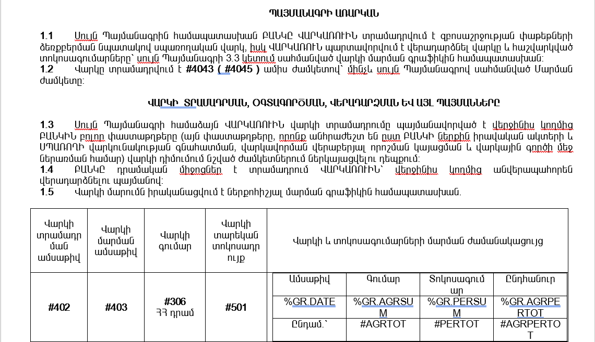
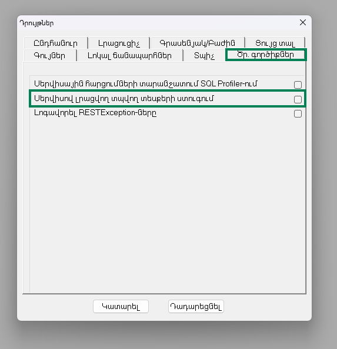
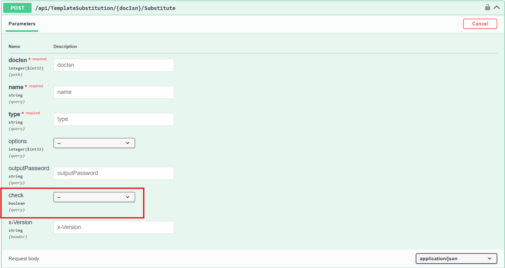
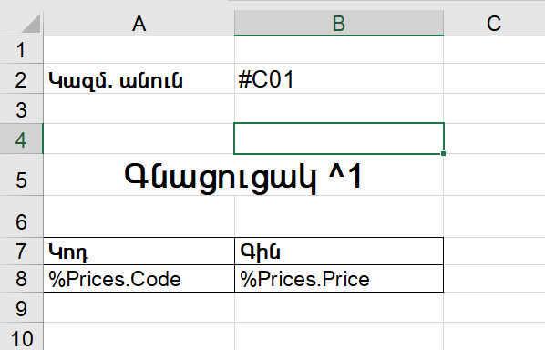
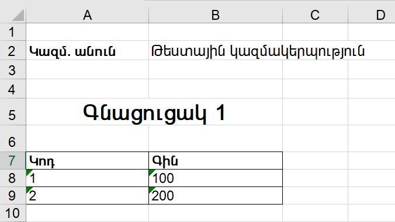

# Տպելու ձևանմուշների նկարագրություն

## Բովանդակություն

- [Ներածություն](#ներածություն)
- [Ատոմիկներ](#ատոմիկներ)
- [Նկարներ](#նկարներ)
- [Աղյուսակներ](#աղյուսակներ)
- [Html տեսակի տպելու ձևանմուշներ](#html-տեսակի-տպելու-ձևանմուշներ)
- [Տպելու ձևանմուշների վալիդացիա](#տպելու-ձևանմուշների-վալիդացիա)
- [Տպելու ձևանմուշի հաշվարկման և լրացման օրինակ](#տպելու-ձևանմուշի-հաշվարկման-և-լրացման-օրինակ)

## Ներածություն

Տպելու ձևանմուշը ֆայլ է՝ նախապես սահմանված ընդլայնմամբ, որը պարունակում է տեքստ։ Այն կարող է ներառել ինչպես հաստատուն (կոնստանտ) տեքստեր, այնպես էլ հաշվարկվող արժեքներ՝ պարամետրեր։

Պարամետրերը կարող են լինել տեքստային (ատոմիկներ), աղյուսակային կամ նկարային։ Սահմանվում են հատուկ սիմվոլներով (#, %, ...), որին անմիջապես հաջորդում է պարամետրի կոդը՝ առանց բացատների, օրինակ՝ **#2020**, **%GR.DATE**, **~405**։ Պարամետրերից հետո պարտադիր պետք է դրվի բացատ։

**Օրինակ**



Պարամետրերի արժեքների հաշվարկը կատարվում է տպելու ձևանմուշին կցված փաստաթղթի [TemplateSubstitution](../server_api/Definitions/Document/Methods/TemplateSubstitution.md) մեթոդում կամ ձևանմուշի ընդլայնման [Calculate](../server_api/Extensions/Definitions/TemplateSubstitution/Methods/Calculate.md) մեթոդում։

Տպելու ձևանմուշների հասանելի ընդլայնումների ցանկին կարող եք ծանոթանալ [այստեղ](../server_api/Types/SubstitutionType.md):

## Ատոմիկներ

Տպելու ձևանմուշներում ատոմիկները նշվում են հատուկ սիմվոլներով՝ **#**, **^**, **$**, որոնց անմիջապես հաջորդում է ատոմիկի կոդը (առանց բացատների), օրինակ՝ **#TOTAL**, **^201**, **$1008**։

Ձևանմուշի լրացման ընթացքում բոլոր ատոմիկները փոխարինվում են համապատասխան հաշվարկված արժեքներով։

Ձևանմուշի ֆայլի տեսակից կախված՝ կիրառելի են հատուկ սիմվոլների կիրառման հետևյալ սահմանափակումները․
* Word (*.doc, *.docx) – **#**, **^**, **$**
* Excel (*.xls, *.xlsx, *.xlsm) – **#**, **^**
* Text (*.txt) – միայն **#**
* Html (*.html) - միայն **#**
* Pdf

Pdf տեսակի ձևանմուշները ձևավորվում են Word, Excel, Html տեսակի տպելու ձևանմուշներից և կիրառվում են նույն սահմանափակումները, ինչ վերոնշյալ տեսակների համար։ 

**Հատուկ սիմվոլների կիրառման առանձնահատկություններ և սահմանափակումներ՝**
* Word (*.doc, *.docx) տեսակի ձևանմուշների header, footer հատվածներում **^** և **$** սիմվոլների կիրառումը չի սատարվում․ կիրառման դեպքում համապատասխան ատոմիկների կոդերը չեն փոխարինվում արժեքներով։
* Word (*.doc, *.docx) տեսակի ձևանմուշների մարմնում (Body), եթե ատոմիկի համար կիառված են **^** և **$** սիմվոլները և ատոմիկի արժեքը դատարկ է (string.Empty, null, բացատներ), ապա այն պարունակող պարագրաֆը ամբողջությամբ հեռացվում է։
* Excel (*.xlsx, *.xlsm) տեսակի ձևանմուշների cell-ում, եթե ատոմիները ունեն տարբեր ֆորմատավորումներ (bold, italic, ...) և կիրառված է **^** սիմվոլը, ապա դատարկ արժեք (string.Empty) ունեցող ատոմիկները չեն փոխարինվում արժեքներով։ Սակայն նույն ֆորմատավորմամբ ատոմիկների կամ ֆորմատավորման բացակայության դեպքում դատարկ արժեքը փոխարինվում է մեկ բացատով (" "):

## Նկարներ

Տպելու ձևանմուշում նկարները նշվում են **#** հատուկ սիմվոլով, որին հաջորդում է նկարի անունը (առանց բացատների)։ Օրինակ՝ **#ClientImage**։

Եթե Word (\*.doc, \*.docx) տեսակի ձևանմուշում նշված անունով նկարի ֆայլը բացակայում է, ապա համակարգը հեռացնում է համապատասխան placeholder-ը (օրինակ՝ #ClientImage)։ Excel (\*.xlsx, \*.xlsm) տեսակի ձևանմուշներում նշված դեպքում առաջանում է սխալ։

## Աղյուսակներ

Տպելու ձևանմուշներում աղյուսակային տվյալները նշվում են հետևյալ ձևով՝ %table_name.column_name: Աղյուսակային արժեքի գրառումը սկսվում է % սիմվոլով, որին հաջորդում է աղյուսակի անունը և սյան անունը՝ կետով բաժանված։ Օրինակ՝ **%T1.C1**, **%ACC.CODE**։

## Html տեսակի տպելու ձևանմուշներ

HTML տեսակի տպելու ձևանմուշները կարող են պարունակել ատոմիկներ, աղյուսակներ, նկարներ, ինչպես նաև  ցանկացած այլ HTML, XML էլեմենտներ (CSS style, JavaScript սկրիպտային ֆունկցիաներ, ․․․):

HTML տպելու ձևանմուշները ատոմար արժեք ավելացնելու համար անհրաժեշտ է սահմանել կամայական Html էլեմենտ (օրինակ [span](https://www.w3schools.com/tags/tag_span.asp))՝ **id** կամ **data-value** ատրիբուտում նշելով ատոմիկի կոդը։ էլեմենտը կարող է նաև պարունակել այլ ատրիբուտներ (օրինակ style), սակայն չպետք է պարունակի ներդրված էլեմենտներ (child elements):

```html
<span id="#ACC">any text</span>    
```

կամ 

```html
<span data-value="#ACC">any text</span>    
```

Աղյուսակներ սահմանելու համար օգտագործվում է [table](https://www.w3schools.com/html/html_tables.asp) էլեմենտը, որի **id** կամ **data-value** ատրիբուտի արժեքը հանդիսանում է աղյուսակի կոդը։ Աղյուսակի սյունակները սահմանվում են [thead](https://www.w3schools.com/tags/tag_thead.asp) էլեմենտում՝ առաջին [tr](https://www.w3schools.com/tags/tag_tr.asp) տողի [th](https://www.w3schools.com/tags/tag_th.asp) էլեմենտների միջոցով։ Այդ նկարագրության հիման վրա [tbody](https://www.w3schools.com/tags/tag_tbody.asp) ենթաէլեմենտում ավտոմատ ավելացվում են աղյուսակի տողերը՝ պահպանելով սյունակների սահմանված հերթականությունը։

```html
<table id="%G1" border="1" style="background-color:Red">
    <thead>
        <tr>
            <th id="%G1.1"></th>
            <th id="%G1.2"></th>
        </tr>
        <tr>
            <td>Անուն</td>
            <td>Նկարագրություն</td>
        </tr>
    </thead>
</table>
```

Պատկերները նկարագրելու համար օգտագործվում է [img](https://www.w3schools.com/tags/tag_img.asp) էլեմենտը, որի **data-image** կամ **id** ատրիբուտում նշվում է պատկերի կոդը։ Պատկերի իրական հասցեն կամ անվանումը տեղադրվում է src ատրիբուտում։


## Տպելու ձևանմուշների վալիդացիա

Վալիդացիան հնարավորություն է տալիս ստուգել ձևանմուշի լրացման արդյունքում չփոխարինված ատոմիկների, աղյուսակային արժեքների առկայությունը։

Այն կարելի է միացնել`
* «Դրույթներ» (Ctrl+o) -> «Ծրագրավորողի գործիքներ» -> «Տպվող տեսքերի ստուգում» նշիչի միջոցով (այն ազդում է միայն UI-ց տպելու ձևանմուշի կանչի դեպքում)։ Նշիչի լռությամբ արժեքը false է։
* TemplateSubstitutionService, TemplateSubstitutionController-ի մեթոդների bool check պարամետրի արժեքավորման միջոցով։





Վալիդացիայի միացված լինելու դեպքում՝
* Text (.txt) և Doc (.doc, .docx) տեսակի տպելու ձևանմուշներում, եթե լրացման արդյունքում մնում են չփոխարինված ատոմիկներ (Text դեպքում՝ ցանկացած տեսակի, օրինակ՝ #21, #CurrentDate, Doc դեպքում՝ ^ և $ տեսակների, օրինակ՝ ^105, $Code), ապա առաջանում է սխալ։
* Doc (.doc, .docx) և Excel (.xlsx, .xlsm) տեսակի տպելու ձևանմուշներում, եթե լրացման արդյունքում մնում են չփոխարինված ատոմիկներ (Doc դեպքում՝ # տեսակի, օրինակ՝#Acc, Excel դեպքում՝ ցանկացած տեսակի, օրինակ` #Acc, ^16), ապա ստուգվում է տվյալ ատոմիկի առկայությունը նկարների բազմությունում (**TemplateSubstitution.imagesubstitutions**)։ Նշված բազմությունում բացակայության դեպքում առաջանում է սխալ։
* Doc (.doc, .docx) տեսակի տպելու ձևանմուշներում, եթե լրացման արդյունքում մնում են չփոխարինված աղյուսակային արժեքներ (օրինակ՝ %T1.C1), ապա առաջանում է սխալ։

## Տպելու ձևանմուշի հաշվարկման և լրացման օրինակ

```c#
var printTemplateSubstitution = new PrintTemplateSubstitution();
printTemplateSubstitution.AtomicSubstitutions.Add("C01", "Թեստային կազմակերպություն");
printTemplateSubstitution.AtomicSubstitutions.Add("1", 1);

PrintTemplateSubstitutionGrid gridSubstitutions1 = printTemplateSubstitution.GridSubstitutions.Add("Prices");

gridSubstitutions1.AddColumn("Code", "Product's code");
gridSubstitutions1.AddColumn("Price", "Product's price");

for (int i = 0; i < 2; i++)
{
    gridSubstitutions1.AddRow();
    int id = i + 1;
    int price = id * 100;

    gridSubstitutions1.SetValue(i, "Code", id);
    gridSubstitutions1.SetValue(i, "Price", price);
}
```




